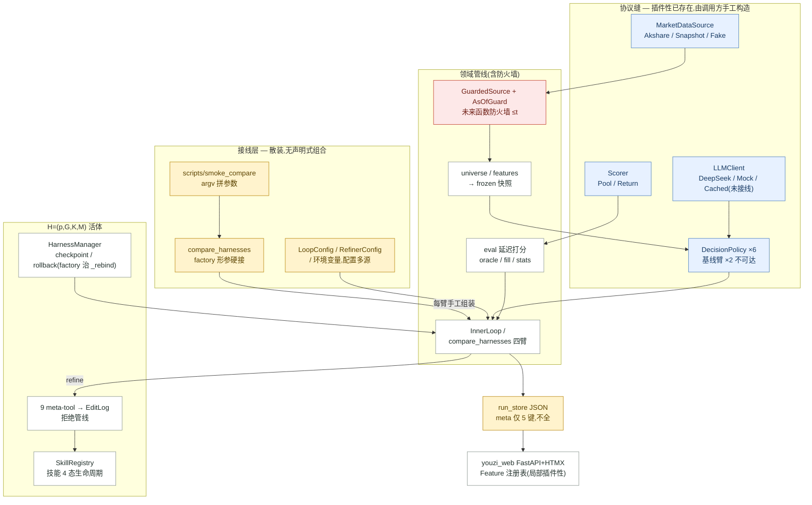
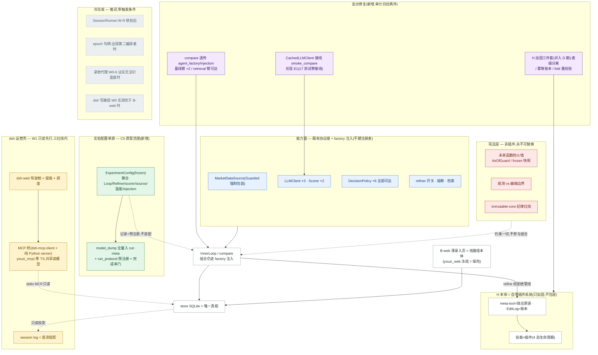

# replant-dsh — DeepSeek Harness 移植工程总文档

> 本文件是移植工程的单一工作文档,由 2026-08-23 的 13-agent workflow 产出物合并而成(合成稿 + 2 份对抗评审 + 3 份立场设计 + 8 份研究笔记,内容原样保留)。
> 原始散件仍在 `docs/superpowers/specs/2026-08-23-deepseek-harness-graft-redesign.md` 与 `docs/findings/2026-08-23-dsh-graft/`。
>
> **目录**
> - **Part 0 提案 v2 + 执行日志(随移植推进滚动更新;与 Part I 冲突处以本 Part 为准)**
> - Part I 合成稿(权威裁决:总纲/红线/不变量/波次/W0 清单)
> - Part II 对抗评审裁定 ×2(不变量守卫 / dsh 工程忠实度)
> - Part III 三份立场设计原文(A 宿主壳 / B 插件原生 / C 会话中心)
> - Part IV 研究笔记 ×8(dsh 6 路尽调 + 本项目 2 路重读)

---

# Part 0 · 重构提案 v2 + 执行日志(以本 Part 为准)

> 产生于两轮追问:"我很看重 everything-is-a-plugin 原则"(08-24)→ "会有略显多余的组件吗"(08-25);后者触发 13-agent 冗余对抗审计(全文 `docs/findings/2026-08-25-replant-redundancy-audit.json`)。**与 Part I §4/§5 冲突处,以本 Part 为准。**

## 0.0 执行日志与当前状态

### 当前状态快照(截至 2026-08-26 晚)

- **dsh `0.1.1-rc.2` 运行中**:`~/Desktop/self-evolve/dsh-playground` 起 `dsh web`(:3080,nohup 独立进程)。DSH_HOME=`~/.dsh`;web profile 默认 `workspace-write` + `approval: ask`;session 落盘 `~/.dsh/sessions`(JSONL)。重启命令:`cd ~/Desktop/self-evolve/dsh-playground && npx -y @deepseek-ai/dsh web`。
- **桥已上线,零 TS**:web profile(`~/.dsh/profiles/web/cordis.patch.yml`)经 `dsh-mcp-client` 挂 `youzi-market` 桥 = **repo 内纯 Python MCP server**(`.venv/bin/python -m youzi_mcp.market`,env `YOUZI_SNAPSHOT`+`PYTHONPATH`)。工具面:`mcp__youzi-market__{ping, market_brief, candidates, get_bars}`,真 PIT 快照数据(2026-05-26..06-12,14 交易日)经 `GuardedSource(as_of=day)`。**market 参数只留槽位**:cn 默认,us/crypto 诚实报"尚未接入";symbol 支持 `cn:` 前缀。
- **仓库增量(未 commit)**:`youzi_mcp/{__init__,market_core,market}.py`(纯逻辑层零 MCP 依赖 + 最薄壳)+ `tests/test_mcp_market.py`;**502 测试全绿(495+7),youzi 核心零改动**;repo venv 加装 `mcp` 2.1.1(venv 是 uv 的:`uv pip install --python .venv/bin/python mcp`)。headless E2E 四项全通(真简报/候选/K 线 + crypto 槽位报错)。
- **§0.3 即刻清单(纯 Python 四项)仍挂起**(08-25 用户决策:dsh 先行);§0.4 冷冻库不变。

### 下一步候选

① 继续挂固定插件:`youzi-ops`(store 持仓/账户/复盘只读)/ `youzi-harness`(H 技能/记忆/doctrine 只读投影);② commit `youzi_mcp/` 批次;③ W0 余 3 项(零工具组合/温度/spawn 沙箱辖域)按需补测;④ B-web 薄录入页(钱路径,按 §0.2 裁决);⑤ 灵活层 `youzi-research`/`youzi-lab`(HMR 热插拔,孵化位)。

### 执行日志

| 日期 | 事件 |
|---|---|
| 08-23 | 13-agent workflow(dsh 尽调 ×6 + 项目重读 ×2 + 三立场设计 + 双对抗评审)→ 合成稿(Part I) |
| 08-24 | 用户:"很看重 everything-is-a-plugin 原则" → 原则辨析(§0.1:原则原生落地,不为运行时肢解核心) |
| 08-25 | 冗余审计(§0.2)→ 提案 v2(§0.3/0.4);用户决策:**即刻清单挂起,dsh 先行**;dsh 装好跑通(=W0);**头号发现 `dsh-mcp-client`:桥 = 纯 Python MCP server,推翻 Part I "TS 薄桥不可避免"假设**;hello 桩端到端通;headless 实证 agent 改文件不问人(R1 红线实锤) |
| 08-26 | 插件拆分方向定型(market/ops/harness 固定 + research/lab 灵活);"市场无关接入框架"三镜头压力测试(24 发现)→ spec;用户收缩:**"不用加太多,留一个位置给 market 就行"** → **W1 第一刀落地:`youzi_mcp/` 真数据上线,502 测试绿,E2E 全通,web 驾驶舱可用** |

### W0 侦察清单状态

- **已答**:① approval=ask(web 默认;headless 实证 agent 改文件不问人)② `ctx.commands` 确认(斜杠命令、结果不进模型历史;注册在 cordis 插件侧)③ schedule 确认(会话级 `schedule_create/list/delete`,every≥5min)④ `--patch`/`--dump-config`/`dsh plugin add`(=pnpm)全通 ⑦ session=JSONL `~/.dsh/sessions`;官方包带中文 README。
- **未测**:⑤ 零工具组合 ⑥ 温度控制 ⑧ spawn 子进程沙箱辖域;`llm-replay` 不在本版包清单。
- **踩坑**:python `mcp` SDK 2.1.1 已把 `FastMCP` 更名 `MCPServer`;macOS 无 `timeout` 命令。

### 关键 spec 与发现文档

- **市场接入框架 spec**(含三镜头压力测试修订 + "留槽位"收缩注记):`docs/superpowers/specs/2026-08-26-youzi-market-framework.md`。五不变量(可见性=`close_ts(bar)≤as_of` / as_of 游标归 server 带外 / **复权即事件**[fetch-time qfq=潜伏未来函数,经实读确认现决策路径零 `daily_ohlcv` 调用、scorer 只吃比值,结构性遏制属侥幸] / 缺失三义分离 / capability 契约)**降级为未来市场接入时的 checklist**;发现全文 `docs/findings/2026-08-26-market-framework-stress.json`。

## 0.1 原则辨析:为什么不建注册表也算 "everything is a plugin"

- **原则 ≠ 运行时**:Cordis 论文明说范式语言无关(Python descriptor 协议被点名可行);dsh 只是它的 TS 实现。看重原则 ≠ 必须引入运行时。
- **youzi 已有一半插件性**:`MarketDataSource`/`LLMClient`/`DecisionPolicy`/`Scorer` 四条协议缝的 provider 都可换,`youzi_web` 有 Feature 注册表;缺的只是组合的声明化与预注册——而这就是 C5 原案的确切范围。
- **H 本身就是插件系统**:技能=插件(4 态生命周期≈fiber)、meta-tool=效应原语、EditLog=效应账本、checkpoint/rollback=逆的应用、Refiner=会自我装卸插件的管理器(dsh 自己的 `self-modification` 包 demo 即"agent 改自己的 live plugin runtime")。研究对象不需要再包一层框架。
- **宪法层刻意不插件化**:防火墙/观测-编辑边界/immutable-core 的力量来自不可替换——dsh 自己的 Cordis 内核同样不是插件。插件原则适用于能力,不适用于宪法。

## 0.2 冗余审计裁决(10 条发现去重后 6 项)

| 组件 | 裁决 | 一句话理由 |
|---|---|---|
| Provider 注册表 + CompositionSpec YAML | **瘦身(CONFIRMED)** | 可组合性已由 factory 注入完整存在(`compare_harnesses` 签名即组合点,Loop/RefinerConfig 本就是声明面);全项目组合调用点仅两处;C5 原案本就写明"保留工厂注入"。计数灌水:GuardedSource 是强制防火墙包装非可选源,Fake/Mock 是测试替身——注册它们反伤不变量① |
| SessionRunner 预埋缝 | **砍掉(CONFIRMED)** | 唯一消费方是条件化远期 W-R;按 `0.0.0.dev0` 未验证 SDK 形状在 W0 前冻协议是反保险。替代:文档一行注记 |
| epoch 句柄 | **推迟(CONFIRMED,维持 P2)** | `_rebind` 债在唯一编排者 InnerLoop 已被 factory + ~5 个回归测试结构性钉死;合成稿 §4.1 本来就没列它 |
| 录放代理(MITM + 温度改写) | **推迟(CONFIRMED,绑 W-R)** | 温度改写只在 dsh SDK 路径才需要;离线复跑 `CachedLLMClient` 已覆盖。近期真该做的是把 E1 接线(见 0.3) |
| youzi_bridge 只读命令 | **保留(PARTIAL)** | R1 红线下 dsh 触达领域的唯一通道;仅需把与 `data_access` 重叠的投影抽成共享读模型模块,两壳薄壳调用 |
| dsh 写路径(ctx.commands) | **推迟(PARTIAL)** | 钱路径不押 developer preview:先按既定计划做 B-web 薄录入页(零未验证依赖);dsh 写路径待 W0 实测后独立决策 |

UI 三份并存由此化解:**B-web=钱路径本体 · youzi_web 冻结=保险 · dsh=只读先行**。

> **⚡ 落地形态更正(08-26)**:上表"youzi_bridge 只读命令(信封 v1)"的实际落地已被 W0 发现的 MCP 路径取代——桥 = `youzi_mcp/` 纯 Python MCP server,信封职责由 MCP 开放协议承担(比自造信封受灾面更小,零 TS)。"共享读模型、不在桥内重写投影"的纪律仍适用。

## 0.3 提案 v2 —— 即刻工作清单(纯 Python,零 dsh 依赖)

1. **ExperimentConfig(=C5 原案原始范围)**:frozen pydantic(`extra="forbid"`)聚合 LoopConfig/RefinerConfig/scorer_kind/source_kind/temperature/injection/种子版本,`model_dump` 全量入 run meta + `run_protocol.py` 窗口预注册 + 完成率<80% 拒池化门 + 删 `RefinerConfig.window` 双旋钮 + decay 升入 LoopConfig。组合仍走 factory 注入,零新抽象层。
2. **修既有组合面唯一真缺口(审计白捡)**:`compare_harnesses` 硬编码 `LLMAgentPolicy`、未透传 agent_factory/injection → PoolAverage/RandomFromPool 基线臂不可达、retrieval 臂无法进对比。修法=一个透传参数 + 代码接通两个基线臂(闭 C2 旧账)。
3. **CachedLLMClient 接线(审计白捡)**:E1 建成 17 测试至今零生产接线——接进 `smoke_compare` 两个 llm_factory(read_write 录制、重放免费),顺修 `smoke_compare.py` L8 过时注释。这才是 E1 未兑现的价值,北极星跑之前该有。
4. **H 加固三件套(并入 D 期 store 迁移)**:skill_def/skill_stats 表级分离(`_PATCH_FORBIDDEN` 升级为 schema 结构)· `UNIQUE(trajectory_id)` 幂等账本 · fold 式 immutable 重校验第三层。

然后:**W0 侦察 spike(Part I §6 清单)→ W1 dsh 只读驾驶舱 → B-web 薄录入页(钱路径)→ W2/W3 按 W0 结论条件推进**。

## 0.4 冷冻库(推迟非丢弃,各带明确触发条件)

- **SessionRunner 协议 + Fake**:W-R 获批 且 W0 第 5/7 条实测有答案后,作为该波次 spec 的第一个 commit(届时 fixture 可真录制而非臆造)。
- **epoch 句柄**:出现第二个跨 rollback 持 H 引用的编排者(W-R refine 会话 / A2 EditGate 逸出 InnerLoop 模式)时,在 manager 层实现(rollback_to 自增 epoch、废引用访问即 raise),可搭 D 期重塑 HarnessManager 的顺风车。
- **录放代理**:W-R 启动 且 W0 第 6 项证实 dsh 无法按臂钉温度时,按"dsh 会话流量录放 + 温度改写"一体建。
- **dsh 写路径**:W0 实测 `ctx.commands` 可用且体验优于 B-web 后独立决策;届时多付的只是一层薄 UI 的有意保险成本。

## 0.5 架构对照图(v2)

### 图一 · 现架构(协议缝已有,组合靠代码)



### 图二 · 提案 v2(原则原生落地 · 经审计瘦身 · dsh 只读先行)



**v2 对照现状的三个转变**:① 声明的对象是**实验**不是装配——ExperimentConfig 记录并预注册组合,组合本身仍走 factory 注入;② 疼处已治、冷冻有条件——`_rebind` 由 factory+回归测试钉死,epoch/代理/SessionRunner 入冷冻库各带触发条件;③ 钱路径不押 preview——B-web 为本体、dsh 只读先行、youzi_web 冻结为保险,store 唯一真相单向投影。

---

# Part I 合成稿(权威裁决)

> **⚡ 时效注记(08-26)**:本合成稿写于实测 dsh 之前。已被实测推翻/取代的假设:①"官方无 Python 插件路径、TS 薄桥(<300 行)不可避免 + 信封 v1"——W0 发现 `dsh-mcp-client`,桥已落地为纯 Python MCP server(`youzi_mcp/`),零 TS;②"dsh `0.0.0.dev0`"——实测已到 `0.1.1-rc.2`;③ W0 清单 8 项中 5 项已答(见 Part 0 §0.0)。三条红线、六不变量论证与波次框架仍有效。

> 日期:2026-08-23。产出方式:13-agent workflow——6 路 dsh 文档/仓库/Cordis 论文深读 + 2 路本项目权威文档重读 → 3 个独立立场设计(A 宿主壳 / B 插件原生 / C 会话中心)→ 2 个对抗评审(不变量守卫 / 工程忠实度)→ 本合成。
> 全部原始材料存档于 `docs/findings/2026-08-23-dsh-graft/`(研究笔记 ×8、设计 ×3、评审 ×2)。
> 本文写作纪律(承 C 案):每条 youzi↔dsh 映射标注**真同构 / 半同构 / 纯修辞**;每条未经一手验证的 dsh 能力标 **[假设待验证]**。

---

## 0. 一句话结论

**"以 dsh 为基底"应读作:dsh 作运行时基底(壳/会话/审批/调度),youzi 作领域基底(真相/尺/防火墙)——而不是把领域核心迁进 dsh。** 全盘插件原生化(立场 B)被两位对抗评审一致否决:dsh 现为 developer preview(repo 建立 2026-08-13,`0.0.0.dev0`,`SESSION_FORMAT_VERSION=0` 明言无兼容承诺,官方明示随时 breaking)——把"会被自进化编辑的活体 H"押在这样的地基上,是把研究皇冠交给一个 10 天大的框架托管。合成方案 = **A 的运营壳为底盘 + C 的研究环机件(修正后、条件化)+ B 只拆纯 Python 零件**。这次嫁接买到的是**壳与审计面**(UI/留痕/审批/调度),不是 alpha;北极星实验(HCH vs Hexpert)与嫁接完全解耦、永不被阻塞。

---

## 1. dsh 设计理念深理解(嫁接的认识论基础)

### 1.1 双支柱:"Everything is a plugin. Every run is traceable."

- **空间支柱(一切皆插件)**:models/tools/skills/sessions/sandbox/storage/scheduling/UI、乃至 agent loop 本身,全是 Cordis 插件;内核只管 "plugin mounting, unmounting, and dependencies"。扩展点在**配置层**(cordis.yml + bundle/profile/patch 叠层)不在源码层。没有特权 core——"Plugins, not loop changes"。
- **时间支柱(一切可溯)**:"**Model-visible means logged**"是**运行时断言**而非约定——凡进模型请求的必须可从 append-only SessionEvent 日志重建;LLM 消息历史是从日志**派生**的(`deriveMessages()`),从不单独存;resume/fork/replay 全部操作同一事件流。

### 1.2 Cordis 论文的理论内核(《A Programming Paradigm for Spatiotemporal Composability》)

- **Temporal**:效应建模为"作用于上下文并同时返回自己的逆"(`Γ → Γ × (Γ→Γ)`);卸载组件 = 应用累积的逆(LIFO)。"a component's teardown is **derived from its loading** rather than written alongside it"。
- **Spatial**:依赖注入形式化为 reactive coeffects——组件声明依赖,依赖齐备才激活、提供者消失自动回退重连;"a plugin whose dependency is unavailable stays inactive until it appears, without erroring"。
- **对本项目的镜像**:论文 §1.2.2 直指自进化 harness——没有 temporal composability,每次自我修改都要整体重启;"a faulty self-modification can disable the very process needed to recover"。这正是我们 `HarnessManager.rollback_to` + `_rebind` 手工债务的形式化解法(我们是快照式回滚,Cordis 是构造式回滚)。**核心哲学句**:"correctness that would otherwise rest on developer discipline becomes a **structural property of the paradigm**"——与本项目"不变量靠评审守"形成鲜明对照,也是本次嫁接最值得**借理念**(未必借运行时)的一句。

### 1.3 与 youzi 的深层同构(为什么嫁接在概念上诱人)

| youzi 既有机制 | dsh 对应物 | 同构度 |
|---|---|---|
| EditLog append-only 审计 | SessionEvent 日志 seq 连续、深冻结 | 真同构(痕迹层) |
| `checkpoint/rollback_to` + rebind | `fork(source, boundary)`,boundary 须"turn 间稳定位置" | 真同构 |
| 观测 vs 编辑边界(stats 直写不入 EditLog) | surface(进模型)/ log-only(仅留档)事件二分 | 真同构 |
| "live H 渲染进 system prompt" | `request/header` EpochHeader 全量请求快照 | 真同构(审计对偶) |
| compare 四臂 factory 注入防污染 | isolation realms("同 key 不同子树不同绑定") | 半同构(realm 是进程内语义,跨进程用不上) |
| `DecisionPolicy` 协议 + 实现注入 | Service Definition / Provider / Consumer 三角色 | 真同构(风格) |
| K 技能库(4 态生命周期 + SkillStats 信用) | dsh skills(SKILL.md 静态指令文件) | **纯修辞**——dsh skill 无生命周期/无战绩/无信用回注 |
| Hmin 裸基线 | Minimal 运行时模式(two-tool 消融基线) | 半同构(思想同) |

### 1.4 preview 现实(嫁接的物理约束)

- **Python 官方路径今天只有客户端**:`deepseek-harness-sdk`(pip,自带打包 runtime 二进制,无需系统 Node)以子进程 stdio JSON-RPC 驱动 dsh 会话;**Python 侧没有文档化的插件/工具注册 API**——想成为一等插件得写 TS。反向通道 `next_request/respond` 存在但零文档背书。
- **SDK 示例默认 `danger-full-access` + 继承全环境**——与防火墙/离线优先相抵,一切组合必须显式收紧。
- `domain/changed` 等事件总线是 Node 进程内语义,跨语言只能走持久层;SQLite 后端"拒绝旧 schema 无迁移"。
- macOS 14+ arm64 / Linux 支持,不支持 Windows;SDK config 未见 temperature 字段(研究臂 temp=0 是开放问题,解法见 §4.3)。

---

## 2. 合成设计总纲

### 2.1 三条不可谈判红线(任何波次、任何演进不得触碰)

1. **R1 工具面红线**:任何 dsh 会话(cockpit/act/refine)**永不配 bash/fs 类通用工具**。教训来自 C 案波次 2 的 bash 桥被评审击穿:PIT parquet 就在文件系统上,bash 即绕过 AsOfGuard 的前视侧信道,且可 sqlite3 直写绕过拒绝管线、可改 seeds——①②③一次全穿。跨语言调用只走**窄类型化工具**(TS `defineTool` 薄代理,白名单命令)。
2. **R2 真相红线**:H 与任何领域真相(store/EditLog/PIT)**永不进 dsh 持久层**,直到 `SESSION_FORMAT_VERSION≥1` 且有升级路径。裁决规则原句:**store 是唯一真相,dsh session log 是观测投影;禁止任何代码从 session log 读数据回流领域。**
3. **R3 北极星红线**:北极星实验(真实多窗 HCH vs Hexpert)永远可在纯 Python 路径独立跑;**任何嫁接波次不得成为其前置**。

另一条评审强制修正(A 案唯一真洞):**钱路径不进模型工具面**——`confirm_decision`/`record_fill` 绝不做成 cockpit LLM 可调用的"工具+approval ask"(载荷是 LLM 可伪造的普通 JSON;ops_repo 现状也无 human-confirm 证明参数)。写路径走 `ctx.commands` 人类命令通道("dispatches without a model turn",出处 repo architecture.md;**API 细节 [假设待验证]**),验证不过则保留 B-web FastAPI 录入页。**youzi_web 冻结保留,不删除**(为 v0 preview 壳杀掉已工作的备胎过于激进)。

### 2.2 双轨架构

```
┌─ 运营轨(A 底盘)──────────────────────────────────────────────┐
│ dsh web(:3080)profile: youzi-cockpit                          │
│   cockpit agent = 操作员助手,非决策者;工具面 = 桥只读白名单     │
│   审批/留痕/调度 = dsh interaction/sessions/schedule            │
│   写路径(确认/成交)= ctx.commands 人类通道 或 B-web 录入页      │
│      │ 每次调用 spawn 短命 python -m youzi_bridge.cli           │
│      ▼ 信封 v1(youzi 定义契约,golden fixtures 双侧共享)        │
│ youzi_bridge/(新包,地位同 youzi_web:单向依赖领域)             │
├─ 领域核心(一行不动)───────────────────────────────────────────┤
│ youzi/:GuardedSource→universe/features→LLMAgentPolicy→eval    │
│   →credit→Refiner(meta-tool→EditLog)→InnerLoop/compare        │
│ store/SQLite=唯一真相 · PIT parquet · harness snapshot          │
├─ 研究轨(C 机件,条件化)────────────────────────────────────────┤
│ SessionRunner 窄协议(run(prompt,session_id)→SessionResult)     │
│   实现①:现行 LLMClient 直连(默认,北极星走这里)               │
│   实现②:dsh 会话(HarnessSessionPolicy 新臂,同窗对跑先证不劣)  │
│ E1 录放代理(OpenAI 兼容 MITM,base_url 指入;兼改写 temperature)│
└────────────────────────────────────────────────────────────────┘
```

- **运营轨**(嫁接第一收益点):dsh 接管 youzi_web 正在自造/将要自造的壳——驾驶舱 UI、人机会话 append-only 留痕、审批闸、调度。TS 桥 <300 行零业务逻辑,信封 v1 由 Python 侧定义,dsh breaking 时受灾面钉死在桥内。
- **研究轨**(条件化,不急):act 外包给 dsh 会话**只作为新增一臂**进 compare 与 `LLMAgentPolicy` 同窗同尺对跑,先证不劣再谈切换;refine 会话与 EditGate(fork+影子验收)是 dsh 格式稳定后的第二阶段选项。CI 永不 spawn dsh 二进制(FakeSessionRunner 兜底)。

### 2.3 组件映射表(合成后)

| youzi 构件 | 处置 | 去向/理由 |
|---|---|---|
| `data/ replay/ universe/ features/ schemas/ eval/ agent/ refine/ harness/ loop/` | **原封保留** | 领域独有,任何框架给不了;防火墙/尺/拒绝管线是研究本体 |
| `youzi/store/`(SQLite 7 表)+ EditLog + PIT | **保留,唯一真相**(R2) | dsh storage domain 明确不用 |
| `llm/client.py + cache.py` | **保留**;新增录放代理(§4.3) | 决策/精炼 LLM 调用留 Python |
| `youzi_web/` | **冻结保留**(录入页可能长期在此) | dsh UI 扩展文档缺失;preview 壳不配当唯一 UI |
| `loop/run_store.py` | 按既定 C 期退役进 SQLite research 表 | 与嫁接正交,不搬进 dsh session log |
| — 新增 `youzi_bridge/`(Python CLI)+ `dsh-youzi-bridge`(TS,<300 行) | **新建** | 运营轨唯一嫁接面 |
| — 新增 `SessionRunner` 协议 + `FakeSessionRunner` | **新建**(研究轨预埋缝) | CI 零 Node;将来任何 act-经-dsh 实验必走此协议 |
| G 子 Agent 群(蓝图目标态) | 远期:dsh subagent 树(`subscribe_session_notifications` 子孙归并) | dsh 格式稳定后 ΔG 脱离占位的最短路径;半同构 |

---

## 3. 六条硬不变量逐条论证(合成后)

1. **未来函数防火墙**:决策路径 100% 在 Python 进程内,结构防御一行不动。dsh 侧三道:(a) cockpit 工具面无 bash/fs(R1),模型够不到文件系统上的 PIT;(b) 桥工具 schema 不暴露日期参数,`decide` 内部钉 t=当日;(c) 含未来数据的研究回放默认不经 dsh;若研究臂接入,act 会话零工具 + runtime 不持有任何数据源(只收 prompt 文本)+ **日志 lint**(act 事件流断言无 oracle 标签类事件、`request/header` 快照与自渲染 H 逐字比对)——防火墙从"结构+评审"升级为"结构+评审+事后机器证明"。
2. **观测 vs 编辑边界**:零迁移。桥不暴露任何 meta-tool;`refine_daily` 是粗粒度触发命令,编辑仍在 Python 拒绝管线内完成入 EditLog。研究轨 refine 会话(远期)只经 TS 窄代理到达同一管线。
3. **immutable-core**:`__setattr__` 守卫 + 双拦截原样。第三层加固(C 案抢救,纯 Python 独立采用):**编辑重放/折叠时对 immutable 目标拒绝入账**——即使入口被绕过,重建 H 时红线编辑也不生效。
4. **领域核心纯净**:`youzi/` 零新依赖;`youzi_bridge/`/`youzi_dsh/` 与 `youzi_web/` 同级单向依赖;架构测试断言 `youzi/*` 不 import 桥/SDK。dsh 隔在两层进程边界外,可整体拔除。
5. **离线优先**:youzi CI 仍纯 Python 全离线;信封合同测试直调 `youzi_bridge.cli`(FakeSource/MockLLM/临时 DB);TS 桥测试独立 lane,**dsh runtime 永不进 youzi CI**;研究轨用 FakeSessionRunner。诚实盲区:「dsh web+桥+审批」端到端只能手动/独立 lane——同"MockLLM 测不了 refine 实效"性质,且只覆盖壳。
6. **人确认下单**:三层独立——(一)全系统无券商接口,下单物理不可能(唯一真结构防线,嫁接不触碰);(二)钱路径不进模型工具面(§2.1 修正:ctx.commands 或 B-web);(三)dsh approval ask 作附加层(**粒度 [假设待验证]**,降级不破前两层)。

---

## 4. 立即可做的抢救零件(与 dsh 成败无关,评审一致点名)

### 4.1 纯 Python 结构升级(并入既定 D 期 store 迁移)
- **`skill_def` / `skill_stats` 表级物理分离**:把 `_PATCH_FORBIDDEN` 从字段黑名单升级为 schema 结构——patch 物理写不到观测字段(B 案抢救)。
- **`UNIQUE(trajectory_id)` 幂等账本**:闭合 `apply_credit` 重复累加已知债务;信用事件带完整后像(whole-value 规则,抄 dsh projection)。
- **fold 式 immutable 重校验**(§3.3 第三层)。

### 4.2 方法论采纳
- **"真同构/半同构/纯修辞"三级标注**定为设计文档写作规范(本文即用)。
- **keyless 断言测试**:任何暴露工具面的组合,启动断言 `schemas()` 恰为白名单集合。
- **同窗对跑先证不劣**:任何 dsh 路径的决策臂,准入门=与现行实现同窗同尺对比不劣。
- **`--dump-config` 产物入库比对**:profile 正确性从口头纪律变成可 diff 工件。

### 4.3 E1 录放代理(白赚的基建)
自建 OpenAI 兼容 MITM 代理(Python):经 `DEEPSEEK_BASE_URL`/`base_url` 指入,record/replay 决策与精炼请求;顺手在转发时**改写 temperature=0.0**(解 SDK 无温度字段问题),改写行为入日志以免污染 request/header 审计比对。无论嫁接成败都是 E1 缓存的升级形态。

---

## 5. 迁移波次(合成)

| 波次 | 内容 | 门/回退 |
|---|---|---|
| **W-P(即刻,纯 Python)** | §4.1 三件套并入 D 期 spec;录放代理 | 与 dsh 零关;正常 spec/plan 流程 |
| **W0 侦察 spike(1–2 天,可整体丢弃)** | 合并三案 [假设待验证] 为一张清单逐项实测(见 §6);产出=答案清单,不触 youzi 仓库 | **总门:后续一切波次以实测答案为准**;回退=删目录零痕迹 |
| **W1 只读驾驶舱** | `youzi_bridge/` 只读命令 + TS 桥 + youzi-cockpit profile;youzi_web 并行不动 | 信封合同测试进 CI(纯 Python);回退=不开 dsh |
| **W2 写路径** | 确认/成交录入:优先 ctx.commands 人类通道(W0 验证);不可用则**留在 B-web 录入页**,dsh 只读呈现 | 回退=B-web(spec 尚在);youzi_web 冻结不删除 |
| **W3 调度+复盘会话化** | 盘前/盘后 dsh schedule(证伪退 cron);每日复盘 dsh session 留痕;EditLog 只读投影进会话 | 逻辑本体全是幂等 CLI(纯 Python 可测) |
| **W-R 研究轨(条件化,独立决策)** | ①SessionRunner+HarnessSessionPolicy 新臂同窗对跑 → ②refine 会话 TS 窄工具桥(R1:无 bash) → ③EditGate=fork+影子验收 | 前置:北极星已在纯 Python 路径先跑;dsh 格式趋稳;**EditGate 须先修自证偏差**(评估窗与塑造该编辑的证据期不相交,否则闸是虚设——评审裁定) |

被否决不做的:H 真相迁 dsh storage、拒绝管线 TS 移植、H-as-fold 全套重构搭嫁接便车(若做,按独立阶段走 spec/plan)、Code Mode、"H 即 bundle-patch" 深嫁接。

---

## 6. W0 侦察清单([假设待验证] 合并)

1. approval ask 对自定义工具的粒度与 UI 形态(A 案第二防线成色所系)
2. `ctx.commands` 人类命令通道 API(钱路径修正案所系)
3. schedule/jobs API(证伪退 cron,损失仅"调度进同一 UI")
4. `dsh plugin --profile X add ./本地目录` 装载 + `--dump-config`
5. 零工具 act 组合可行性(minimal 例最少带 bash+editor;fallback:只读空 workspace——但按 R1 需确认无 fs 触达)
6. per-臂 temperature 控制(录放代理改写为兜底解)
7. `llm-replay` adapter 语义;session JSONL 落盘确切路径;中文 UI 程度
8. TS 桥 spawn 子进程是否受 sandbox-policy 管辖(设计不依赖它,防线在工具面)

---

## 7. 风险与开放问题

1. **preview 漂移是首要风险**:对策已内建(真相不进壳、信封由我方定义、TS 桥唯一受灾面、每波可回退、版本钉 commit)。残余:dsh 大改时驾驶舱短暂退回 youzi_web/CLI。
2. **cockpit 言论逃逸审计面**(评审 J1):操作员据以行动的可能是 cockpit 的二次转述(在 dsh log 里)而非 DecisionPackage 原文。对策:工具结果渲染只呈现 DecisionPackage 原文 + decision_id 溯源;system prompt 钉"呈现与操作,不改写建议"——诚实承认这层是纪律不是结构。
3. **spawn-per-call 对长任务**:`decide`/`refine_daily` 内含真实 LLM 调用(30s–数分钟),timeoutMs 语义与中断时 Python 侧事务原子性需在 W1 实测(refine 已有"当日跳过、H 不变"的失败语义兜底)。
4. **杠杆的诚实定价**:本嫁接买到的是壳与审计面;若北极星证明自进化无 alpha,运营 Co-pilot 的 UI/审批/留痕仍然成立——这恰是嫁接把宝押在"无论研究成败都需要的部分"上的理由。
5. **哲学收获与远期期权**:Cordis 的构造式回滚/反应式重连是 `_rebind` 债务的理论解;Python descriptor 协议被论文点名可行——若 dsh 开放 Python 插件口或格式到 v1,C 案(会话中心)是升级路线图,B 案封存为远期蓝图。


---

# Part II 对抗评审裁定

### 评审 J1:不变量与交易域守卫

**排名**:A-宿主壳 > C-会话中心 > B-插件原生

#### 设计 A-宿主壳 — 评分:不变量 8 / dsh 忠实度 9 / 杠杆 5 / 可行性 8

**致命伤/软肋**:
- 人确认闸的'第三层(领域 API 要求显式 human_confirm 载荷)'与代码现状不符:ops_repo.py:99 的 confirm_decision 没有任何 human-confirm 证明参数,今天的'人确认'靠调用拓扑(人点 youzi_web)强制。一旦 confirm_decision/record_fill 变成 cockpit LLM 可调用的 dsh 工具,即使补上 human_confirm 载荷字段,它也是 LLM 可伪造的普通 JSON 参数——第三层是纸防线。此时人确认唯一实防线只剩 approval ask,而 ask 对自定义工具的粒度恰是设计自认的头号 [假设待验证]。ask 若降级,cockpit agent 可自主把决策批量转为 confirmed 状态。不破⑥的'绝不自动交易'(无券商接口是真结构防线),但'人确认'从结构退化为'靠一层未验证配置'。修法:confirm/record_fill 必须走 ctx.commands 人类命令通道(no model turn)或彻底不进模型工具面,而非'工具+ask'
- cockpit agent 的会话言论完全逃逸领域审计面:操作员实际据以行动的是 cockpit 的二次解读(dsh session log 里),而 store/EditLog 只记 DecisionPackage 原文——'store 是唯一真相'裁决规则管住了数据回流,管不住人被未审计的 LLM 措辞引导。设计只给了 system prompt 约束(纪律不是结构)
- Wave 3 删除 youzi_web 换一个官方明示随时 breaking、SESSION_FORMAT_VERSION=0 的 preview 壳,回退方案是'退回 cron+CLI'即 UI 全损——为 v0 壳杀掉已工作的 2000 行备胎过于激进;应永久保留冻结只读态而非删除
- spawn-per-call 模型对长任务未经检验:decide/refine_daily 内含真实 DeepSeek 调用(30s-数分钟),dsh timeoutMs 杀进程与 UI 阻塞语义未设计;refine 被中途杀死时 Python 侧 Refiner 事务边界是否原子未论证

**可抢救想法**:
- 信封 v1 由 Python 侧定义 + golden fixtures 双侧共享,dsh breaking 只伤 <300 行 TS 桥——受灾面收缩设计是三案中最好的
- 失败语义三分(exit 0+ok:false=领域拒绝 / exit≠0=基建故障 / timeoutMs=超时)+ decision_id/fill_id 幂等键
- 'store 是唯一真相,session log 是观测投影,禁止任何代码从 session log 读数回流领域'——单向投影铁律应被任何最终设计原句继承
- 研究面完全不经 dsh:北极星实验与嫁接零耦合、任何波次不阻塞不污染——这是三案中唯一对北极星零风险的表述
- Wave 0 侦察 spike 以 [假设待验证] 清单为门 + --dump-config 产物入库比对固化 profile
- 三层独立防线的论证结构(逐层论证'该层挂掉不变量仍立')值得作为所有闸的论证模板——尽管其第三层本身不实

**裁定**:六不变量无一被实质破坏:决策路径/编辑管线/immutable 守卫/领域纯净全部原封,离线可测性仅新增'壳盲区'(不覆盖领域逻辑)。真实弱点集中在人确认闸的第二三层成色(ask 未验证 + 载荷可伪造)和 cockpit 言论逃逸审计。买到的少(壳),但买到的都是真的,且随时可整体拔除。三案中唯一敢立即上生产节奏的。

#### 设计 B-插件原生 — 评分:不变量 3 / dsh 忠实度 5 / 杠杆 9 / 可行性 3

**致命伤/软肋**:
- 不变量④被实质破坏(设计自认'字面改写'):H=(p,G,K,M)——本项目的研究对象本体——迁入一个建库 10 天、0.0.0.dev0、SESSION_FORMAT_VERSION=0 无兼容承诺的框架的持久层(storage domain)与生命周期(fiber)。dsh breaking 时受灾的不再是壳而是研究核心;'双语言双核+协议缝合'是对不变量的重新定义,不是遵守
- 不变量③对象级守卫消失(设计自认'Python __setattr__ 守卫无 TS 直接对等物'):补偿方案'密封种子渲染时强制并入'把最坏情形从'状态不可腐坏'降为'腐坏状态被渲染掩盖'——DB 中被越权改写的 doctrine 与渲染时并入的原件并存,状态与呈现分叉,审计者看到的 H 不再等于存储的 H。这是掩盖不是守卫
- 不变量①从类型结构降为配置+断言(设计自认'轻微弱化',实为中度):as_of 从 InnerLoop 单进程内的类型化单点(firewall.py:AsOfGuard 由构造方注入)变为 Python→session 配置→bridge→youzid 四跳旅程;研究模式 youzid 持有含未来日的 PIT 窗口,任何一跳配错 as_of,AsOfGuard 的 as_of 本身就是错值,再无第二道防线。'往 profile 加一个默认工具即破防'靠代码评审顶住——这正是'靠纪律不靠结构'的定义
- 不变量②在迁移期双实现:拒绝管线(项目评审史抓过半应用/幻觉 target/静默丢弃的地方)移植为 TS,且 TS waterfall'忘调 next() 即静默短路'是编辑闸本体的静默放行失败模式;金样测试只覆盖已写用例,历史 bug 恰恰都是金样外的
- 不变量⑤实质变重:Node 22+pnpm+vendored preview runtime 进 CI,keyless 测试把 dsh 本体(Node 进程)放进测试回路;风险最高的 H 编辑逻辑的测试迁到最不成熟的车道;'永不触网'从 dsh 默认(SDK 例默认 danger-full-access)靠我方显式收紧——又一处纪律替代结构
- 北极星被排到 W4,压在最大迁移风险(W2 H 内核 TS 化 parity 门)之后——项目中心问题被嫁接阻塞,直接违反简报'嫁接不应阻塞北极星';且迁移后 system prompt 由 dsh 组装,与迁移前 Python 路径产出不可比,历史基线作废
- 载荷最重的路径依赖最多未读 API:system-prompt 段贡献、storage 访问控制(哪个插件能写哪张表?未验证——Node 进程内任何插件可写任意 domain 表则②③全靠约定)、approval 事件 schema、ToolGuard 签名、preset 运行时创建全是 [假设待验证],dsh_fidelity 因此失分

**可抢救想法**:
- 表级分离 skill_def/skill_stats:把 _PATCH_FORBIDDEN 从字段黑名单升级为 schema 结构——这想法不需要 dsh,现在就该在 D 期 Python SQLite 迁移中采用
- UNIQUE(trajectory_id) 幂等账本闭合 apply_credit 重复累加已知债务——同样纯 Python 可立即落地
- keyless 启动断言 ctx.tools.schemas() 恰为白名单集合——任何暴露工具面的方案都该带这条验收测试
- 跨语言金样方法论(同种子+同编辑脚本→H JSON 哈希一致)——若未来真做双实现,这是唯一护栏的正确形态
- '现有 Python 拒绝测试表即 TS 验收清单'的移植纪律
- fiber 反应式装卸对 rollback→_rebind 手工债务的结构性解法——概念值得在 Python 侧模仿(factory 重建已是雏形),不必为它迁语言

**裁定**:三案中唯一把'会被自进化编辑的活体'交给 preview 框架托管的设计。④实质破坏、③对象级守卫让位于渲染掩盖、①降为配置纪律、②迁移期双实现带静默短路失败模式——按严格标准 invariants≤4。它对 dsh 的想象最完整,但载重路径上 [假设待验证] 密度也最高。作为 dsh 格式稳定(≥v1)后的远期蓝图有参考价值;作为现在的迁移计划应整体否决,只抢救其纯 Python 可用的三个想法。

#### 设计 C-会话中心 — 评分:不变量 4 / dsh 忠实度 8 / 杠杆 7 / 可行性 6

**致命伤/软肋**:
- 波次 2 的 bash 桥是结构性破防,①②③一次全穿:给 refine 会话一个通用 bash 工具去跑 youzi-metatool CLI,等于把 shell 交给 LLM——refine 智能体可以 sqlite3 直写 harness_edit/store 绕过拒绝管线(破②)、编辑 seeds 文件(破③的源头,fold 重校验若以 seeds 为 immutable 基准则基准本身可改)、直读 PIT parquet(破①:研究模式快照目录含相对模拟日 t 的未来数据,refine 会话把未来行情编进 lesson→次日决策即前视泄漏,且这条侧信道恰好绕过 AsOfGuard——parquet 在文件系统上,不经 GuardedSource)。防火墙的原始设计是'策略够不到任意日期',bash 让它够到一切。设计自己在①的论证里给 act 会话裁到零工具,却在②的运输层开了更大的门。'最朴素有文档背书'是便利性论证不是安全论证。此洞使 invariants 按严格标准压到 4;修法明确:目标态的 TS defineTool 窄代理必须从波次 2 第一天就是唯一路径,bash 桥从设计中删除
- EditGate 影子走查有自证偏差:候选 H 里已折叠进窗口 N 内那些日子的 credit/lesson(它们的已实现结果塑造了候选编辑),再用候选 H 重决策同一窗口并以同批已实现结果打分——评的是'考过的题'。不破活体路径的前视(影子决策不交易),但闸的统计效力系统性虚高,劣质编辑更易 adopt。需窗口与证据期不相交,或至少剔除塑造过该编辑的交易日
- H=fold(编年史) 是全项目最侵入的核心重构(rollback 语义、SnapshotStore、所有 H 消费方),却以'波次 0 前置'名义摆在嫁接账单外——而其动机(与 dsh SessionEvent 同形)对齐的是一个 v0 明言无兼容承诺的格式。为镜像 preview 格式重塑自己的核心,是嫁接成本的隐性前置,双跑对账缓解但不消除
- 零工具 act 组合可行性 [假设待验证] 且 minimal 例最少带 bash+editor——若 fallback 落到'只读空 workspace 但保留默认工具',act 会话同样拿到 bash,①的'runtime 不持有任何数据源'论证对文件系统上的 PIT parquet 不成立(同波次 2 同款侧信道);温度能否按臂钉 0.0 未查明,直接威胁对比实验确定性
- 研究热路径塞进 Node 子进程:多窗回测=数百日×多臂,每日 act 一次 stdio JSON-RPC 子进程会话+JSONL 落盘,吞吐/成本/稳定性未预算——买到的是'带日志的重型 LLM 调用',代价是把最需要跑得多跑得快的实验环变重

**可抢救想法**:
- SessionRunner 窄协议 + FakeSessionRunner + 'CI 永不 spawn runtime 二进制':三案中最干净的离线可测缝,Node 完全不进 youzi CI,盲区诚实定性为'旧债换债主'——任何最终设计接入 dsh 会话都该经这个协议
- fold 时对 immutable 目标拒绝入账:即使编年史事件被伪造也拒绝折叠——把③从 2 层升 3 层,纯 Python 可独立采用(不必连带 H-as-fold 全套)
- 日志 lint:act 会话事件流断言无 oracle 标签类事件 + request/header 快照与自渲染 H 逐字比对——把防火墙从'结构+评审'升级为'结构+评审+事后机器证明',是三案中唯一新增的可机检审计面
- whole-value 后像 + trajectory 幂等键把 apply_credit 事件化,顺手闭合重复累加债务
- 波次 1 同窗对跑(HarnessSessionPolicy 作新臂与 LLMAgentPolicy 同尺对比,先证不劣再切换)+ '北极星可在旧路径先跑'——嫁接不阻塞中心问题的正确姿势
- E1 自建 OpenAI 兼容录放代理经 base_url 指入,不依赖未读的 llm-replay——对未验证官方能力一律备好我方实现的态度
- 映射诚实度三分法(真同构/半同构/纯修辞)——评审友好度的典范,最终设计文档应沿用此自我标注纪律

**裁定**:概念上最优雅、诚实度最高(自我标注修辞成分),⑥⑤④守得最干净(保留 B-web 录入页、CI 零 Node、领域零侵入),但波次 2 的 bash 桥一处便利性妥协让①②③在 refine 会话里同时失守——按严格标准 invariants 压到 4。此洞是可修的(TS 窄工具从第一天起),修掉后本案不变量成色接近 A;H-as-fold 与 EditGate 偏差则是需要独立论证的方法论债。

**给合成者的总建议**:合成建议:以 A 为底盘,C 为第二阶段增强,B 只抢救纯 Python 想法、整案冻结到 dsh 格式稳定后再议。具体拼法:(1) 底盘=A 的最小嫁接:真相全留 Python(store/EditLog/PIT),信封 v1 由 Python 定义+golden fixtures,失败语义三分,研究面完全不经 dsh,Wave 0 侦察 spike 作总门。(2) 必修 A 的一个真洞:confirm_decision/record_fill 绝不做成 cockpit LLM 可调用的工具+ask(ops_repo.py:99 现状无 human-confirm 载荷,补上也是 LLM 可伪造字段)——写路径走 ctx.commands 人类命令通道或干脆不进模型工具面,把'人确认'从'一层未验证配置'恢复为调用拓扑结构;同时 youzi_web 冻结保留而非删除。(3) 从 C 抢救四件套且与波次解耦:SessionRunner/FakeSessionRunner 协议(将来任何 act-经-dsh 的实验都走它,CI 零 Node);fold 式 immutable 重校验作③的第三层(不必连带 H-as-fold 全套重构);act 会话日志 lint(无标签事件+request/header 逐字比对);'同窗对跑先证不劣'作为任何 dsh 路径决策臂的准入门。(4) 从 B 抢救三件纯 Python 即可落地的:skill_def/skill_stats 表级分离(D 期直接采)、UNIQUE(trajectory_id) 幂等账本、schemas() 恰为白名单的 keyless 断言测试。(5) 三条红线写进最终设计的不可谈判清单:任何 dsh 会话(act/refine/cockpit)永不配 bash/fs 类通用工具(C 波次 2 的教训——PIT parquet 在文件系统上,bash 即绕过 AsOfGuard 的前视侧信道);H 与任何领域真相永不进 dsh 持久层直到 SESSION_FORMAT_VERSION≥1 且有升级路径(B 的教训);北极星实验永远可在纯 Python 路径独立跑、任何波次不得成为其前置(A 的解耦表述原句照抄)。(6) 排序敏感项:若最终设计想采 C 的 EditGate,必须先修影子走查的自证偏差(评估窗与塑造该编辑的证据期不相交),否则闸是虚设。总体判断:这次嫁接买的是壳(UI/留痕/审批/调度),不是 alpha——设计选择应最小化对研究核心的触碰,A 的'dsh 只当壳,真相不进壳'是唯一与 preview 现实相称的总纲。


---

### 评审 J2:dsh 工程忠实度与可行性

**排名**:C-会话中心 > A-宿主壳 > B-插件原生

#### 设计 A-宿主壳 — 评分:不变量 9 / dsh 忠实度 9 / 杠杆 6 / 可行性 8.5

**致命伤/软肋**:
- 无致命伤,但有一处战略软肋:Wave2 把'钱路径'(confirm_decision/record_fill 录入)改道到一个 developer preview 产品上,而其成色系于 approval ask 粒度这个官方未写、自己也承认未查明的能力——dsh 大版本 breaking 时运营写路径瘫痪,回退=重启 B-web spec(成本=整个原计划),这不是零成本回退而是全额返工
- 驾驶舱一切交互经 cockpit LLM 中转:双份 LLM 成本/延迟,且 DecisionPackage 由 cockpit agent 二次转述的幻觉风险只有 prompt 级对策(风险6自认);ctx.commands 免 LLM 通道未验证,若不可用则连 /positions 查询都烧 token
- 杠杆自我设限:dsh 的会话溯源/replay/fork 完全不覆盖研究环与决策 LLM 调用——嫁接后项目的核心活动(北极星实验)在 dsh 视野之外,买到的只是蓝图 §5 里本来就标记为'可替代自由度'的壳

**可抢救想法**:
- 信封 v1:版本化 JSON 契约由 youzi 侧定义、TS 桥只消费、golden fixtures 双侧共享——把 dsh 漂移的受灾面钉死在 <300 行 TS 内,这是三案中最好的抗漂移结构
- Wave 0 侦察 spike:把全部 [假设待验证] 列成清单、1-2 天实测、可整体丢弃、后续波次以结论为门——应提升为全局方法论
- `--dump-config` 产物入库比对:把'profile 配置正确性'从口头纪律变成可 diff 的入库工件
- 不变量⑥的三层独立论证(全系统无券商接口/approval ask/领域 API 强制 human_confirm 载荷),dsh 整层挂掉不破铁律
- spawn 短命子进程 + 无常驻服务 + 状态全在 SQLite:失败语义=干净进程边界,无半死状态
- 'store 唯一真相、dsh session 是观测投影、禁止任何代码从 session log 读数回流领域'的裁决规则

**裁定**:最诚实、引用最干净的设计:每条 dsh 能力都有笔记出处或明确标注待验证,六条不变量论证扎实,回退路径真实;代价是自认放弃 dsh 深层能力,买到的只是壳——但这个壳恰是项目原计划要自造的部分,作为运营面方案成立。

#### 设计 B-插件原生 — 评分:不变量 4.5 / dsh 忠实度 6 / 杠杆 8.5 / 可行性 3

**致命伤/软肋**:
- H 真相迁入 dsh storage domain 直接违背研究笔记自己的结论('preview 期不要把 youzi 真相源搬进 dsh')——SESSION_FORMAT_VERSION=0、storage domain 迁移路径未知、'SQLite 后端拒绝旧 schema 无迁移'有明文警告;夜间 JSON 导出逃生舱承认了风险却没消除它:项目皇冠(自进化的活体 H)押在 0.0.0.dev0 的地基上
- 拒绝管线(不变量②③最密集的代码)移植为 TS + 种子 schema 双语言镜像 + 跨语言金样测试:对单人纯 Python 项目是不可承受的双实现税;且 W2 的'双跑影子验证 diff 产出 H'作为 parity 门不可判定——refine 是 LLM 驱动的,两套不同 harness 的 prompt 装配必然导致输出分歧,这个回退门形同虚设,迁移会卡死在中间态
- 不变量③④被自认降级:immutable-core 失去 __setattr__ 守卫、只剩'渲染时强制并入'的钳制;'领域核心一包纯净'变成'双语言双核协议缝合'——设计诚实标价,但价就是不可接受
- 迁移优先级倒置:北极星(HCH vs Hexpert)尚未回答,W2 就把 refine 半环迁 TS——若自进化被证无 alpha(风险7自己预见了),整个 harness-kernel 投资归零;该实验本应是嫁接深度的前置门,不是 W4 的收尾
- '_rebind 债务被结构性解决'是未标注的能力过度外推:domain/changed 是进程内事件、fiber 自动重载是插件级语义,把它们直接等同于'H 版本切换后所有消费方自动换绑'缺乏文档支撑且未标 [假设待验证]——这是全设计唯一接近臆造的引用(非虚构 API 名,是虚构语义迁移,故 fidelity 记 6 不触 ≤4 线);另 system-prompt 段贡献、schedule、approval 事件、preset 运行时创建四个 load-bearing 机制全是 [假设待验证],假设密度远超另两案

**可抢救想法**:
- skill_def 与 skill_stats 表级物理分离:把 _PATCH_FORBIDDEN 从字段黑名单升级为 schema 结构性保证——无需 TS,可直接落回 Python SQLite D 期设计,是本案最值得抢救的想法
- UNIQUE(trajectory_id) 幂等账本闭合 apply_credit 重复累加债务(C 案也有,合并采纳)
- youzid 掉线→bridge 撤回服务→依赖工具 fiber 转 PENDING 的 fail-closed 失败语义:'依赖缺失是常态而非异常'哲学的正确应用
- 研究臂隔离=每臂独立 runtime 进程+独立 profile/session_root(拒绝进程内 isolate realm 的清醒判断)
- 现有 Python 拒绝管线测试表 = 任何未来移植的现成验收清单
- keyless 启动断言 ctx.tools.schemas() 恰为白名单的测试模式
- 评测时钟与交易日游标以 Python 为准、'评测尺是裁判永不外包'的原则

**裁定**:杠杆最高、对 dsh 理解最深,但工程上是把 495 测试全绿的单语言核心肢解成双语言双核去迎合一个 10 天大的 preview 运行时——假设密度、双实现税、不可判定的 parity 门、优先级倒置四罪并罚,整案不可采,拆零件抢救。

#### 设计 C-会话中心 — 评分:不变量 8.5 / dsh 忠实度 9 / 杠杆 7.5 / 可行性 7

**致命伤/软肋**:
- 无致命伤,三处真实软肋:(1) W0 的 H 事件化(fold/whole-value/fork@seq)比既定 D 期'拆两张表'的 spec 范围大得多,触及 HarnessManager/rollback/rebind 全链——虽纯 Python、双跑对账、可回退,但这是打着对齐旗号的实质性重构,须按独立阶段走 spec/plan 流程而非搭嫁接便车
- (2) 温度控制是研究臂的阿喀琉斯之踵:smoke_compare 依赖 temp=0.0,SDK config dataclass 无 temperature 字段、cordis 按臂设温未查明——设计诚实标为开放问题,但若证伪则 W1 的 dsh 臂在研究面直接失格(缓解:录放代理可在转发时改写 temperature,见 overall)
- (3) W2 的 bash+CLI 桥让'meta-tool 穿 waterfall ask 闸'的说法打折:pre-execute 拦的是 bash 工具整体而非单个 meta-tool 算子,per-op ask 粒度需自写参数检查 policy——数据流③的表述略有夸大,目标态(defineTool 代理)才真正兑现

**可抢救想法**:
- '真同构/半同构/纯修辞'三级诚实标注法:对每条 youzi↔dsh 映射自我审计修辞成分,是三案中唯一主动防止自我欺骗的方法论,应定为最终设计文档规范
- OpenAI 兼容录放代理(经 DEEPSEEK_BASE_URL 指入):E1 缓存/离线确定性与 harness 选型解耦,无论嫁接成败都白赚一件基建
- SessionRunner 窄协议 + FakeSessionRunner(录制 JSONL fixture 带版本戳):CI 永不 spawn runtime 二进制,离线优先的正确续写
- 日志 lint:act 会话断言无 oracle 标签事件 + request/header 快照与自渲染 H 逐字比对——防火墙首次获得机器可执行的事后审计面
- '新臂同窗对跑、先证不劣再切换'的迁移模式:每一波都是加法不是替换,北极星实验永不被阻塞
- W0 纯 Python 事件化(SessionEvent 同形 schema)保留格式稳定后真相合流的期权,而不预付其风险
- EditGate=fork+影子走查+成本封顶(N 日重决策预算化),A2 债务的最短落地路径
- refine 失败→当日跳过(H 不变)、act 失败→空仓兜底:失败语义与既有'全拒不崩'完全同构

**裁定**:对 dsh 引用最严谨(自带修辞审计)、与项目既定路线(D 期/A2/E1)咬合最深、每波可跑可退且北极星永不被阻塞的设计;它买的是研究环的审计面与会话运行时而非壳,代价是运营 UI 收益基本放弃——与 A 恰好互补,应作为合成的主骨架。

**给合成者的总建议**:合成建议(以 C 为骨、A 为壳、B 只拆零件):① 研究环采 C——W0 纯 Python 的 H 事件化(whole-value+fold+trajectory 幂等键,与既定 D 期同向,零 dsh 依赖,双跑对账+flag 回退)先行;act 外包做成"新增一臂与 LLMAgentPolicy 同窗对跑、先证不劣再切换",北极星实验在旧路径不被阻塞。② 运营壳采 A——TS 薄桥(<300 行、零业务)+ spawn 短命 Python 子进程 + 信封 v1(youzi 定义契约、golden fixtures 双侧共享)+ 三层独立的人确认防线 + "store 唯一真相、session log 仅观测投影、禁止从日志回流数据"的裁决规则;但把 A 的 Wave2"B-web 录入改道 dsh"降级为条件项(approval ask 粒度 Wave0 实证通过才做,否则保留 FastAPI 录入页,即 C/B 的立场)。③ 整体拒绝 B 的 TS harness-kernel 与 H 真相迁移(双语言双核+拒绝管线移植+parity 门不可判定,且在北极星未答前就把 refine 迁走是优先级倒置),但抢救其零件:skill_def/skill_stats 表级分离(把 _PATCH_FORBIDDEN 从字段黑名单升级为 schema 结构,可直接落回 Python SQLite D 期)、UNIQUE(trajectory_id) 幂等账本、服务撤回→fiber PENDING 的 fail-closed 失败语义、每臂独立进程+独立 profile/session_root 的硬隔离、现有拒绝测试表作任何移植的验收清单。④ 统一前置:合并三案的 [假设待验证] 为一张 Wave0 侦察清单(approval ask 粒度、schedule API、零工具组合可行性、ctx.commands、per-臂温度控制、system prompt 注入面),任何后续波次以实测答案为门;dsh 版本钉 commit,唯一边界包(youzi_dsh)承载全部 dsh 接触面。⑤ 关键补丁:温度问题(SDK config 无 temperature 字段)可用 C 的录放代理顺手解——OpenAI 兼容 MITM 代理在转发时改写 temperature=0.0,同时把改写行为入日志以免污染 request/header 审计比对。⑥ 保留 C 的"真同构/半同构/纯修辞"标注法作为最终设计文档的写作规范——它是对抗 preview 期 API 漂移最便宜的免疫系统。


---

# Part III 三份立场设计原文


## 设计 A:最小嫁接 · dsh 作宿主壳

# 嫁接设计:evolving-alpha × DeepSeek Harness — 立场 A【最小嫁接 · dsh 作宿主壳】

> 依据:8 路研究笔记(dsh 6 路 + proj 2 路)。凡引用 dsh 能力均标注笔记出处;笔记未覆盖的一律标 **[假设待验证]**。dsh 现为 developer preview(官方明示随时 breaking、`SESSION_FORMAT_VERSION=0` 无兼容承诺),本设计的总纲领因此是:**dsh 只当壳,真相不进壳**。

---

## 设计总览(一段话立场)

youzi 的 Python 领域核心——防火墙取数、评测尺、H=(p,G,K,M)、meta-tool/EditLog、信用回注、InnerLoop/compare——**一行不动**;dsh 只接管"外壳性"职责:操作员驾驶舱 UI、人机会话与 append-only 留痕、审批闸(人确认)、日程调度。嫁接面是一条**唯一的、极薄的进程间协议**:一个 TS 桥插件(`dsh-youzi-bridge`,项目中仅有的新 TS 代码,零业务逻辑)把 youzi 的窄命令 API 暴露为 dsh 工具,每次调用 spawn 一个短命 Python 子进程(`python -m youzi_bridge.cli`),stdin/stdout 走单次 JSON 信封。研究面(compare/smoke 脚本)完全不经 dsh。`youzi/store` SQLite 与 EditLog 仍是唯一真相源,dsh session log 只是观测投影——冲突时 store 赢。本设计诚实承认:它**放弃**了 dsh 的深层能力(Cordis 可逆效应治不了 Python 侧 rollback/_rebind 债、session 事件溯源不覆盖研究环、H 不做成 bundle-patch),换来的是六条硬不变量零妥协和随时可整体拔除 dsh 的回退自由。

## 组件映射表(youzi 现有构件 → dsh 概念)

| youzi 构件 | 处置 | dsh 对应物 | 理由 |
|---|---|---|---|
| `data/`+`replay/`(GuardedSource/AsOfGuard/PIT parquet) | **保留** | 无 | 头号铁律的载体,任何框架给不了(proj:code ②) |
| `universe/` `features/` `schemas/`(frozen 快照) | **保留** | 无 | 结构防御本体 |
| `eval/`(oracle/scorer/fill/stats) | **保留** | 无 | 领域客观尺 |
| `agent/`(LLMAgentPolicy/parse 幻觉过滤) | **保留** | 无(**不用** dsh 的 agent loop 做决策) | 决策路径必须留在防火墙内;dsh cockpit agent 只是操作员助手,不产生决策 |
| `refine/`(Refiner 4-pass/credit/signatures) | **保留** | 无 | 自进化核心;dsh skill 是静态指令文件,无 SkillStats/生命周期对应物(dsh:develop 启示 3) |
| `harness/`(H、metatools、EditLog、snapshot/manager) | **保留** | 无(EditLog 仅作只读投影进会话) | 观测/编辑边界与 immutable-core 全在此;rollback/_rebind 契约照旧 |
| `loop/inner_loop.py` `loop/compare.py` | **保留** | 无 | 熔断/水位线/防前视断言与调度骨架深度纠缠,拆分风险>收益(proj:code ①④) |
| `loop/run_store.py` | **按既定 spec 退役**(C 期迁 SQLite research 表) | 无 | 与嫁接正交;不搬进 dsh session log(dsh:repo 启示 3) |
| `youzi/store/`(SQLite 运营 7 表) | **保留,唯一真相源** | 不用 dsh storage domain | `SESSION_FORMAT_VERSION=0`、`domain/changed` 不跨进程(dsh:reference 风险) |
| `llm/client.py`+`cache.py` | **保留** | 不换 dsh-llm-deepseek | 决策/精炼 LLM 调用留在 Python(录放缓存=离线测试底座);cockpit 自己的模型才用 dsh 的 provider |
| `youzi_web/`(FastAPI+HTMX) | **三步退役**:并行→冻结只读→删除 | `dsh web` UI + 桥工具渲染(dsh:guide) | 嫁接的第一收益点;registry.Feature 外壳哲学由 cordis.yml 组合承接 |
| 原定 B-web 录入页(spec 2026-06-22) | **改道** | dsh 驾驶舱 + approval ask 承接录入 | 避免重复造 UI;spec 文档保留作回退方案 |
| `scripts/`(smoke/capture,手动触网) | **保留**;定时触发交给 dsh schedule | `schedule` 包/`web-schedule` 例/`ctx.jobs`(dsh:repo) | 调度器只按点触发幂等 CLI,逻辑仍在 Python |
| — (新增) | **新建** `youzi_bridge/`(Python CLI 适配层) | 桥的 Python 半边 | 与 youzi_web 同级:单向依赖 youzi,领域零感知 |
| — (新增) | **新建** `dsh-youzi-bridge`(TS 插件,<300 行) | `ctx.tools.register(defineTool(...))`(dsh:develop) | 官方文档没有 Python 写插件的路径(dsh:python-sdk 未查明清单),TS 薄桥不可避免——诚实承认这一层 |

## 运行时架构

```
 操作员(浏览器)
     │
┌────┴──────────────────────────────────────────────────────────┐
│ dsh web  http://127.0.0.1:3080   profile: youzi-cockpit       │
│  ├─ Web UI:会话 composer / 工具结果渲染 / 审批询问(dsh:guide)│
│  ├─ sessions:append-only JSONL 留痕,resume/fork(dsh:reference)│
│  ├─ 权限闸:permission-preset = sandbox×approval(dsh:guide)   │
│  ├─ cockpit agent(dsh-llm-deepseek;操作员助手,非决策者)      │
│  │    工具面 = 仅桥工具白名单;无 bash/fs/web-search           │
│  └─ dsh-youzi-bridge(TS 薄桥:拼参数→spawn→解析,零业务)      │
└──────────────────┬────────────────────────────────────────────┘
        每次调用 spawn:python -m youzi_bridge.cli
        stdin→ 单个 JSON 请求;stdout→ 单个 JSON 响应;进程退出
┌──────────────────┴────────────────────────────────────────────┐
│ youzi_bridge/(Python 适配层,单向依赖 youzi,无常驻进程)       │
│   窄命令白名单:market_brief/universe/decide/confirm_decision/ │
│   record_fill/positions/account/review_daily/refine_daily/...  │
│ ┌────────────────────────────────────────────────────────────┐ │
│ │ youzi/ 领域核心(原封不动)                                  │ │
│ │  akshare/PIT → GuardedSource → universe/features(frozen)   │ │
│ │  → LLMAgentPolicy.decide(H 渲染+DeepSeek+parse)→ eval      │ │
│ │  → apply_credit → Refiner(9 meta-tool→EditLog)→ InnerLoop │ │
│ │  store/SQLite=真相源 · harness snapshot · PIT parquet       │ │
│ └────────────────────────────────────────────────────────────┘ │
│ 研究面:scripts/smoke_compare 等纯 Python,不经 dsh             │
└────────────────────────────────────────────────────────────────┘
```

**数据流(驾驶舱日节奏)**:盘前——调度触发(或操作员一句话/命令)→ cockpit agent 调 `youzi_decide` 工具 → 桥 spawn Python → GuardedSource 固定 t=今日 → DecisionPackage JSON 返回 → 工具 `output.render` 在 UI 呈现排序候选+计划+理由(dsh:develop 的 defineTool render)。操作员逐条确认 → `youzi_confirm_decision` 工具触发 **approval ask** → 批准后写 store(领域 API 仍要求显式 human_confirm 载荷)。盘中/盘后——人在券商 App 手动成交后回填 `record_fill`;收盘 `review_daily` + `refine_daily`(触发 Python Refiner,编辑摘要作为工具结果留痕进会话)。整个交互全程落 dsh append-only session log,可 resume/fork 复看。**研究面数据流零变化**:compare_harnesses 照旧四臂 factory 隔离、直连 DeepSeek、产物落 store/研究表。

## dsh 买到了什么(逐条指认出处)

1. **驾驶舱 UI 免费得**:`npx @deepseek-ai/dsh web`、workspace 绑定、composer、审批询问界面(dsh:guide quickstart)。youzi_web 约二千行 FastAPI+HTMX 壳的功能与后续演进全部卸载。
2. **append-only 会话留痕 + resume/fork/replay**:"system prompts, reasoning, tool calls and results… every context injection" 全入日志,"Resume, fork, search, and replay all operate on the same event stream"(dsh:philosophy);`ctx.sessions.create/fork(boundary)/flush`、崩溃恢复合成 `turn/end{interrupted}`(dsh:reference)。人机确认过程从此天然可审计——这正是蓝图 §8"全程审计留痕"里我们准备自造的部分(proj:blueprint ⑤)。
3. **权限闸机器化**:sandbox `read-only` fail-safe 默认、permission-preset = sandbox×approval(`ask`/`never`)(dsh:guide config-catalog);tools `pre-execute` waterfall 的 allow/deny/**ask**(dsh:develop、dsh:reference);`interaction` 包(approval/permission/ask-user)(dsh:repo)。"人确认下单"的第二道防线不再自写。
4. **工具面即安全面**:`schemas()` 白名单投影("must never leak into a model request")、参数 deep-frozen、`timeoutMs`/`isConcurrencySafe`/`presentResult`(dsh:develop、dsh:reference)——桥工具的模型可见面是显式投影。
5. **组合即配置**:cordis.yml + profile/bundle/patch 叠序 + `disabled: true` + `dsh plugin --profile X add ./本地目录` + `--dump-config` 存档(dsh:develop publish、dsh:repo)——youzi-cockpit 剖面(去 bash/fs/web-search)用配置声明,不 fork dsh 源码。
6. **cockpit 模型直配 DeepSeek**:`@deepseek-ai/dsh-llm-deepseek`,`DEEPSEEK_API_KEY` env、凭证按请求时解析(dsh:guide、dsh:reference)。
7. **人类命令通道**:`ctx.commands` "dispatches without a model turn"(dsh:repo 架构文档)——/positions、/account 这类查询不必烧 LLM token。**[细节 API 未读,待 Wave 0 验证]**
8. **调度**:`schedule` 包 + `web-schedule` 示例 + `ctx.jobs`(dsh:repo 包地图)。**[假设待验证:schedule 的配置/API 全未读;证伪则退 cron/launchd 调 CLI,损失仅"调度进同一 UI"]**
9. **skills 作只读知识注入**:`.dsh/skills/<name>/SKILL.md`(rank 100 最优先)+ frontmatter 可调用性控制(dsh:develop、dsh:reference)——《轮回》playbook 的人类文档版给 cockpit agent 答疑用;**不放 H 本体**(H 渲染只发生在 Python 决策路径)。
10. **keyless 测试模式可借鉴**:真 Loader 启动 cordis.yml 验证输出+干净退出(dsh:repo examples)——TS 桥的独立测试 lane 照此办理。

**买不到/放弃的(诚实清单)**:Cordis 可逆效应与 reactive coeffects 不跨语言,Python 侧 `rollback_to→_rebind` 债照旧手工守;dsh session 事件溯源**不覆盖**研究环与决策 LLM 调用(它们在 Python 进程内;缓解:E1 缓存+store 已留全量请求/响应,桥在工具结果里带 decision_id/evidence 指针回链);isolate realms 不用于四臂隔离(Python factory 注入照旧);Code Mode、dsh storage domain、"H 即 bundle-patch"深嫁接(dsh:repo 启示 4)全部放弃——preview 期这些是负资产。

## 六条硬不变量逐条论证

**① 未来函数防火墙——守住,且 dsh 侧加了三道结构论证。** 决策路径 100% 在 Python 进程内,GuardedSource/frozen 快照/延迟打分一行未动。dsh 侧:(a) cockpit profile **不装** bash/fs/web-search——工具面只有桥命令白名单(cordis.yml 显式组合有据:minimal.cordis.yml 逐件声明、显式关功能,dsh:python-sdk/dsh:guide);(b) 桥工具 schema **不暴露 as-of 日期参数**——`youzi_decide` 内部固定 t=交易日历当日,复盘类命令只读 store 中已实现记录、不进任何决策推理路径;模型摸不到 execute 内部(schemas() 白名单 + deep-frozen,dsh:develop);(c) 存在"未来"的回放窗口(研究面)**完全不经 dsh**。验收手段:keyless 测试断言 cockpit 的 `ctx.tools.schemas()` 恰为白名单 **[测试写法待 Wave 0 验证]**。残余诚实项:防线部分依赖 profile 配置正确性——用 `--dump-config` 产物入库比对固化(有据)。

**② 观测 vs 编辑边界——守住,零迁移。** `_PATCH_FORBIDDEN`/`_UPDATE_FORBIDDEN`、apply_credit 直写、9 meta-tool 入 EditLog 全在 Python 原样。桥**不暴露任何 meta-tool 为 dsh 工具**;`refine_daily` 是"触发 Refiner 跑一遍"的粗粒度命令,编辑仍在 Python 拒绝管线内完成、入 EditLog 带 rationale;dsh session log 只记"触发了 refine + 编辑摘要"——这是观测投影,不是第二编辑入口。cockpit agent 无 fs 工具,物理上写不到 H。概念上 dsh 的 surface/log-only 二分与此边界同构(dsh:reference 启示 5),但本立场只借镜不迁移。

**③ immutable-core——守住,零变化。** `DoctrineEntry.__setattr__` 守卫 + `Doctrine.rewrite/remove` 双拦截全在 Python。dsh 层没有任何路径触到 doctrine 对象;唯一理论新风险是"有人给 cockpit 加 bash 改种子文件"——v1 不装 bash,若未来装,须 sandbox read-only 且 workspace 不含 seeds/(workspace 目录边界有据,dsh:guide)。

**④ 领域核心纯净——守住。** `youzi/` 零改动、零新依赖。新增 `youzi_bridge/` 是与 `youzi_web/` 同级的适配层(单向依赖 youzi);TS 桥在独立目录/仓,Python 侧对 dsh 零感知。架构测试延伸一条:断言 `youzi/*` 不 import `youzi_bridge`。宿主框架(dsh)被隔在两层进程边界之外,可整体替换——这恰是不变量④的原始意图。

**⑤ 离线优先——守住,但端到端有一个新盲区,诚实声明。** youzi CI 仍纯 Python 全离线:桥合同测试直接调 `youzi_bridge.cli` 的 main(JSON in/out;FakeSource/MockLLM 经 env 注入;DB 用临时文件/`:memory:`),golden 信封样例做双侧共享 fixtures。TS 桥零业务逻辑(拼参数→spawn→解析),单测 mock spawn + 可选 keyless loader 测试,放独立 lane,**dsh runtime 永不进 youzi CI**。诚实代价:「dsh web+桥+审批」的真端到端只能手动或独立 lane 验——这与今天"MockLLM 测不到 refine 实效"是同类已知盲区,且盲区只覆盖壳、不覆盖任何领域逻辑。

**⑥ 人确认下单、绝不自动交易——守住,三层独立防线。** 第一层(结构,与 dsh 无关):全系统**不存在任何券商接口**,"下单"物理上不可能——人只能在自己券商 App 手动下单后回填成交,嫁接不改变这一点。第二层(dsh):`confirm_decision`/`record_fill` 两个写命令配 approval **ask**(pre-execute waterfall ask 有据;**具体触发粒度与 UI 形态官方未写**,dsh:guide 未查明清单——Wave 0 实测,若 ask 无法精确到单工具则此层降级,不影响另两层)。第三层(领域):OpsRepository 命令 API 本身要求显式 human_confirm 载荷。三层各自独立成立,dsh 整个挂掉也不破此不变量。

## TS/Python 边界协议

**进程模型**:`dsh web`(Node,常驻)→ 桥插件(进程内 TS)→ **每次工具调用 spawn 一个短命 Python 子进程**,stdin 写一个 JSON 请求,stdout 读一个 JSON 响应,进程退出。无常驻 Python 服务、无端口、无 HTTP。选它的理由:最薄;状态全在 store/SQLite,天然无会话粘性;失败语义=干净的进程边界,不存在半死状态。冷启动约 0.5–1s,对日频节奏无感。(对照:官方 Python SDK 是反方向——Python 驱动 dsh 子进程走 stdio JSON-RPC(dsh:python-sdk);本立场驾驶舱面用不上它,列为 Wave 4 可选。)

**信封 v1**(唯一跨语言契约,版本化):

```
请求:  {"v":1, "cmd":"decide", "args":{...}, "trace_id":"..."}
成功:  {"v":1, "ok":true,  "data":{...}, "refs":{"decision_id":"...", "session_day":"..."}}
失败:  {"v":1, "ok":false, "error":{"code":"DUPLICATE_CONFIRM", "message":"...", "retryable":false}}
```

- cmd 白名单 v1:`market_brief / universe / decide / pending_decisions / confirm_decision / record_fill / positions / account / review_daily / refine_daily / research_summary`。大对象(DecisionPackage)整体内嵌 JSON;价格/金额传字符串定点。
- **失败语义三分**:exit 0 + `ok:false` = 领域拒绝(如重复确认、幂等冲突)→ 呈现给操作员;exit≠0 或 stdout 非 JSON = 基建故障 → TS 侧包装为工具错误(`tool/result` 的 `error` 字段有据,dsh:reference);超时由 `timeoutMs`(字段有据)兜底杀进程。写命令以 decision_id/fill_id 为幂等键,重放安全(record_fill 单事务原子化已在 main)。
- **并发**:写命令声明 `isConcurrencySafe()=false`(字段有据,**语义细节待验证**);SQLite WAL+busy_timeout 兜底;读命令并发自由。
- **谁调谁**:仅 dsh→Python 单向。信封由 youzi 侧定义并出 golden fixtures,TS 桥消费——dsh preview 的破坏性变更最多伤 TS 桥一层,信封与 Python 侧不动。

## 迁移波次

**Wave 0 — 侦察 spike(1–2 天,可整体丢弃)**。装 dsh,手写 hello 桥工具,逐项实测本设计的 [假设待验证]:approval ask 对自定义工具的粒度与 UI 形态;web-app profile 剥掉 bash/fs/web-search 后可用性;`dsh plugin add ./本地目录` 装载;schedule 包 API;session JSONL 落盘路径;`ctx.commands` 用法。产出=验证清单答案,不触 youzi 仓库。回退=删目录,零痕迹。**任何后续波次以 Wave 0 结论为门**。

**Wave 1 — 只读驾驶舱**。建 `youzi_bridge/`(只读命令)+ TS 桥只读工具 + `youzi-cockpit` profile(cordis.yml + preset);youzi_web 并行不动。离线可测:信封合同测试进 youzi CI(纯 Python,FakeSource/MockLLM/临时 DB);TS 单测+keyless 测试独立 lane。回退:不开 dsh,一切照旧——本波零风险。

**Wave 2 — 写路径 + 审批闸**。`confirm_decision`/`record_fill` 工具上线,approval ask preset 固化进 profile 并以 `--dump-config` 产物入库比对;**原定 B-web 录入页改道由驾驶舱承接**(spec 文档保留);youzi_web 冻结为只读备胎。离线可测:写命令合同测试(临时 DB,断言领域拒绝/幂等分支);审批层本身属壳盲区,手动验收单覆盖。回退:重启 B-web 录入页方案(spec 还在,成本=原计划)。

**Wave 3 — 调度 + 复盘会话化 + 退役**。盘前/盘后任务接 dsh schedule(Wave 0 证伪则退 cron/launchd 调 CLI,只损失"调度进同一 UI");每日复盘固定为 dsh session 模板(留痕、可 resume/fork 复看);EditLog 与研究结论经只读命令投影进会话;**youzi_web 删除**。离线可测:被调度的逻辑本体全是幂等 CLI 命令(纯 Python 可测),调度器只负责按点触发。回退:cron 触发 + store 数据完好,UI 损失可忍。

**Wave 4 — 可选,默认不做**。研究面观测增强:用 Python SDK(dsh:python-sdk)跑"复盘解说"会话,或把 CachedLLMClient 录放镜像转为 dsh 可浏览的 session 文件 **[假设待验证:UI 能否识别外部生成的 session;且 SESSION_FORMAT_VERSION=0 明言无兼容承诺——倾向永久搁置,研究面观测继续走 store/研究表]**。

## 风险与开放问题

1. **preview 破坏性变更**(官方明示;repo 建立仅 10 天)。对策已内建:真相源不进 dsh、信封由 youzi 定义、TS 桥是唯一受灾面且 <300 行、每波有回退路径。接受的残余风险:dsh 大改时驾驶舱短暂退回 youzi_web/CLI。
2. **approval ask 粒度未查明**(dsh:guide 未查明清单)——本设计第二防线的成色系于此;Wave 0 首要问题。降级不破不变量⑥(另两层独立)。
3. **schedule/commands API 全未读**(dsh:repo 仅见包名与示例名)——已按"证伪即退 cron"设计。
4. **TS 维护成本**:团队纯 Python 栈。对策:桥零业务逻辑、信封 fixtures 双侧共享、TS 变更只该发生在 dsh breaking 时。若 dsh 未来开放 Python 插件口(现状:官方零信息,dsh:python-sdk),桥可原地替换。
5. **双记与漂移**:dsh session log 与 store 复盘数据并存。裁决规则写死:**store 是唯一真相,dsh session 是观测投影**,任何冲突以 store 为准;禁止任何代码从 session log 读数据回流领域。
6. **cockpit agent 的言论风险**:操作员助手可能对候选做二次解读、被误当决策依据。对策:工具结果渲染中决策理由只呈现 DecisionPackage 原文(decision_id 可溯源到 store),preset 的 system prompt 明确其"呈现与操作,不改写建议"角色;dsh 的 system prompt 快照测试文化("插件不许偷加上下文",dsh:python-sdk)同向支持。
7. **开放问题**:中文 UI 支持程度(笔记无信息);TS 插件自 spawn 的子进程是否受 sandbox-policy 管辖(未查明——本设计不依赖它,防线在工具面而非沙箱);Wave 3 后单机单人假设是否维持(多用户不在本立场范围);北极星(HCH vs Hexpert 真实多窗对比)与本嫁接**完全解耦**——研究面不经 dsh,嫁接的任何波次都不阻塞也不污染北极星实验。

## 设计 B:深度分解 · 插件原生(评审整案否决,封存参考)

# 嫁接设计:youzi × DeepSeek Harness(立场 B:深度分解·插件原生)

> 引用图例(每条 dsh 能力可在研究笔记指认):【P】=dsh:philosophy 【G】=dsh:guide 【S】=dsh:python-sdk 【D】=dsh:develop 【R】=dsh:reference 【M】=dsh:repo。笔记未覆盖处一律标 **[假设待验证]**。

## 设计总览(一段话立场)

认真对待 "Everything is a plugin"【M:repo description】:把 youzi 拆成两个纯核 + 一层 dsh 插件接线。**TS 侧**承载"会被自进化编辑的活体"——H=(p,G,K,M) 迁入 dsh storage domain(我们声明 schema 的分域表【R/storage】),9 个 meta-tool 变成 `ctx.tools.register` 的 dsh 工具【D/basic/tool】、拒绝管线移植为不依赖 cordis 的 `youzi-harness-kernel` 纯 TS 包(照抄 dsh 自家纪律"接线归 cordis.yml,逻辑归包"【M:examples/AGENTS.md】);act 与 refine 都变成 dsh agent session(不同 preset/profile),人确认走 approval/interaction【M:packages】+ tools/pre-execute 的 ask【R/tools】,会话/留痕/回放全部交给 append-only session log【R/session】。**Python 侧**只留 dsh 给不了的纯数值/数据层:GuardedSource/PIT 防火墙取数、universe/features、oracle/打分/可成交/统计裁决、credit 数值、B2 熔断判定、运营台账 SQLite——打包成 `youzid` 侧栏进程,与 dsh 经一条我们自有的双工 JSON-RPC 信道缝合(传输形态照抄官方 Python SDK 的行分隔 stdio JSON-RPC【S】,但协议两端全是我方代码,零未验证 dsh API 依赖)。诚实前置:这是把"领域核心一语言一包"改成"双语言双核",拒绝管线要移植、dsh skill 概念装不下 K 的生命周期、preview 版随时 breaking——这些代价在下文逐条标价,不藏。

## 组件映射表

| youzi 构件 | dsh 概念 | 处置 | 理由 / 出处 |
|---|---|---|---|
| `LLMAgentPolicy`(act) | 交易 preset 的 agent session(turn/step loop) | **替换** | 工具循环/留痕/派生历史 dsh 原生【M:architecture.md】;决策输出改为 `submit_decision` 工具,schema=DecisionPackage,参数在工具边界推断校验【D/basic/tool】 |
| `agent/parse` 幻觉过滤 | `submit_decision.execute` 校验 + `tools/post-execute` waterfall | **融合** | universe 内 code 过滤/confidence 钳制移入工具执行【R/tools】;turn 失败→空仓兜底留在编排侧 |
| 9 个 meta-tool | 9 个 dsh tools(仅 refine preset 挂载) | **替换**(TS 移植) | `ctx.tools.register(defineTool)`【D/basic/tool】;拒绝管线入 `youzi-harness-kernel`;闸门挂 pre-execute waterfall(allow/deny/ask)+ guard【R/tools】 |
| `EditLog` | storage domain `harness_edit` 表(真相)+ 自定义 SessionEvent(审计投影) | **融合** | domain 原子排队写【R/storage】;SessionEventMap 可由下游插件 merge 新类型【R/persistence-catalog】;既定 D 期"拆 harness_edit 表"被 storage domain 吸收 |
| `HarnessManager.checkpoint / rollback_to` + `SnapshotStore` | content-addressed 版本表 + roll-forward revert + `domain/changed` 反应式换绑 | **替换** | rollback=写指回旧内容的新版本行;消费方经服务解析 H,提供者变更→依赖 fiber 自动卸载重载【D/framework】——`_rebind` 手工债务被结构性解决(笔记明点此共振【P】) |
| K `SkillRegistry`(4 态生命周期) | `skill_def`/`skill_stats` 双表 + 动态 SkillProvider 投影 | **融合** | `ctx.skills.registerProvider()` 支持动态源【R/skills】,笔记称此为"最顺嫁接点"【D】;**诚实:dsh skill 是静态指令概念,无生命周期/stats/信用**——生命周期机器在我们的表里,skill 只是 active 子集的模型可见投影 |
| p `Doctrine`(含 immutable 核) | storage domain + system-prompt 段贡献插件 | **融合** | "插件贡献 system section"有快照测试文化背书("unintended system section fails the job"【S:development.md】);system-prompt 子系统页未读→贡献 API 细节 **[假设待验证]**;immutable 核=密封种子文件渲染时强制并入 |
| M `MemoryStore`(双衰减) | `lesson` 表 + 检索注入(context) | **融合** | 注入必落日志——"Model-visible means logged" 是运行时断言【M:architecture.md】,检索注入反而首次获得强制审计;衰减数值在 youzid 算、经命令通道写 |
| G 子 Agent 群(现为 no-op) | `dsh-tool-subagent` + `preset` 包(per-session 合成 agent) | **新生** | 隔离委托 + 子会话树事件自动归并【R/tool-catalog】【S】;`define_subagent` 写 preset 行→ΔG 首次可实现;运行时创建 preset 是否支持 **[假设待验证]** |
| `Refiner`(refine 半环) | refine preset 的独立 agent session,schedule 触发 | **替换**(编排) | Refiner 本就是"LLM+工具+拒绝";证据包由 youzid 组装、作 prompt 注入;`packages/schedule` + web-schedule 示例存在【M】,API 细节 **[假设待验证]** |
| `refine/credit.apply_credit` | Python 数值保留;写入走 bridge 非模型命令通道 | **融合** | `ctx.commands` "dispatches without a model turn"【M:architecture.md】语义对口;加 UNIQUE(trajectory_id) 幂等账本——顺手闭合"无幂等守卫"已知债务 |
| `InnerLoop` | 拆三份:日节律→schedule(运营)/Python 驱动(研究);打分/水位线/熔断数值→Python;refine 触发→schedule+bridge | **融合** | 熔断/水位线是评测数值,dsh 无对应物;回滚动作经 bridge 下发 revert(入 EditLog) |
| `compare_harnesses` | Python 保留主驱动;臂隔离=每臂独立 runtime 进程 + 独立 profile/session_root(isolate realm 备选) | **保留+增强** | factory 防污染 ↔ isolation realms 同构(笔记明点【P】);`isolate: {…}` 服务隔离【D/framework/service】 |
| `WalkForwardEval`/oracle/scorer/fill/stats | 无对应物 | **保留**(Python) | 纯数值领域尺,任何 harness 都给不了 |
| `data/`+`replay/`(GuardedSource/PIT) | 经 youzid 暴露为日锚定只读服务 | **保留**(Python) | 防火墙结构防线原样;dsh 侧数据工具**无日期参数** |
| `llm/client`+`CachedLLMClient` | LlmAdapter seam + llm-replay adapter | **替换**(act/refine 路径) | `registerAdapter`/`stream()`【R/llm-streaming】【D/practice/llm-adapter】;llm-replay 存在但细节未读 **[假设待验证]**;纯 Python 试验路径保留原件 |
| `loop/run_store` | session log(JSONL/SQLite 后端【G】【R/persistence】)+ 既定 C 期 research 表 | **退役** | transcript 归 dsh、数值产物归 Python research SQLite,与既定路线一致 |
| `youzi_web` 决策驾驶舱 | dsh Web UI + interaction/approval | **退役**(分步) | 权限询问/审批 UI 现成【G:quickstart】【M:packages/interaction】;**ops 录入页暂留 FastAPI**——dsh UI 扩展开发文档完全缺失【D 诚实清单】 |
| `youzi/store` 运营 7 表 | 不迁移;dsh 经工具读、写经 ask 审批 | **保留**(Python 真相) | 钱数据写者是"人+命令 API",非 agent;笔记警告 preview 期勿把真相迁入 dsh 持久层【M 启示3】 |
| seeds(pydantic 校验) | 入口权威不变;TS 侧 Schemastery 镜像 | **融合** | "Export schemas, not plain objects"、非法配置加载期报错【D/basic/config】;跨语言金样一致性测试压漂移 |

## 运行时架构

```
                ┌──────────────────────── dsh 运行时(Node/Cordis)────────────────────────┐
                │ profiles(bundle+patch 叠层【M】): trading.yml / refine.yml / arm-*.yml     │
 人(浏览器)◄──►│ Web UI + interaction(approval: ask)        schedule(盘前/收盘节律)       │
                │        │                                          │                        │
                │  agent loop(turn/step)◄─ system-prompt 段:p 渲染 + K(active)投影 + M 检索 │
                │        │ tool calls                                                        │
                │  ┌─────▼─────────────────────────────────────────────┐                     │
                │  │ ToolRuntime:pre-execute(allow/deny/ask)→ guards → │                     │
                │  │  execute → post-execute【R/tools】                 │                     │
                │  │  · 只读数据工具(无日期参数,as_of 钉在会话)        │                     │
                │  │  · submit_decision(schema=DecisionPackage)        │                     │
                │  │  · 9 meta-tools(仅 refine preset)· ops 写工具(ask)│                     │
                │  └─────┬───────────────────────┬───────────────────┘                     │
                │  youzi-bridge 插件      youzi-harness-kernel(纯 TS:拒绝管线/regime 归一)  │
                │        │                       │                                           │
                │        │        storage domains:doctrine/skill_def/skill_stats/lesson/     │
                │        │          harness_edit/version(+domain/changed 反应式通知【R】)    │
                │        │        session log:append-only,自定义 harness/* 审计事件【R】     │
                └────────┼───────────────────────────────────────────────────────────────────┘
                         │ 一条双工行分隔 JSON-RPC(我方自有协议;传输形态同官方 SDK【S】)
                ┌────────▼──────────── youzid(Python 侧栏进程)─────────────────┐
                │ data:AsOfGuard/GuardedSource → PIT parquet → universe/features │
                │ eval:oracle/scorer/fill/stats · credit 数值 · B2 熔断判定       │
                │ store:运营 7 表 SQLite(真相)· research 表(C 期)              │
                └─────────────────────────────────────────────────────────────────┘
 研究模式:Python compare_harnesses 为宿主,经 deepseek-harness-sdk 拉起 N 个隔离 runtime
 (每臂独立 profile + session_root),bridge 配置连回 Python 进程内的 youzid 服务;
  打分/水位线/熔断/bootstrap 裁决全在 Python,天平不动。
```

**数据流(运营日)**:schedule 建交易会话(as_of=今日钉入会话配置)→ system prompt 由 p/K/M 三个投影段合成(快照测试锁死每一段【S:development.md】)→ agent 调只读数据工具(bridge→youzid→GuardedSource,frozen 快照整对象返回)→ `submit_decision` 校验(code∈universe、confidence 钳制)后写候选/决策草案 → 人在 Web UI 经 approval 确认 → ops 写工具(ask 闸)落 Python 台账。**收盘**:schedule 触发 youzid 对 t−horizon 决策延迟打分 → credit 经 bridge 命令通道写 `skill_stats`(幂等账本,不产生编辑事件)→ B2 熔断数值判定,触发则下发 revert(写新版本行 + 入 harness_edit)→ refine 会话(refine preset)接收证据包,经 9 meta-tool 编辑 H → `domain/changed` 通知,次日会话投影出新 H——无人手 `_rebind`。

## dsh 买到了什么(逐条指认出处)

1. **append-only 会话日志 + resume/fork/replay 同一事件流**【P 官网原文】【R/session:fork(boundary)/flush/deriveMessages/崩溃合成 turn-end】——run_store 的 transcript 职能整体退役;`request/header` EpochHeader 全量快照【R】= "渲染后的 H 进 system prompt"的免费审计对偶,HCH vs Hexpert 任意历史决策可重建请求。
2. **工具管线闸门**:pre-execute waterfall(allow/deny/**ask**)→ monotonic guards → post-execute【R/tools】【R/capability-seams】——六道闸从"提示词+评审纪律"变成机器挂点;`schemas()` 白名单投影("must never leak into a model request"【D】)保证模型可见面显式。
3. **审批/人确认基建**:interaction 包(approval/permission/ask-user)【M:packages】+ Web UI "先问再执行"【G:quickstart】+ permission-presets(sandbox×approval)【G:config-catalog】。
4. **Fiber 生命周期/服务反应式装卸**:依赖消失→消费方自动卸载、回来自动重载【D/framework】——rollback 旧引用悬空债务的结构性解法(笔记明点共振【P】)。
5. **storage domains**:DomainSpec 声明 schema、原子排队写、`domain/changed`、sqlite/json 后端可换【R/storage】——H 的 D 期 SQLite 计划换壳落地。
6. **skills 动态 provider**:`registerProvider()` + 六级来源 rank【R/skills】——K 的 active 投影有官方接口。
7. **LlmAdapter seam + llm-replay**:实现 `stream()` 即换 provider【R/llm-streaming】;llm-replay 可替代 CachedLLMClient 录放(细节未读 **[假设待验证]**)。
8. **subagent 隔离委托 + 子会话树事件自动归并**【R/tool-catalog】【S:subscribe_session_notifications】——G 群与多臂审计的现成底座。
9. **profile/bundle/patch 叠层 + isolate**【M:architecture.md】【D/framework/service】——臂配置=一层 patch,防交叉污染有机制不靠约定。
10. **schedule/jobs**:包与示例存在【M:packages, examples/web-schedule】,API 细节 **[假设待验证]**。
11. **Python SDK 子进程驱动**:行分隔 JSON-RPC/通知订阅/事件全量留痕(RunResult.events)【S】——研究模式的驱动通道。
12. **快照测试文化**:任何插件多贡献一段 system prompt 即 fail【S:development.md】——p 投影的防污染验收现成范式。

## 六条硬不变量逐条论证

**① 未来函数防火墙——守住,且多两道机器闸。** 取数唯一通道=youzid 的 GuardedSource(Python 原样,AsOfGuard 不动);dsh 侧数据工具**不接受日期参数**,as_of 在会话创建时钉入 bridge 配置——结构防御平移:模型在工具 schema 层面就够不到任意日期。交易/refine profile 用白名单组合,不挂 web/bash/fs/subagent 默认工具(minimal.cordis.yml 先例证明可精确排除【S】【G】);keyless 启动测试断言 `ctx.tools.schemas()` 恰为预期集合(目录即由真实 boot 后读 schemas() 生成,证明此断言可写【R/tool-catalog】)。打分延迟不变(Python WalkForwardEval);oracle 标签只走 bridge 命令通道写 stats,永不成为 surface 事件——dsh 的 surface/log-only 二分【R/session】恰好承载"标签留档但不进模型历史"。**新增风险**:防线从单进程类型结构延伸到进程间协议,一旦有人往 profile 加默认工具即破防——用"profile 即代码评审 + schemas() 断言测试"顶住;这是从"frozen 对象够不到"降为"组合+断言够不到",诚实计为轻微弱化。

**② 观测 vs 编辑边界——守住,且更结构化。** 结构编辑唯一入口=9 个 dsh tools→TS 内核→`harness_edit` 表+审计事件,缺 rationale 拒绝(拒绝管线语义全量移植,现有 Python 拒绝测试表即 TS 验收清单)。观测(SkillStats/importance)经 bridge 命令通道(非模型 turn【M:architecture.md】)直写 `skill_stats`/`lesson`,不产生编辑事件;**表级分离**(skill_def 无 stats 列)使 patch 工具物理写不到观测字段——`_PATCH_FORBIDDEN` 从字段黑名单升级为 schema 结构。credit 幂等账本 UNIQUE(trajectory_id) 闭合已知债务。**代价**:迁移期拒绝管线双实现,漂移靠跨语言金样测试压制;waterfall 忘调 `next()` 即静默短路【D/framework/events】是 TS 侧新坑,需 lint/测试盯。

**③ immutable-core——守住,但防线形态变了。** 三层:(a) 密封种子文件随 bundle 只读分发,doctrine 投影渲染时**强制并入** immutable 条目——即使 DB 被越权改也删不掉红线;(b) `rewrite_doctrine`/`remove` 工具对 immutable=True 拒绝(TS 内核);(c) ToolGuard 第二道闸(guard 存在于管线【R/capability-seams】,签名未读 **[假设待验证]**)。**诚实**:Python `__setattr__` 守卫无 TS 直接对等物;补偿是工具参数与会话事件 deep-freeze【R/tools】【R/session】+ 单写者拓扑(仅 refine 会话挂 meta-tools)。进程内任意代码突变的防线弱于 pydantic 守卫——这是本设计的一处真实代价,靠(a)的"渲染时并入"把最坏情形钳为"红线永远出现在模型面前"。

**④ 领域核心纯净——字面改写,精神保住。** Python 剩余核(data/eval/store)零 web/框架依赖不变;youzid 只是薄 RPC 壳,壳依赖领域、领域不依赖壳(现分层原则平移)。TS 侧照抄 dsh 自家纪律:领域逻辑在 `youzi-harness-kernel`(纯 TS 包,不 import cordis),接线在插件与 cordis.yml【M:examples/AGENTS.md】,插件只依赖 Service Definition【M:packages/README】。**诚实**:不变量④的字面是"youzi/ 一包纯净",嫁接后变成"双语言双核、各自纯净、协议缝合"——H 域被移出 Python,这是立场 B 的固有价格,不装作等价。

**⑤ 离线优先——守得住,但 CI 变重。** Python 车道原样(FakeSource/MockLLM/`:memory:`,495 测试不动)。TS 车道:fake LlmAdapter(实现 `stream()` 即可【R/llm-streaming】)或 llm-replay **[假设待验证]**;fake-youzid(同协议内存实现,喂 FakeSource 数据);keyless 测试先例=真 Loader 起 cordis.yml 验输出+干净退出【M:examples】。跨语言金样(同种子+同编辑脚本→H JSON 哈希一致)进 CI。**代价**:CI 新增 Node 22.19+/pnpm 车道;dsh 版本必须钉死 commit(0.0.0.dev0【S】);"永不触网"靠我们的 profile 白名单+断言,不是 dsh 默认(SDK 示例默认 danger-full-access【S】,必须显式收紧)。

**⑥ 人确认下单——守住,且获得更好的 UI。** 结构保证第一条:**全系统不存在下单工具**,缺席即防御(与今天一致)。运营写工具(confirm_decision/record_fill)pre-execute 返回 ask【R/tools】,经 interaction/approval 人审【M:packages】,Web UI 先问再执行【G:quickstart】;profile 钉 approval=ask、禁 never。人确认回流(DAgger 数据)以 approval 结果事件留痕——approval 事件 schema 未核【R 诚实清单】**[假设待验证]**,W3 前必须实读。

## TS/Python 边界协议

- **双拓扑**:运营=dsh-as-host——youzi-bridge 插件 spawn youzid 子进程(`packages/subprocess` 存在【M】),行分隔 JSON-RPC on stdio(与官方 Python SDK 同款传输,先例在库【S】)。研究=Python-as-host——compare_harnesses 经 `deepseek-harness-sdk` 拉起 runtime 子进程【S】,bridge 配置为连回 Python 进程内 youzid 服务的本地 socket。
- **单信道双向**:同一条双工连接承载 dsh→Py(`data.get_state`/`data.get_universe`/`eval.score`)与 Py→dsh(`credit.apply`/`harness.revert`/`refine.trigger`)。两端皆我方代码,**零未验证 dsh API 依赖**;刻意不用 SDK 的 `next_request/respond` 反向通道(存在但无文档背书【S】)。
- **序列化**:全 JSON;frozen 快照整对象传输并采纳 whole-value 规则(状态载荷带完整后像【R/session】);H 版本 content-addressed(sha256);每请求带 `as_of`+`request_id`。
- **失败语义**:youzid 掉线→bridge 撤回服务→依赖工具 fiber 转 PENDING(依赖缺失即静默失活,不误报【D/framework】【P】)→会话取不到数,**fail-closed**;runtime 掉线(研究)→SDK 超时带 exit code+stderr 尾 400 行诊断【S】,该臂作废重跑;写路径幂等键(edit_id/trajectory_id)允许安全重试;交易日游标与评测时钟以 Python 侧为准(评测尺是裁判,永不外包)。

## 迁移波次

**W0 垫片与钉版本(不碰现有代码)**:vendor dsh 钉 commit;youzid 抽壳(在现有 OpsRepository/GuardedSource 后面加 stdio JSON-RPC 入口);协议 schema + fake-youzid;金样测试框架。离线:纯 Python,495 测试不动,无 Node 依赖。回退:删目录,零耦合。

**W1 act 半环上 dsh(研究模式)**:trading profile(白名单工具)、bridge、数据工具、`submit_decision`;新 `DshAgentPolicy` 实现 `DecisionPolicy` 协议——InnerLoop/compare **零改动**即可换臂。离线:Python CI 用 `FakeHarnessPolicy` 替身(协议注入,永不需要 Node);TS 车道 keyless 启动断言工具集恰为预期;LLM 用 fake adapter。回退:factory 换回 `LLMAgentPolicy`,协议未变。

**W2 H 内核 TS 化**:`youzi-harness-kernel` + storage domains + 9 meta-tools + credit 桥 + revert 命令;**双跑影子验证**——同一证据包分别喂 Python Refiner 与 dsh refine 会话,diff 产出的 H。离线:拒绝管线测试表全量移植为 TS 单测;跨语言金样进 CI。回退:H 导出/导入 JSON 双向;Python Refiner 留 flag 后备直到 parity 达标。

**W3 运营模式 dsh-as-host**:schedule+approval+Web UI 接管决策驾驶舱;ops 写工具走 ask;youzi_web 只留 ops 录入页(UI 扩展文档缺失,不强迁)。前置:实读 approval/schedule 子系统页(现为 [假设待验证] 密度最高处)。离线:ops 真相仍在 Python,store 测试不动;approval 流 keyless 可测性验证是本波验收项。回退:youzi_web 驾驶舱与 dsh UI 双跑一个月,同读同一存储,不满意即切回。

**W4 多臂隔离 + 北极星**:每臂独立 runtime 进程 + profile patch + session_root;RunStore 退役(transcript→session log,数值→既定 C 期 research 表);跑真实多窗 HCH vs Hexpert。离线:多臂编排用 SDK 层替身测试。回退:compare_harnesses 原路径因 W1 的协议对等而完好。

## 风险与开放问题

1. **preview 地基**:0.0.0.dev0、SESSION_FORMAT_VERSION=0 无兼容承诺、"随时 breaking"【S】【M:AGENTS.md】。对策:钉 commit;真相只在 storage domain(schema 我方声明)与 Python store,session log 仅审计投影;夜间导出 H 为我方 JSON 格式作逃生舱。
2. **双实现漂移**:拒绝管线/种子 schema 在迁移期两语言并存;金样测试是唯一护栏,W2 未达 parity 前不许下线 Python Refiner。
3. **[假设待验证] 清单(按波前置实读)**:schedule/jobs API(W3)、approval 事件 schema 与 keyless 可测性(W3)、system-prompt 段贡献 API(W2)、llm-replay 细节(W1)、preset 运行时创建(ΔG,W4 后)、ToolGuard 签名(W2)、storage 后端能否收养既有 SQLite 文件(倾向不收养)。
4. **dsh skill ≠ K** 是本设计最大的圆钉方孔:我们只用 skill 体系作投影,不假装语义吻合;若 SkillProvider 接口变动,投影层是唯一受伤面。
5. **UI 缺口**:dsh UI 扩展零文档【D】——ops 录入页可能长期留在 FastAPI,youzi_web 退役是渐进而非一刀。
6. **开放问题**:研究模式 N 臂=N 进程(保守,硬隔离)还是 1 进程 N isolate realm(轻,但 realm 语义为进程内【P】)?refine 证据包经 prompt 注入是否撞 context 上限(compaction 子系统未读)?G 群 8 子 Agent 的成本(每子代理一个 session)在 DeepSeek 计费下是否可承受?
7. **运维重量**:单机单人场景常驻 Node+Python 双进程、双测试车道——若北极星实验证明自进化无 alpha,本嫁接的回报主要剩"运营 Co-pilot 的 UI/审批/审计",届时应重估 W3/W4 是否继续。

## 设计 C:会话日志中心 · 机制再想象

# 嫁接设计:立场 C —— 会话日志中心的两环再表述(youzi × dsh)

> 依据:8 路研究笔记(下文以 [phi]=dsh:philosophy、[gui]=dsh:guide、[sdk]=dsh:python-sdk、[dev]=dsh:develop、[ref]=dsh:reference、[repo]=dsh:repo、[blu]=proj:blueprint、[cod]=proj:code 指认出处)。凡笔记未见的能力一律标 **[假设待验证]**。

## 设计总览(一段话立场)

把"进化"重述为**会话空间上的操作**:act = 一次 append-only 会话(frozen 快照进 prompt、DecisionPackage 出、全程入日志);refine = 一次"批注会话"(读经 Python 评测尺整理过的历史证据包,经 meta-tool 桥发出结构性编辑);H 本身重述为**编年史事件流的纯折叠投影**(seed 事件 + 每日编辑事件 → fold 出 H_t),从而 Hexpert = "只含 seed 前缀、从不追加编辑"的同源分支,rollback = 在历史稳定边界上 fork 再续写,EditGate = 在 fork 出的候选分支上跑影子走查再 adopt。dsh 提供其中"会话运行时"那一半的现成实现——append-only SessionEvent 日志、resume/fork、request/header 全量请求快照、JSONL/SQLite 落盘、Python SDK 子进程驱动([ref][sdk]);而 youzi 的领域内核(防火墙、oracle 打分尺、信用回注、meta-tool 拒绝管线、immutable-core)**一行不迁**,继续做 Python 真相源。关键的诚实前提:dsh 处于 developer preview、`SESSION_FORMAT_VERSION=0` 无兼容承诺([ref][repo]),因此本设计遵循 [repo] 笔记的结论——**preview 期不把 youzi 真相源搬进 dsh session log**:H 编年史与运营/研究数据的真相留在 `youzi/store`(事件 schema 刻意做成与 dsh SessionEvent 同形),dsh 会话日志是 act/refine 对话的**权威留痕副本与审计面**,真相合流是格式稳定后的可选终态。

## 组件映射表

| youzi 现有构件 | dsh 概念([出处]) | 处置 | 理由与诚实度 |
|---|---|---|---|
| `LLMAgentPolicy.decide()`(act 半环) | 一次 session/turn:`harness.run(prompt, session_id)`([sdk]) | **融合** | DecisionPolicy 协议不动,新增 `HarnessSessionPolicy` 实现;dsh 是"带日志的重型 LLM 调用"。真同构。 |
| `llm/client.py` 重试/退避 | runtime 内 LlmAdapter + 重试策略([ref] llm-streaming) | **融合** | act 路径退给 runtime;in-process 路径(Refiner 离线测试)保留原 client。 |
| `llm/cache.py` CachedLLMClient(E1) | replay=重派生请求([ref]);`llm-replay` adapter 存在但未读 | **保留** | **E1↔replay 是半修辞**:dsh replay 重建的是请求不是响应。落地方案:自建 OpenAI 兼容录放代理(Python),经 `base_url`/`DEEPSEEK_BASE_URL` 指入([sdk][gui]);`llm-replay` 语义 [假设待验证]。 |
| `loop/inner_loop.InnerLoop` | 无对应(编排留 Python) | **保留** | 日循环、延迟打分、信用、熔断、水位线全是领域机制([cod]④);只把两处 LLM 调用改指会话。 |
| `loop/compare.compare_harnesses` | 每臂独立 `DeepSeekHarness` 子进程 + 独立 `session_root`/cordis([sdk]);isolate realms([phi]) | **融合** | factory 注入升级为 OS 级进程隔离,防污染更强。realms 属进程内语义,跨进程用不上——引其思想不引其机制。 |
| `loop/run_store.RunStore` | dsh 会话转录(JSONL/SQLite)([ref] persistence)+ store C 期 `research_run` 表([cod]③) | **退役** | 与既定 spec 方向一致:结构化结论进 SQLite,原始对话留痕归 dsh transcripts。 |
| `harness/snapshot+manager`(checkpoint/rollback) | `fork(source, boundary)`,boundary 须"turn 间稳定位置"([ref] session) | **融合** | checkpoint=记录编年史 seq;rollback=在该 seq fork 出新分支头,旧时间线保留可审计。fork 的"稳定边界"约束与 pre-refine checkpoint 语义**真同构**;但 rebind 契约不消失,变为"fork 后重折叠 H + factory 重建 agent/refiner"([cod]④)。 |
| `harness/edit_log.EditLog` | refine 会话内 tool/call+tool/result 事件流([ref]);"Model-visible means logged"([repo]) | **融合** | **痕迹层真同构、真相层修辞**:refine 会话日志天然记录每次 meta-tool 调用及 rationale,但格式 v0 无兼容承诺 → 真相仍在 `harness_edit` 表(D 期),会话日志为影子,加一致性断言。 |
| `harness/metatools.py` 9 算子 + 拒绝管线 | dsh tool(`defineTool`)是模型侧入口([dev]);校验执行在 Python | **保留(原样)** | 全拒/不半应用/不崩的拒绝管线是领域不变量②③的执行体,绝不重写为 TS。dsh 侧只是薄代理。 |
| `refine/credit.apply_credit` | projection 的 whole-value 事件规则([ref] session-projection) | **保留+改造** | 直写语义不变;事件化为"携带完整后像 + trajectory 幂等键"的观测事件,顺手闭合"apply_credit 无幂等守卫"隐患([cod]②)。真同构且是白捡的修复。 |
| `eval/`(oracle/scorer/fill/stats) | 无对应 | **保留(原样)** | dsh 没有任何"决策好不好"的领域尺([dev] 启示 3)。 |
| `data/`+`replay/`(GuardedSource/AsOfGuard/PIT parquet) | 无对应 | **保留(原样)** | 防火墙三重防御是头号铁律;PIT parquet 真相不动([cod]②③)。 |
| `agent/parse.py` 幻觉过滤/空仓兜底 | 无对应 | **保留(原样)** | "LLM 输出一律不可信"对 `final_response` 同样成立。 |
| `harness/` p·K·M·regime | p→我们自渲染 system prompt(经 `DSH_SYSTEM_PROMPT`/组合配置 [sdk][gui]);K→SkillProvider 动态供给([dev][ref] skills) | **保留+投影** | dsh skill 是静态指令文件、无 SkillStats/生命周期/信用([dev] 启示 3)——K 的真相与进化留域内,dsh skills 只是"现役技能渲染后的只读投影"。M 同理(证据包内注入)。 |
| immutable doctrine 守卫 | 无对应 | **保留(原样)** | 见不变量③。 |
| `youzi/store/` 运营 7 表 + OpsRepository | dsh storage 子系统存在([ref] storage) | **保留** | 运营真相绝不进 dsh;`domain/changed` 仅进程内、跨语言须走持久层([ref] 风险)。 |
| `youzi_web/`(FastAPI+HTMX) | `dsh web` UI + 会话检索([gui][repo]) | **分阶段退役** | B-web 运营录入页保留(写路径经领域命令 API);研究/会话查看长期由 dsh web 替代——但 UI 扩展文档缺失([dev] 未查明),节奏见波次,含 [假设待验证]。 |
| G 子 Agent 群(蓝图目标态,现为 no-op) | `dsh-tool-subagent` + `subscribe_session_notifications` 子孙树归并([sdk][ref]) | **融合(未来)** | 8 具名子 Agent([blu]④)映射为子会话树,事件自动归并入父臂审计。这是嫁接后 ΔG-pass 脱离占位的最短路径。 |
| A2 EditGate(待做) | fork 出候选分支 + 影子走查([ref] session;机制自建) | **新建** | 见总览与波次 3。**"在 fork 上验收"是真同构,"adopt"是修辞**:dsh 无 merge 原语,adopt=把候选编辑事件重放到主编年史,弃分支。 |

**映射诚实度小结**:真同构——act=会话、fork 边界=checkpoint 稳定点、whole-value 投影=H 折叠/信用幂等、request/header=H 渲染审计、surface/log-only 二分=观测/编辑二分([ref] 启示 5)。半同构——EditLog(痕迹是、真相否)、Hexpert=fork(对**编年史**成立,对逐日 act 会话只是"每臂一族会话"的记账修辞)、E1↔replay(精神同、机制异)。纯修辞——"refine 直接读历史会话":refine 实际消费的是 Python 评测尺整理的证据包(oracle 标签根本不在 act 会话日志里,也不该在),不是裸会话回读。

## 运行时架构

```
┌─ Python 主进程(orchestrator,youzi 全域逻辑) ──────────────────────────────┐
│  InnerLoop / compare_harnesses(不变)                                       │
│  ┌───────────┐   frozen MarketState/Universe    ┌──────────────────────┐    │
│  │ data/replay│──(GuardedSource, ≤t)──────────▶│ HarnessSessionPolicy │    │
│  │ PIT parquet│                                 │ (DecisionPolicy 实现) │    │
│  └───────────┘                                  └──────────┬───────────┘    │
│  eval 延迟打分 → apply_credit(whole-value 幂等事件)→ B2 熔断              │
│  Refiner 编排:证据包组装 → refine 会话 → meta-tool 拒绝管线(Python)      │
│  youzi/store SQLite:ops 7 表 · research · harness_version/edit(=H 编年史真相)│
│  H_t = fold(编年史事件);rollback = fork@seq + 重折叠 + factory rebind      │
└───────┬──────────────────────────────┬──────────────────────────────────────┘
        │ SDK: stdio JSON-RPC(子进程,每臂一个)[sdk]          ▲
        ▼                              ▼                       │ HTTP/CLI(仅 refine 会话)
┌─ dsh runtime(臂 HCH)─────┐  ┌─ dsh runtime(臂 Hexpert)─┐  │
│ act 组合:llm-deepseek +   │  │ act 组合同左(无 refine    │  │ meta-tool 桥:
│  sdk-jsonrpc,零工具/禁网  │  │  会话,无编辑事件追加)     │  │ dsh tool → youzi
│ refine 组合:+ meta-tool 桥│  └───────────────────────────┘  │ 命令 API(校验在 Python)
│ session_root/HCH/*.jsonl   │   session_root/Hexpert/*.jsonl  │
└──────────┬────────────────┘                                  │
           └── LLM 出站 → base_url ⇒ Python 录放代理(E1)⇒ DeepSeek API
```

数据流(一日):① orchestrator 经 GuardedSource 造 frozen 快照 → 渲染 H_t 进 prompt → `run(prompt, session_id="HCH/2026xxxx/act")`;runtime 内一个 turn(零工具),`final_response` 回 Python,`RunResult.events` + `session.event` 通知全量留痕([sdk])。② parse → DecisionPackage → 延迟打分 → apply_credit(观测事件,幂等键)→ 熔断评估。③ 触发 refine 日:orchestrator 组证据包(A3 水位线切片 + credit 报告 + 失败签名,均 Python 产)→ `run(evidence, session_id=".../refine")`,refine 组合暴露 9 个 meta-tool 桥工具;每次调用穿 dsh tools waterfall(pre-execute 可 ask)([dev])→ 落到 Python 拒绝管线 → 通过则写 `harness_edit`(真相)+ 编年史追加事件;会话日志自动持有同一串 tool/call 痕迹。④ 次日 fold 出 H_{t+1}。熔断触发:定位退化窗前最近 checkpoint seq → 编年史 fork@seq → 重折叠 → factory 重建 agent/refiner(rebind 契约保留,[cod]④)。

## dsh 买到了什么

1. **append-only 类型化会话日志**:SessionEvent(type/seq/time/data)、seq 连续、深冻结、`deriveMessages()` 派生模型历史([ref] session)——act/refine 全程留痕不再自建。
2. **"Model-visible means logged" 运行时断言**([repo])——"进模型的必可从日志重建"从评审纪律变成机器保证,是防火墙的**事后审计面**(见不变量①)。
3. **request/header EpochHeader 全量请求快照**([ref])——每次 loop 记录 config/system/tools 完整后像,正是 [ref] 启示 4 说的"live H 渲染进 prompt 的审计对偶":HCH vs Hexpert 的每一次决策请求可逐字重建。
4. **fork(boundary)/parentSession/seedLength + resume/崩溃恢复**(未闭合 turn 合成 `turn/end{interrupted}`)([ref] session/persistence)——多窗长跑可断点续跑;EditGate 沙箱与 rollback 的分支语义现成。
5. **projection 子系统**(init/apply 纯折叠、whole-value 规则、snapshot/restore/stateVersion)([ref] session-projection)——H-as-fold 与信用幂等的形式模板,直接照抄其事件规则。
6. **Python SDK**:子进程 stdio JSON-RPC、同步 turns API、`RunResult.events`、`on_notification`、`subscribe_session_notifications` 子孙会话树归并([sdk])——编排接线零自研,子 Agent 树审计白送。
7. **tools waterfall 管道**(pre-execute allow/deny/**ask**、guards)([dev])——meta-tool 桥的机器闸;六道闸中"人审"有现成挂点([dev] 启示 2)。
8. **SkillProvider 动态供给**(`registerProvider`)([dev][ref] skills)——K 现役集渲染为 skills 暴露给模型,[dev] 笔记明言这是"最顺的嫁接点"。
9. **两种转录后端**(JSONL zstd 帧/raw lines、SQLite)([ref] persistence)——留痕存储免费;JSONL 格式公开可跨语言读([repo] 启示)。
10. **组合即配置**:cordis.yml 逐件声明、显式关插件(minimal 例即关 skills/触网件)([sdk][gui])+ preset 按会话合成 agent([repo])——act/refine/各臂三种组合三份 YAML。
11. **审批 seam**:`interaction` 包(approval/permission/ask-user)([repo])——决策确认 UI 的长期宿主。
12. **`dsh web` 会话检索 UI**([gui][repo])——研究回看界面;但**面板扩展方式文档缺失**,深度定制 [假设待验证]。
13. **`llm-replay` adapter**([ref] capability-seams,页面未读)——响应级回放的官方候补,语义 **[假设待验证]**;自写 LlmAdapter(`stream()` 契约有文档 [dev])是备选。

## 六条硬不变量逐条论证

**① 未来函数防火墙 —— 守住,且升级为可审计。** 结构防御原封:快照仍由 Python 侧 `GuardedSource` 产出,frozen 无句柄,dsh runtime **从头到尾不持有任何数据源**——它只收到 prompt 文本。act 组合裁到零工具、无 web/fs 插件(cordis 显式关,[sdk][gui] minimal 例先例;"零工具组合可行"依据"一切皆插件"哲学推断,[假设待验证])+ sandbox `read-only`([gui])。oracle 标签只进 refine 会话的证据包(t+horizon 后),永不进 act 会话——由编排保证,且新增一个**日志 lint**:扫描 act 会话事件流断言无标签类事件、`request/header` 快照中 system prompt 与我们渲染的 H 逐字一致(能力 2/3 使此断言可机器执行)。净变化:防火墙从"结构+评审"变为"结构+评审+事后日志证明"。

**② 观测 vs 编辑边界 —— 守住,借 surface/log-only 二分强化。** 结构性编辑:唯一入口仍是 Python 9 算子拒绝管线;refine 会话中的桥工具只是运输层,校验/落库在域内;真相入 `harness_edit`(带 rationale),会话日志的 tool/call 流是影子痕迹,波次 2 加"影子↔真相"一致性断言。观测直写:apply_credit 语义不变、不入 EditLog;事件化后标记为编年史的 **log-only 观测事件**(不参与"编辑史"派生),与 dsh surface/log-only 二分一一映射([ref] 启示 5)。whole-value+幂等键顺带闭合重复累加隐患。代价诚实说:边界在**两处**表达(域内 `_PATCH_FORBIDDEN` 强制 + 事件分类),需一条架构测试钉住两者同步。

**③ immutable-core —— 守住,原样。** `DoctrineEntry.__setattr__` 守卫 + `Doctrine.rewrite/remove` 双拦截不动;桥工具无新增权能(它只能到达拒绝管线,而管线对 immutable 全拒)。新增一层:H=fold 之后,**折叠函数本身重校验**每条编辑事件——即便有人绕过管线伪造编年史事件,fold 时对 immutable 目标拒绝入账。防线从 2 层变 3 层。

**④ 领域核心纯净 —— 守住。** `youzi/` 零新增依赖;全部 dsh 接触面收进新包 `youzi_dsh/`(地位同 `youzi_web`:单向依赖领域、只经协议注入)。`HarnessSessionPolicy` 实现既有 `DecisionPolicy` 协议;`deepseek-harness-sdk` 只在 `youzi_dsh` 内 import 且懒加载(照抄 akshare/openai 末端懒加载惯例 [cod]⑤)。架构测试断言 `youzi/` 无 `youzi_dsh`/`deepseek_harness` import。

**⑤ 离线优先 —— 守住,靠协议替身,不靠 dsh。** 新增窄协议 `SessionRunner`(`run(prompt, session_id) → SessionResult{final_response, events}`),`youzi_dsh` 的真实现包 SDK,测试用 `FakeSessionRunner`(脚本化返回 + 录制的 events fixture,JSONL raw lines 格式公开 [ref] 可造)。**CI 永不 spawn runtime 二进制**——SDK 需真二进制([sdk]),故集成冒烟归 `scripts/smoke_dsh_*.py` 手动位。E1 录放代理本身纯 Python 可离线测。诚实代价:与 MockLLM 盲区同构([cod]⑤),离线测得了编排正确性、测不了 dsh runtime 真行为;这不是新债,是旧债换了债主,冒烟脚本是既有解法。

**⑥ 人确认下单 —— 守住,平凡且加固。** 任何组合里都不存在下单工具——不变量由"工具不存在"结构保证;确认写路径仍是 `OpsRepository.confirm_decision`(B-web 录入页)。加固项:refine 编辑的 adopt 可选挂 tools pre-execute `ask` 闸([dev]),把"人确认"从下单扩展到"人批准打法变更"(EditGate 人工档);approval 默认 fail-safe 与 dsh 权限哲学同向([gui])。**必须显式规避**:SDK 示例默认 `danger-full-access` + 继承全环境([sdk]),我们的 cordis 组合一律显式收紧。

## TS/Python 边界协议

- **进程模型**:Python orchestrator 常驻;每臂一个 `DeepSeekHarness` 上下文管理器(独立子进程、独立 `cwd`/`session_root`/`cordis`/`env`,[sdk])。通信 = stdio 上行分隔 JSON-RPC 2.0,SDK 纯同步+线程,无 asyncio([sdk])——与 InnerLoop 的同步日节奏合拍。臂间隔离在 OS 进程级,factory 契约升级不废除。
- **谁调谁**:Python→dsh:turn 驱动(`initialize`/`session/prompt`/`shutdown`,[sdk])。dsh→Python:仅 refine 会话内,经桥工具;**波次 2 用 bash 工具跑 `youzi-metatool` CLI**(最朴素、有文档背书的路径 [sdk] 启示 2),契约:stdin JSON `{op, target, payload, rationale}` → stdout JSON `{accepted|rejected, reason}`,exit code 非 0 = 桥故障(≠拒绝)。目标态换 TS `defineTool` 代理 → 本地 FastAPI 命令 API(TS 侧 `defineTool` 有文档 [dev];HTTP 跳自建)。反向通道 `next_request/respond` 存在但无文档用例([sdk]),**[假设待验证]**,不作依赖。
- **序列化**:入 = prompt 纯文本(H 渲染 + frozen 快照 JSON 内嵌);出 = `final_response` 文本,走既有 `agent/parse`(不可信输入原则不变)。事件流经 `on_notification`/`RunResult.events` 收取(`session.event`/`turn/end`/`subagent.*` method 名见 [sdk]);跨语言**不依赖** runtime 进程内事件总线([ref] 风险),必要时直读 JSONL 转录。
- **失败语义**:act 会话超时/崩溃 → SDK raise(带 stderr tail 诊断 [sdk])→ 编排按"LLM 失败"处理 = 空仓兜底,session_id 加 attempt 后缀重试,废会话留档;refine 会话失败 → 当日跳过 refine(H 不变),与"全拒不崩"同语义;runtime 中途死 → dsh 崩溃恢复合成 interrupted turn/end([ref]),编排以日为幂等单元重跑。
- **版本钉死**:SDK `0.0.0.dev0`、版本随 Node 主 repo 浮动([sdk])→ requirements 精确 pin + `SessionRunner` 薄适配隔离 API 漂移;事件 method 名视为不稳定,fixture 录制带版本戳。

## 迁移波次

- **波次 0(前置,零 dsh 依赖)——H 事件化**。D 期 `harness_version/harness_edit` 落地时按 SessionEvent 同形 schema(type/seq/time/data)+ whole-value 后像 + trajectory 幂等键实现;`H = fold(events)` 与 `SnapshotStore` 双跑对账一个窗口后切换;rollback 改为 fork@seq。离线可测:纯 Python,新增 fold/幂等/fork 单测,495 测试全绿为门。回退:保留 SnapshotStore 读路径,一个 flag 切回快照式。
- **波次 1——act 外包**。新包 `youzi_dsh/`:`SessionRunner` 协议 + SDK 实现 + `FakeSessionRunner`;`HarnessSessionPolicy` 进 compare 作新臂与 `LLMAgentPolicy` **同窗对跑**(同一评测尺,先证不劣再切换);E1 录放代理上线(`base_url` 指入)。离线可测:Fake runner + 录制 fixture,CI 零 runtime;真实冒烟 `scripts/smoke_dsh_agent.py`。回退:DecisionPolicy 协议下换回原实现,一行配置。
- **波次 2——refine 会话 + meta-tool 桥**。`youzi-metatool` CLI(纯域内逻辑重打包,先独立测)→ refine cordis 组合(bash 桥)→ InnerLoop 的 refine 步改走会话;影子↔真相一致性断言上线。离线可测:CLI 直测拒绝管线全用例;会话层用 Fake runner 脚本化 tool-call 序列;原 in-process Refiner 路径**保留**为离线测试与回退双用途。回退:`enable_refine` 走旧 Refiner。
- **波次 3——EditGate(A2)落地为 fork 验收**。候选编辑先落编年史 fork 分支 → 影子走查:近 N 日用候选 H 重决策(经 E1 代理,新 prompt 必 miss → 真 LLM,成本按 N 封顶)→ 同 oracle 已实现结果打分,对比现役 H 同窗 advantage → 达标 adopt(重放事件到主线)/ 不达标弃分支;可选人工 ask 档。离线可测:MockLLM/Fake runner 测闸机器全逻辑(通过/拒绝/平局/成本封顶)。回退:闸关 = 现行"直接生效"行为。
- **波次 4(可选,格式稳定门)——真相合流 + UI 收编**。`SESSION_FORMAT_VERSION>0` 且升级路径明确后:编年史/转录迁 dsh SQLite 持久层,`dsh web` 接管研究回看,`youzi_web` 收缩为运营录入。此前 dsh 侧永远只是副本。回退:默认态即回退态(store 为真相)。

## 风险与开放问题

1. **preview 不稳定是首要风险**:`0.0.0.dev0`、`SESSION_FORMAT_VERSION=0`、官方明示随时 breaking([sdk][ref][repo])。对策已内建(真相不迁、薄适配、版本 pin),但波次 1-3 的返工概率仍非零。
2. **决策温度与确定性**:smoke_compare 依赖 temp=0.0;SDK config 未见 temperature 字段([sdk]),cordis 组合能否按臂设温未查明——**开放问题**,冒烟首日必须核。
3. **零工具 act 组合可行性 [假设待验证]**:minimal 例最少也带 bash+editor([sdk]);若 agent-loop 拒绝零工具,退路是给一个只读空 workspace(防火墙不破,审计面稍脏)。
4. **prompt 纯净性**:dsh 自身可能注入 system 段(system-prompt 子系统 [dev]);其快照测试文化("插件偷加上下文即 fail" [sdk])+ 我们的 request/header lint 是对策,但注入面全貌未查明。
5. **`llm-replay`/Python 侧工具注册/UI 扩展**三处官方文档空白([ref][sdk][dev] 未查明清单)——分别有备选(自建代理/CLI 桥/保留 youzi_web),不构成阻断但压缩了立场 C 的理想形态。
6. **EditGate 影子成本**:每次验收 N 日真 LLM 重决策,费用与延迟需预算化(N、触发频率、仅高风险编辑触发的分级策略——开放调参)。
7. **诚实的总代价**:本设计买到的是**会话运行时与审计面**,不是 alpha。北极星问题(HCH 能否胜 Hexpert)与嫁接正交;嫁接不应阻塞既定的真实多窗对比——波次 1 的"同窗对跑"设计刻意让北极星实验可在旧路径先跑。
8. **平台约束**:SDK 不支持 Windows、macOS 14+ arm64([sdk])——当前开发机(darwin)符合,部署面收窄需记录。


---

# Part IV 研究笔记(尽调一手材料)


## dsh:philosophy — 设计理念与 Cordis 内核理论

# DeepSeek Harness (dsh) 设计理念与 Cordis 内核理论 — 尽调笔记

来源基线:官网 https://deepseek.com/harness/en/ · 仓库 https://github.com/deepseek-ai/deepseek-harness · Cordis 论文《A Programming Paradigm for Spatiotemporal Composability》(Shi/Zhang/Cui, PKU+DeepSeek-AI, 2026-08-13 草稿, 88 页, https://github.com/cordiverse/paper)。dsh 为 **developer preview**(官方明示 "COMPATIBILITY-BREAKING CHANGES" 可能随时发生),文档确实稀疏,以下只写实际读到的。

## 核心概念

**1. Agent = Model + Harness;dsh = 插件化 harness**
- 是什么:dsh 把 harness 的一切能力做成 Cordis 插件:"models, tools, skills, sessions, sandboxes, storage, loops, scheduling, and the UI" 全部可换可组合;内核只负责 "plugin mounting, unmounting, and dependencies"。
- 为什么:让开发者 "select, swap, or extend any capability in configuration without changing the DeepSeek Harness source code"——能力扩展全部外置,内核零改(与本项目 `youzi_web/registry.Feature` append-only 外壳零改是同一哲学)。

**2. 时空可组合性(spatiotemporal composability)— 论文的中心命题**
- 是什么:动态组合的两个正交维度。**Temporal**(时间):卸载组件时,其对共享环境的全部副作用必须可完全回退。**Spatial**(空间):组件间依赖必须可声明、可被运行时反应式地解析/提供/撤回。
- 为什么:静态组合中二者退化为词法作用域与模块导入;动态场景(插件系统、**自进化 agent harness**)里现行做法只有"重启进程/容器编排"这种粗粒度替代,论文 §1.2.2 直指自进化 harness:没有 temporal composability,每次自我修改都要整体重启、丢光进程内状态,"a faulty self-modification can disable the very process needed to recover";没有 spatial composability,模块只能靠 ad hoc 手段感知依赖变化。

**3. 可逆效应(revertible effects)→ 时间维**
- 是什么:把效应建模为 `Γ → Γ × (Γ→Γ)`——作用于上下文并**同时返回自己的逆**。effect context `∂Γ := Γ × (Γ→Γ)`,第二分量是"累积器"(已发生效应之逆的复合);卸载组件 = 应用累积器(LIFO 回退)。逆的正确性(witness `g(δ)=γ`)是组件作者的义务,运行时只负责追踪与复合。
- 为什么:"a component's teardown is **derived from its loading** rather than written alongside it"——清理代码不再靠人写 deactivate 钩子(论文以 VSCode 为反例:activate 后无法运行时卸载,deactivate 只是关机回调)。等式只到**观测等价** ≃(如 free 不恢复堆布局)。跨组件乱序回退需效应两两独立(commutative key),否则顺序由累积器(组件内 LIFO)或声明的 coeffect(组件间)承担。

**4. 反应式余效应(reactive coeffects)→ 空间维 = 依赖注入的形式化**
- 是什么:把 IoC 容器形式化为 coeffect context `Σ = (k:K) ⇀ V_k`(带类型族的依赖表);组件声明依赖集 d,满足谓词 `σ ⊨ d`;每次上下文变更被分类为 **activating / deactivating / neutral**(notify),激活即执行组件效应(带追踪),失活即应用累积器回退。`set(k,v)` 本身就是效应函数——**coeffect 操作是 effect、effect 可逆**,两机制互为齿轮。
- 为什么:组件只在依赖齐备时激活、依赖消失时自动回退,"keeping them consistently wired as providers are added, removed, or replaced"——依赖重连不再是使用者的债务(对照本项目 rollback 后旧引用悬空、需手工 `_rebind` 的坑)。

**5. 统一上下文范式(context paradigm)**
- 是什么:`Γ∞ := μΓ. Γ × (Γ→Γ) × Σ`——递归自相似类型,把效应累积器与依赖表并入单一一等公民 ctx;组件与环境的**每一次交互都过 ctx**。effect 变换实现字面意义的 "plug-in" 隐喻:加载=执行效应(插入),卸载=回退效应(拔出),层级树上父 ctx 聚合子效应。
- 为什么(§3.3.3):函数式显式穿状态可追责但工效差,命令式隐式突变(React useEffect、Spring getBean)工效好但不可追责;ctx 范式两者兼得——"correctness that would otherwise rest on developer discipline becomes a **structural property of the paradigm**"。

**6. 组件/纤维/生命周期**
- 组件 = 三元组 `(d, p, e)`:依赖声明 d(inject)、供给声明 p(provide)、带逆的效应函数 e(apply)。**fiber** = 组件的一次实例化,携带自己的生命周期状态;registry 按名持有 fiber,父指针成树。coeffect 表是**派生的**:即活跃 fiber 供给的并集(提供者唯一)。
- 生命周期:基础二态 Inactive⇄Active;实现态机 `INACTIVE / LOADING / ACTIVE / UNLOADING / FAILED`,转移**有惯性**(inertia:一旦开始必跑完,再看 target 是否仍匹配,不匹配则链式进入下一转移);target 由依赖解析实时重算,依赖提供者换人(uid 变)即触发 reload。卸载顺序:提供者先停止供给(UNLOADING),等被通知的依赖方全部回到 INACTIVE 再执行自己的逆(排水式 teardown)。

**7. 隔离与拦截(fork/isolation 语义)**
- **coeffect isolation**:两层映射 `Σiso = (K⇀R) × ((r:R)⇀V_r)`——key 先经 realm 表 ρ 解析到 realm 再取值;`isolate(k,r)` 派生子 ctx 改写 ρ、共享表不动,故**无逆可追、丢弃派生 ctx 即恢复**(derived realization)。同一逻辑依赖在不同子树绑定不同值 = "runtime ad-hoc polymorphism",用于多租户、测试、组件沙箱。loader 层的 realm 分 local(私有随 entry 迁移)/ global(同名共享)。
- **coeffect interception**:`ι` 元数据表 + provider function,依赖被**访问**时合并 metadata(右偏,外层 ctx 可覆盖组件声明),"letting an enclosing context constrain how a component uses a coeffect without modifying that component"——运行时可装卸、不触发 reload。这是其能力式访问控制的机制(§6.3):inject 声明=capability 请求,ctx 代理=capability 仲裁,未声明访问直接抛错,orchestrator 可在加载前审计全部能力。

**8. 声明式装载器与 HMR**
- 配置 = entry 树(id/url/isolate/intercept/config/disabled),loader 做**增量 reconciliation**(按字段派最小扰动操作,keyed diff 递归);元定理保证终态只依赖最终配置、与操作顺序无关(quiescence)。HMR 把可逆效应用到模块级:dispose 旧 fiber 即回收全部效应,重导入后装新 fiber,**无需开发者标注 accept 边界**(对照 Webpack/Vite),失败则整体事务回滚。

**9. dsh 的可追溯性**
- "Everything the model sees is recorded in an **append-only session log**: system prompts, reasoning, tool calls and results, subagent scheduling, and every context injection." + "Resume, fork, search, and replay all operate on the **same event stream**." 单一事件流是恢复/分叉/检索/重放的共同底座。

## 关键 API·配置·扩展点(仅实际读到的)

**Cordis 核心库**(论文 §5.1 Table 2,https://github.com/cordiverse/paper → paper.pdf pp.54-61):
- `ctx.effect(callback)` — 唯一的上下文突变原语;callback 返回/yield 逆函数,返回 dispose 闭包(幂等,armed 标志),dispose 前缀复合进父 ctx 累积器(`∂²Γ` 递归)。
- `ctx.get(key)` / `ctx.set(key, value)` — 反射式 coeffect 读写;set 内部即 ctx.effect,自动追踪回收,装/卸均 notify 依赖方。
- `ctx[key]` — 属性式访问(TS 用 Proxy get trap);沿 fiber 链上溯,按 fiber.committed 视图解析并**强制 d 声明**:未声明→UNDECLARED_ACCESS,声明未激活→INACTIVE_ACCESS。
- `ctx.isolate(key, realm)` / `ctx.intercept(key, metadata)` — 派生子 ctx,见上。
- `ctx.use(component, config)` — 实例化组件为 fiber(注册即父 fiber 的一个被追踪效应,卸父级联卸子);`ctx.registry` 枚举 fiber。
- 组件接口:`component.inject`(依赖声明 d)、`provide`(供给 p)、`component.apply(ctx, config)`(效应函数 e);fiber 字段:`uid/inject/apply/ctx/parent/state/dispose/committed/target/inertia`。
- 内部符号槽:`ctx[@@store]` / `ctx[@@isolate]` / `ctx[@@intercept]`。
- Loader 组件:`@cordisjs/group`(子 entry 列表)、`@cordisjs/include`(外部 YAML/JSON 配置嫁接)、`@cordisjs/hmr`。
- 语言无关性注脚:`create_task` 显式写出以示语言无关——"with lazy scheduling (e.g., **Python coroutines**, Rust futures) the host must spawn the task for it to progress"(p.59 fn.2)。

**dsh**:
- 启动:`npx @deepseek-ai/dsh web` → Web UI 默认 `http://127.0.0.1:3080`(https://raw.githubusercontent.com/deepseek-ai/deepseek-harness/master/README.md)。
- 插件生态约定:插件仓库加 GitHub topic **`dsh-plugin`**(README;社区索引 https://github.com/topics/dsh-plugin)。
- Web UI 流:Settings→Models 存 DeepSeek API key;选 workspace 后 session composer 才可用;权限策略下先问再执行;agent 可读写 workspace 文件/跑命令/委派子任务/维护 plan(https://deepseek-harness.github.io/deepseek-harness/en/guide/quickstart)。
- **Python SDK**:包 `deepseek-harness-sdk`;`DeepSeekHarness(provider, model, max_tokens, cwd, session_root, cordis)` 上下文管理器 + `run(task, session_id)` → 结果对象含 `.final_response`;**页面只展示 Python 作为客户端,未展示 Python 写插件的路径**;传输协议未说明(https://deepseek-harness.github.io/deepseek-harness/en/guide/python-sdk)。

## 设计哲学(原文 + 一句解读)

- **"Everything is a plugin. Every run is traceable."**(官网)— 双支柱:空间上一切能力可插拔,时间上一切行为落在 append-only 事件流上可重放;恰好对应论文的 spatial/temporal 两维。
- **"Developers can select, swap, or extend any capability in configuration without changing the DeepSeek Harness source code."**(官网)— 扩展点在配置层不在源码层,内核是纯组合语义。
- **"correctness that would otherwise rest on developer discipline becomes a structural property of the paradigm."**(论文 §3.3.3)— 把"靠纪律守"的清理与依赖重连,变成运行时的结构保证——与本项目"不变量靠评审守"形成鲜明对照。
- **"a component's teardown is derived from its loading rather than written alongside it"**(论文 §3.3.3)— 逆随效应给出,卸载免费。
- **"a plugin whose dependency is unavailable stays inactive until it appears, without erroring"**(论文 §5.3 Koishi)— 依赖缺失是常态而非异常;4000+ 社区插件生态即其压力测试。
- **"unlike application frameworks that target a specific domain…it prescribes no concrete scenario; its sole responsibility is to supply universal dynamic composition semantics"**(论文 §5,meta-framework 定位)— Cordis 不带领域词汇,dsh 只是其上的 agent 领域词汇包(Koishi 是聊天机器人词汇包)。

## 对"把一个 Python 领域系统嫁接到 dsh 上"的启示

1. **官方 Python 路径今天只有客户端**:`deepseek-harness-sdk` 是驱动 dsh 会话的薄包装,`youzi/` 若接入,现实形态是 "Python 域系统 = orchestrator,dsh = 被调的 agent 执行器",而非把 youzi 逻辑做成 dsh 插件。想成为一等插件得写 TS(或等官方开 Python 插件口)。
2. **跨进程是论文钦定的桥**:§6.2 服务代理(service broker)+ RPC 做 cross-process invocation,"An interface intended to be exposed across processes must therefore be designed against an **asynchronous contract**"——若把 youzi 域逻辑封成 dsh 可注入的远程服务,接口必须异步化。
3. **范式本身语言无关,Python 被点名可行**:§6.4 明说空间维在运行时层需要透明访问拦截,"e.g., via JavaScript's Proxy object or **Python's descriptor protocol (`__get__`)**";时间维只需闭包+可撤模块注册。理论上可在 Python 内自建 mini-Cordis,但官方没有实现——这是自研成本而非拿来即用。
4. **理论与本项目痛点强共振**(嫁接的真正价值在借理念,未必在借运行时):
   - `HarnessManager.checkpoint/rollback` 是**快照式**回滚;Cordis 是**构造式**回滚(逆随效应累积)。后者天然解决本项目 "rollback 后旧引用悬空需 _rebind" 的债务——reactive coeffects 会自动 deactivate/reactivate 依赖方。
   - 9 个 meta-tool 全走 EditLog ↔ Cordis "每次突变必过 ctx.effect 单一原语";观测 vs 结构编辑边界 ↔ 效应(可逆、入账)vs 派生 ctx(isolate/intercept,不入账、丢弃即恢复)的两分。
   - compare_harnesses 的 factory 注入防交叉污染 ↔ **isolation realms** 就是为"同 key 不同臂不同绑定"造的机制(多租户/测试/沙箱)。
   - 每日 refine 编辑活体 H = 论文 §1.2.2 的自进化动机原型;声明式配置 + keyed-diff reconciliation 与"种子 H + 每日 CRUD"同构。
5. **风险**:developer preview、明示会破坏兼容;内核 TS 与 youzi 纯 Python 栈异构,引入 = 增加一整个运行时;论文自认证据是"existence-and-adoption result rather than a quantitative one"(单生态单语言,无对照)。

## 未查明/文档缺失(诚实清单)

- **Runtime modes 全貌未查明**:官网有 "Runtime Modes Overview" 一节,但首页/README/quickstart 实际只写清了 Web UI 一种(`dsh web`);quickstart 提 "其他 CLI modes" 而未列名。待查:https://github.com/deepseek-ai/deepseek-harness/blob/master/apps/cli/README.md
- **dsh 插件开发 API**(插件如何注册 model/tool/skill、config schema)未读,范围外只记 URL:https://deepseek-harness.github.io/deepseek-harness/en/develop/basic/ · https://github.com/deepseek-ai/deepseek-harness/blob/master/AGENTS.md · /en/guide/providers
- **Python SDK 传输协议未说明**(进程内 or 子进程 or HTTP 不明);Python 写插件是否可能,官方文档零信息。
- **Cordis 实际 TS 仓库未读**(https://github.com/cordiverse/cordis):论文呈现的是 Cordis **v4** 语义,Koishi 现用 **v3**(论文 fn.4),dsh vendored 的版本号未查明——纸面 API 与实仓可能有出入。
- **session log 的事件 schema/存储格式**、六项官网未提的细节(sandbox 实现、权限策略模型)未查明。
- 背景数据为**二手**:v0.1 preview 2026-08-13 发布、MIT、"两天 95k stars" 来自 MarkTechPost/Flowtivity 等第三方报道,非官方口径。
- 论文为 **preprint under active revision**("content may change substantially"),引用需注日期(Draft of August 13, 2026)。

Sources: [deepseek.com/harness/en/](https://deepseek.com/harness/en/) · [cordiverse/paper](https://github.com/cordiverse/paper)(paper.pdf 本地副本:/private/tmp/claude-501/-Users-pan-Desktop-self-evolve-evolving-alpha/c40186b2-297c-4f8b-940b-6f217451ca03/scratchpad/cordis-paper.pdf)· [deepseek-harness README](https://github.com/deepseek-ai/deepseek-harness) · [quickstart](https://deepseek-harness.github.io/deepseek-harness/en/guide/quickstart) · [python-sdk](https://deepseek-harness.github.io/deepseek-harness/en/guide/python-sdk) · 二手:[MarkTechPost](https://www.marktechpost.com/2026/08/17/deepseek-ai-releases-deepseek-harness-in-developer-preview/) · [Flowtivity](https://flowtivity.ai/blog/deepseek-harness-open-source-agent-explained/)

## dsh:guide — 用户侧指南(启动/模型/权限)

## 核心概念

- **dsh(DeepSeek Harness)**:DeepSeek 开源的 agent harness,开发者预览版(明言持续 breaking changes)。核心命题 "Agent = Model + Harness"——harness 让模型"理解环境、用工具、在真实世界持续工作"。为什么:把模型能力与运行环境解耦,harness 本身成为可组合的产品。(https://deepseek.com/harness/en/ · README)
- **一切皆插件(Cordis)**:全部能力——模型、工具、技能、会话、沙箱、存储、循环、调度、UI——都是可换可重组的插件,插件系统叫 Cordis,设计源自一篇"spatiotemporal composability"论文。为什么:换任何一层(如换 LLM provider、换会话存储)不动其余层。(https://deepseek.com/harness/en/ · README)
- **Workspace(工作区)**:agent 可读写的目录;`dsh` 进程以启动目录为默认文件系统位置;Web UI 中必须先 "Choose workspace" 选定项目目录,**session composer(会话输入框)在选定 workspace 前不可用**。为什么:把 agent 的文件权限边界显式绑定到一个目录。(https://deepseek-harness.github.io/deepseek-harness/en/guide/quickstart)
- **Session(会话)**:append-only 会话日志,记录 system prompt、推理、工具调用与结果、子 agent 调度、每次 context 注入;SDK 侧复用 `session_id` 可保留 shell 状态与对话历史。为什么:可追溯 + 可恢复。(https://deepseek.com/harness/en/ · guide/python-sdk)
- **四个 runtime modes**(官方原文,https://deepseek.com/harness/en/):
  - **Standard**:"Full coding agent with file editing, shell, file and web search, skills, planning, goals, subagents, and workflows."
  - **Code**:"All Standard mode capabilities, with tools exposed through the Code Mode SDK so the model can combine multi-step operations in one TypeScript program."(用模型生成的 TS 程序编排多步工具调用)
  - **Minimal**:"Two-tool coding agent with persistent bash and str_replace_editor."(评测/消融用的受控环境)
  - **Creator**:"Built for creating custom agent presets, with all Standard mode capabilities plus runtime inspection, plugin experiments, and preset-authoring guidance."
- **权限体系 = sandbox mode × approval policy**:sandbox 有 `read-only`(fail-safe 默认)/`workspace-write`/`danger-full-access`;approval policy 有 `ask`/`never`;permission-presets 插件把二者打包成预设。Web UI "在活跃权限策略要求批准的操作前会先询问"。(reference/config-catalog · guide/quickstart · guide/python-sdk)

## 关键 API·配置·扩展点

- **启动**:`npx @deepseek-ai/dsh web`(或源码 `pnpm install && pnpm run build && pnpm dsh web`);Web UI 默认 `http://127.0.0.1:3080`,自动开浏览器,`--no-open` 关闭。(raw README master 分支;注意仓库默认分支是 `master` 不是 `main`)
- **配置文件**:`$DSH_HOME/.credentials.yaml`(API key,只写不显)+ `$DSH_HOME/settings.yaml`(凭据引用 + 模型设置)。(guide/providers)
- **Web UI 配模型**:Settings → Models → 填 DeepSeek API key → 保存即生效,无需重启。(guide/quickstart)
- **OpenAI 兼容自定义 provider**(guide/providers,route 级配置;经摘要模型转录,键名以下为实际读到的):

```yaml
llm-pi-ai:
  providers:
    <provider-id>:            # 永久 ID,进请求与会话
      apiKeyEnv: <ENV_VAR>
      api: openai-completions
      baseURL: https://<endpoint>/v1
      defaultInput: [text, image]   # 模型默认 text-only,vision 需显式开
      compat:
        supportsDeveloperRole: false      # 端点拒 developer role 时
        maxTokensField: max_tokens        # 从 max_completion_tokens 改回 max_tokens
models:
  - id: model-name
    input: [text, image]
    compat: { thinkingFormat: deepseek }
```

- **内置 DeepSeek provider 插件** `@deepseek-ai/dsh-llm-deepseek`(reference/config-catalog):`apiKeyEnv`(默认 `DEEPSEEK_API_KEY`)· `baseURL`(fallback `$DEEPSEEK_BASE_URL`)· `thinking: enabled|disabled` · `reasoningEffort: off|low|high|max`(默认 high)· `maxTokens`(默认 256000)· `defaultContextWindow`(默认 1000000)。默认模型经 `@deepseek-ai/dsh-agent-default-model` 的 `provider`/`model` 键指定。
- **工具呈现** `@deepseek-ai/dsh-agent-tool-presentation` 的 `mode`:`native`(逐工具 schema)/`code`(只发 `run_code` + 生成的 SDK)/`both`——即 Code Mode 的底层开关。(reference/config-catalog)
- **沙箱/审批**:`@deepseek-ai/dsh-sandbox-policy` 的 `mode`(默认 `read-only`);`@deepseek-ai/dsh-permission-presets` 预设结构 `sandbox: SandboxMode` + `approval: ApprovalPolicy`(策略含 `ask`/`never`)。(reference/config-catalog)
- **会话持久化两后端**:`dsh-session-persistence-jsonl`(`root` 必填、`packChunks` 默认 true、`compression: zstd|none`)/ `dsh-session-persistence-sqlite`(`path`、`journalMode: wal|delete|truncate|persist`、`busyTimeoutMs`)。(reference/config-catalog)
- **Python SDK**(guide/python-sdk):`pip install deepseek-harness-sdk`;运行时自带打包 Node,无需系统 Node.js:

```python
from deepseek_harness import DeepSeekHarness
with DeepSeekHarness(
    provider="deepseek-official", model="deepseek-v4-flash", max_tokens=49_152,
    cwd=str(workspace), session_root=str(sessions),
    cordis="examples/jsonrpc-agent/minimal.cordis.yml",
) as harness:
    result = harness.run("Inspect the repository and fix the failing tests.", session_id="example-001")
print(result.final_response)
```

  环境变量:`DEEPSEEK_API_KEY` · `DEEPSEEK_BASE_URL`(可指向自建 `/v1`)· `DSH_MODEL` · `DSH_SYSTEM_PROMPT`。SDK 例走 `danger-full-access`;工具仅 bash(300s 超时)+ str_replace_editor(输出 16000 字符上限);context compaction 关闭;会话为未压缩 JSONL。
- **示例目录**(https://api.github.com/repos/deepseek-ai/deepseek-harness/contents/examples):`acp-agent` / `headless-agent` / `jsonrpc-agent` / `mcp-memory` / `web-cordis` / `web-schedule`。`jsonrpc-agent/minimal.cordis.yml` 即 SDK 用的最小组合:JSONRpc server + deepseek llm + 持久 bash + editor + JSONL 持久化,显式关掉 skills/jobs/context 注入/compaction。
- **插件生态**:GitHub topic `dsh-plugin` 做社区插件发现。(README)

## 设计哲学

- "Every capability is a plugin that can be swapped or recomposed: models, tools, skills, sessions, sandboxes, storage, loops, scheduling, and the UI."——harness 不是框架而是插件总线,你的领域系统也应以插件身份接入而非 fork。(https://deepseek.com/harness/en/)
- 一切入 "append-only session log: system prompts, reasoning, tool calls and results, subagent scheduling, and every context injection"——审计优先,和本项目 EditLog 的思路同构。(同上)
- Minimal 模式官方定位是受控评测环境("Two-tool coding agent"),二手资料强调它"不是更差的 Standard 而是消融基线"——与本项目 `Hmin_*` 裸基线思想一致。(官方 deepseek.com;消融解读来自二手博客,需自行判断)
- 权限默认 fail-safe(`read-only`)、升权限显式(preset = sandbox × approval)——默认不信任 agent,与"人确认下单"哲学同向。(reference/config-catalog)

## 对"把一个 Python 领域系统嫁接到 dsh 上"的启示

1. **官方 Python 通道就是 `deepseek-harness-sdk`**:`DeepSeekHarness(cordis=<yml>, cwd=workspace, session_root=...)` 同步阻塞跑一轮,拿 `result.final_response`——youzi 的 `LLMAgentPolicy.decide()` 可以在保持 `DecisionPolicy` 协议不变的前提下,把"调 LLM"换成"调 harness.run"(harness 负责工具循环,youzi 负责喂 frozen 快照 + parse 输出)。
2. **cordis.yml 是组合点**:仿 `minimal.cordis.yml` 自定组合——关掉 web search 等触网工具即可维持"离线优先/未来函数防火墙"(agent 拿不到任意日期数据源,只给它 frozen MarketState 文件)。
3. **DeepSeek API 直配**:内置 `dsh-llm-deepseek` 用 `DEEPSEEK_API_KEY`/`DEEPSEEK_BASE_URL` 即可;任何 OpenAI 兼容网关走自定义 provider 的 `api: openai-completions` + `compat` 修正(`maxTokensField`、`supportsDeveloperRole`)。
4. **会话持久化后端可换 SQLite**——与 youzi/store 的"分域 SQLite 真相源"路线天然对齐;JSONL append-only 日志则可作为决策审计副本。
5. **权限模型可映射六道闸**:sandbox `read-only` + approval `ask` 正是"系统建议、人批准"的机器化表达;但注意 SDK 示例默认 `danger-full-access`,嫁接时必须显式换 preset。
6. Code Mode(模型写 TS 程序编排工具)对纯 Python 领域栈价值有限,除非把 youzi 能力包成工具后想让模型一次编排多步。

## 未查明/文档缺失(诚实列出)

- **runtime modes 的切换方式**(CLI flag?Web UI 开关?preset 名?)官方 guide/reference 均未写;四模式描述只在 deepseek.com/harness/en/ 营销页,"何时用哪个模式"的指引全来自二手博客(zimaspace/dshkit.dev 等,未核实)。
- **session composer** 仅一句"选 workspace 前不可用",字段/控件零文档。
- **权限批准的具体粒度**(哪些操作触发 ask、批准 UI 形态)未写;approval policy 是否有 `ask`/`never` 之外的值未确认。
- **dsh CLI 子命令**:除 `dsh web`(`--no-open`)外无任何 CLI 文档;guide 索引页(`/en/guide/`)404,可能还有未被链接的 guide 页。
- `llm-pi-ai` 这个 route 键名的含义/命名规则未解释;`$DSH_HOME` 默认路径未写。
- WebFetch 经摘要模型转录,以上 YAML 片段的字段名可信、缩进/完整性未逐字核验;`minimal.cordis.yml` 原文未拿到逐字版。
- 范围外仅记 URL:`/en/develop/basic/` · `/en/reference/cordis-primer` · `/en/reference/capability-seams` · `/en/reference/agent-lifecycle` · `/en/reference/tool-execution-pipeline` · `/en/reference/tool-catalog` · `/en/reference/persistence-catalog` · `/en/reference/cordis-api/{context,events,fiber,registry,service,inherited}`(均以 `https://deepseek-harness.github.io/deepseek-harness` 为前缀)。

## dsh:python-sdk — Python 嫁接面(最关键)

# dsh Python 嫁接面尽调笔记(developer preview,repo 创建于 2026-08-13,默认分支 `master`)

**一句话结论:Python SDK 是"Python 客户端驱动 dsh 运行时"的形态——SDK 以子进程方式拉起捆绑的 dsh 运行时可执行文件,经 stdio 上的行分隔 JSON-RPC 2.0 与之通信;agent/工具/插件本体全部活在运行时(Node 侧、由 cordis 组合文件声明),Python 侧不是插件宿主。但协议是双向的(`next_request`/`respond` 存在),留有回程通道,只是文档未展示 Python 侧注册工具/技能/存储的官方路径。**

## 核心概念

- **DeepSeekHarness(高层 turns API)**:是什么——同步、可复用的门面类,`with DeepSeekHarness(...) as h: h.run(prompt, session_id=...)`,子进程生命周期归实例所有、跨多次调用复用。为什么——把"拉起运行时→initialize→跑一个 turn→收尾"压成一个上下文管理器,SDK 消费者不必碰 JSON-RPC。(来源:`python/sdk/src/deepseek_harness/api.py`;guide/python-sdk)
- **HarnessClient(底层 JSON-RPC 客户端)**:是什么——直接暴露 `request/notify/next_notification/subscribe_notifications/next_request/respond` 的泛用 RPC 客户端;README 明言 SDK 提供"high-level turns API and lower-level JSON-RPC client"两层。为什么——高层 API 只覆盖单 turn 编排,任何协议级扩展(自定义 method、事件订阅、回应运行时发来的请求)都下沉到这层。(来源:`client.py`;`python/README.md`)
- **runtime-bin(捆绑运行时)**:是什么——`deepseek-harness-runtime-bin` 平台轮子,内含编译好的 dsh 可执行"carrier"+默认 agent 配置;"The bundled runtime operates independently of system Node.js"(目标机不需要装 Node)。为什么——把 Node 运行时当作 Python 包的二进制依赖分发,`pip install` 即得完整 agent 栈;SDK "automatically launches the matching bundled runtime unless explicitly directed otherwise"。(来源:`python/README.md`;`python/sdk/pyproject.toml`;guide/python-sdk)
- **cordis 组合文件**:是什么——YAML(如 `minimal.cordis.yml`)逐件声明整台 agent 由哪些插件组成:`sdk-jsonrpc-server`、`llm-deepseek`、`sandbox`/`sandbox-policy`、`pty`/`terminal-bash`、`fs-local`、`agent-spine`、`persistent-bash`、`str-replace-editor`、`sessions`(JSONL 持久化)。为什么——repo 口号即 "Everything is a Plugin"(repo description),连"JSON-RPC 服务器面向 SDK"这件事本身也是一个插件(`sdk-jsonrpc-server`);Python 侧通过 `cordis=` 参数选择整台机器的形状。(来源:`examples/jsonrpc-agent/minimal.cordis.yml`;repo metadata)
- **Session 与 JSONL 持久化**:是什么——`session_root` 目录下按 `session_id` 落未压缩 JSONL;`h.start_session(session_id)` 返回轻量 `Session` 句柄(仅 `harness`+`id`+`run`)。为什么——会话状态归运行时管,Python 侧只持 id;复跑同 id 即续会话(推断自 API 形状,续跑语义未见文档明说)。(来源:`api.py`;guide/python-sdk)

## 关键 API·配置·扩展点(全部来自实际读取的源码/文档)

- `DeepSeekHarnessConfig` dataclass 字段(`api.py`):`provider="deepseek-official"` · `model="deepseek-v4-flash"` · `max_tokens` · `cwd`(工作区)· `runtime_cwd` · `session_root` · `cordis`(组合文件路径)· `env`(注:"runtime inherits the caller's environment by default")· `runtime_bin` · `launch_args_override` · `request_timeout_seconds` · `shutdown_timeout_seconds=1.0` · `base_url` · `api_key`。
- `DeepSeekHarness`(`api.py`):`__init__(config=None, **kwargs)` / `start()` / `close()` / `start_session(session_id=None) -> Session` / `run(input: str | list[JsonObject], *, session_id=None, on_notification: Callable[[Notification], None] | None) -> RunResult` / `client` property → `HarnessClient`。
- `RunResult`(`api.py`):`session_id` · `final_response` · `finish_reason` · `events: list[JsonObject]` · `notifications: list[Notification]` · `session_root`。模块级帮助函数:`normalize_input` / `final_response(events)` / `finish_reason(events)`(malformed 时 raise `SdkProtocolError`)。
- `HarnessClient`(`client.py`)出站 RPC:`initialize`(params `{cwd, provider, model, maxTokens?}`)· `session/prompt`(params `{sessionId, contentBlocks}`)· `shutdown`;泛用 `request(method, params, *, response_model: type[ModelT], timeout_seconds=None, on_notification=None, notification_filter=None, notification_subscription=None)`(响应用 pydantic model 校验)与 `notify(method, params)`。
- 入站(运行时→Python):事件/通知 method 名(源码中出现):`session.event` · `session.status` · `agent/inbox/spliced` · `assistant/message` · `turn/end` · `subagent.started` / `subagent.finished`(payload 带 `parentSessionId`/`childSessionId`)。订阅面:`next_notification()` · `subscribe_notifications(filter)` · `subscribe_session_notifications(session_id)`(经 subagent 生命周期边自动把**子孙 session 树**的事件并进来——`_session_parents` 映射 + `_notification_belongs_to_session_tree`)。
- **反向通道**:`next_request() -> IncomingRequest` · `respond(request_id, result)` · `respond_error(request_id, *, code, message, data=None)` ——运行时可以向 Python 侧发 JSON-RPC **请求**并等 Python 回应。用途未见文档示例(见"未查明")。
- 进程模型(`client.py`):`subprocess.Popen(stdin=PIPE, stdout=PIPE, stderr=PIPE, text=True, bufsize=1)`;可执行解析顺序 `runtime_bin` → `bridge_bin` → 从 `deepseek_harness_runtime` 包 `resolve_bundled_launch_args`(缺则 `FileNotFoundError`);无显式配置时自动注入 `DSH_CORDIS_CONFIG`(指向 `bundled_default_config_path()`)。**纯同步 + 线程**:reader 线程解析 stdout JSON 行并路由到响应队列/订阅队列,stderr 线程留最近 400 行(超时诊断带 exit code + stderr tail);`threading.Lock` 保护状态、独立 `_write_lock` 串行化 stdin 写。**没有 asyncio API。**
- 环境变量(guide/python-sdk;example README):`DEEPSEEK_API_KEY` · `DEEPSEEK_BASE_URL`(OpenAI 兼容端点可自指)· `DSH_MODEL` · `DSH_SYSTEM_PROMPT` · `DSH_CWD` · `DSH_SESSION_ROOT`;开发者向:`DSH_RUNTIME_MODE=node`(用系统 Node 22.19+ 跑 built carrier)或 `launch_args_override` 直跑未编译 TS 源码(`python/development.md`)。
- 打包/成熟度(`python/sdk/pyproject.toml`;`python/development.md`):`name="deepseek-harness-sdk"`,**`version="0.0.0.dev0"`**,`requires-python>=3.10`,依赖仅 `pydantic>=2.12,<3` + `deepseek-harness-runtime-bin==0.0.0.dev0`(uv source 指向 `../sdk-runtime`,editable);hatchling 构建;"The root `package.json` version is authoritative for both Python distributions"(版本随 Node 主 repo 走);发布 = 1 个纯 SDK wheel + 3 个平台运行时 wheel,预发布版本按 PEP 440 归一。平台:Linux x64/arm64、macOS 14+ arm64;**PTY 后端要 POSIX 终端,明确不支持 Windows**。
- 示例(`examples/jsonrpc-agent/minimal.py` + README):无 UI——"stdout belongs to the SDK protocol and turns are driven by the SDK";full 变体给模型 `bash`/`read`/`write`/`edit`/`subagent`/`todo_write`,minimal 变体只给 persistent `bash` + `str_replace_editor`(300s 超时 / 16K 字符输出上限);示例策略是 `danger-full-access`,官方警告只在一次性环境跑。

## 设计哲学

- **"Everything is a Plugin."**(repo description)——运行时没有不可拆的核:LLM 提供方、沙箱、PTY、文件系统、会话持久化、乃至 SDK 服务器本身都是 cordis 里一行可换的插件。
- **"stdout belongs to the SDK protocol and turns are driven by the SDK."**(jsonrpc-agent README)——嵌入形态下 Python 是 turn 的**驱动者**,运行时是无头执行体;人机 UI 被整体拆除而非隐藏。
- **"The client selects the channel and supplies default configuration; the runtime itself always requires an explicit configuration."**(python/README.md)——配置无隐式兜底:SDK 负责挑运行时并递配置,运行时拒绝无配置启动;组合即真相。
- **"The runtime inherits the caller's environment by default."**(api.py)——务实的子进程模型:凭 env 传密钥/端点,SDK 不做密钥管理。
- 例外即失败的验收文化:"a plugin that contributes an unintended system section or user message fails the job."(development.md 快照测试)——system prompt 的每一段贡献都被快照锁死,插件不许偷加上下文。

## 对"把一个 Python 领域系统嫁接到 dsh 上"的启示(对 evolving-alpha)

1. **嫁接方向是确定的:Python 在上、dsh 在下。** youzi 的编排层(InnerLoop/compare)可以保留为 Python 主进程,把"一个 agent turn"外包给 dsh:`DeepSeekHarness(cordis=..., cwd=..., session_root=...)` + `run(prompt, session_id=day_id)`。这与现有 `LLMAgentPolicy.decide()` 的形状同构——dsh 相当于一个带工具/沙箱/会话的重型 LLM 调用。
2. **但工具/技能在运行时侧、用 TS 写(或用其自带插件)。** 想让 dsh 的 agent 直接调 youzi 的 `MarketDataSource`/meta-tool,官方路径是写 cordis 插件(Node 侧)——Python 侧没有文档化的工具注册 API。变通:a) 反向通道 `next_request`/`respond` 理论上可承载"运行时问、Python 答",但无文档背书,preview 期慎依赖;b) 让 dsh 的 bash/fs 工具跑 youzi CLI 脚本(最朴素、立即可用,但绕开了类型化协议,且要沙箱内可见 venv)。
3. **同步阻塞模型与 InnerLoop 的每日节奏天然合拍**;`on_notification` 流式事件 + `RunResult.events` 全量留痕可直接喂研究库落盘。subagent 树的事件自动归并(`subscribe_session_notifications`)对多臂/多子代理审计有现成支撑。
4. **不变量冲突要前置警惕**:示例组合是 `danger-full-access` + 继承全环境——与本项目"防火墙/离线优先"相抵,必须自写收紧的 cordis(sandbox-policy 换掉)并隔离 workspace;且 SDK 测试需真运行时二进制,"永不触网/纯离线测试"边界要重新设计(FakeHarness 替身)。
5. **成熟度风险**:`0.0.0.dev0`、repo 建立仅 10 天(2026-08-13→08-21 仍在 push)、版本随 Node 主 repo 浮动——API 面(尤其事件 method 名)应视为不稳定,嫁接层要做薄适配器隔离。

## 未查明/文档缺失(诚实清单)

- **Python 侧能否注册工具/技能/存储:未查明。** `next_request/respond/respond_error` 证明协议双向,但读到的文档/示例全部是"运行时自带插件 + Python 只驱动 turn";没有任何"Python-hosted tool/plugin"的官方 API 或示例。cordis 插件的实现语言文档未明说(捆绑在 Node carrier 内,强烈暗示 TS/JS)。
- `IncomingRequest` 的实际用途(权限请求?客户端工具?)——`models.py`(673B)与 `errors.py`(660B)未读,`SdkProtocolError` 之外的错误类型未确认。
- `session/prompt` 之外还有哪些运行时接受的 method(如 session 列表/恢复/中断);续会话(同 `session_id` 重跑)的确切语义未见文档。
- `python/sdk-runtime/` 目录内部、`python/sdk/tests/`(尤其 `next_request` 的测试用法)未读。
- cordis 文件的完整 schema、插件清单、`agent-spine` 的槽位模型——属别路范围,仅记 URL:`https://deepseek-harness.github.io/deepseek-harness/en/`(站点根)、`https://github.com/deepseek-ai/deepseek-harness/blob/master/docs/user/guide/python-sdk.md`(pyproject 里的权威文档链接)、`examples/jsonrpc-agent/cordis.yml`(full 变体)。
- 转写保真度注:本笔记引用的源码签名/YAML 结构经 WebFetch 中间模型转写,个别参数名可能有转写噪声;`0.0.0.dev0`、JSON-RPC method 名、进程模型等多处交叉印证过,置信度高。

## dsh:develop — 插件/扩展开发

# dsh 插件/扩展开发尽调笔记(Development 分区全爬 + 2 个 reference 子系统页)

来源根:`https://deepseek-harness.github.io/deepseek-harness/en/develop/`(下文简写 `DEV/`);reference 简写 `REF/` = `.../en/reference/`。共抓 11 页。文档为 developer preview,内容经摘要式抓取,引文以页面原文为准。

## 核心概念

- **Plugin(插件)**:一个 TypeScript 模块,导出 `name` + `apply(ctx, config)`;支持函数/对象/类三种形态。为什么:一切能力(工具、LLM 适配器、文件访问、agent loop 本身)都是插件,挂进共享 Context,系统即"插件树"。(`DEV/basic/`、`DEV/cordis-tutorial/`)
- **Cordis**:dsh 底层插件框架(`@deepseek-ai/cordis`,即 Koishi 系 cordis 的 fork)。提供 Context、服务注入、事件、生命周期。为什么:用一个小运行时统一"注册-清理-替换"语义,让任何能力可热插拔。
- **Fiber 生命周期状态机**:每个插件一个 Fiber,状态 `PENDING → LOADING → ACTIVE`(失败 `FAILED`)`→ UNLOADING → DISPOSED`。依赖(`inject`)未满足则停在 PENDING;服务消失时依赖方自动卸载、服务回来自动重载。为什么:依赖驱动的自动装卸是 HMR 与服务替换的前提。(`DEV/framework/`)
- **自动资源回收**:经 `ctx` 注册的一切(`ctx.on`、`ctx.tools.register`、timer)在卸载时自动清理;自定义资源用 `ctx.effect(() => disposer)`。Disposer 按注册逆序跑,异步 disposer 并发不保序。(`DEV/framework/`)
- **Service(服务)**:"a capability one plugin exposes to other plugins",按名字挂在 `ctx` 上(如 `ctx.tools`/`ctx.llm`/`ctx.agents`)。消费方声明 `inject: ['tools']` 保证就绪;可选依赖用 `ctx.get('name')`。(`DEV/framework/service`)
- **三角色能力设计**(官方 practice 模式):**Service Definition**(抽象类+类型契约,一个包)/ **Service Provider**(实现,可多个、cordis.yml 里选)/ **Consumer**(把能力包成 model-facing tool)。Provider 与 Consumer 只依赖 Definition,互不相识。例:`dsh-shell`(定义)← `dsh-bash-local`(提供)← `dsh-tool-bash`(消费)。(`DEV/practice/`)
- **Tool vs Skill(确切区别)**:
  - Tool = "A registered tool: its schema plus the execution function"——模型可调用的**执行**单元,注册进 `ctx.tools`(ToolRuntime),经 policy/guard 管道执行。(`REF/subsystems/tools`)
  - Skill = "optional instructions, not session events"——**可选指令文本**,存于 skill registry 而非会话历史;从文件系统发现(`<name>/SKILL.md` 或 `<name>.md`,kebab-case 命名,frontmatter 键 `disable-model-invocation`/`user-invocable`),由 model-facing 的 `skill` tool 按名取内容。即:tool 管执行,skill 管指令;skill 本身也是经一个 tool 暴露给模型的。(`REF/subsystems/skills`)
- **Bundle vs Profile**:Bundle = 带 `dsh.bundle.patch`(指向 `cordis.patch.yml`)的 npm 包,发行"一层配置";Profile = `$DSH_HOME/profiles/<name>` 下用户可运行组合,`dsh.profile.bundles` 有序列出各 bundle。为什么:配置即组合,分发与本地组装解耦。(`DEV/basic/publish`)

## 关键 API·配置·扩展点(仅列实读到的)

- 插件骨架:`export const name`;`export const inject = ['tools','llm']`;`export function apply(ctx: Context, config: Config)`。(`DEV/basic/`)
- `ctx.effect(() => cleanup)`(显式资源)· `ctx.plugin(child)`(嵌套子 Fiber,随父卸载)· `fiber.dispose()`。(`DEV/framework/`)
- **定义 tool**(`DEV/basic/tool`,`@deepseek-ai/dsh-tools`):
  ```ts
  ctx.tools.register(defineTool({
    name: 'greet', description: 'Greet someone by name.',
    parameters: { name: { type: 'string', required: true, description: '...' } },
    output: { schema: { type: 'string' }, render: (_args, v) => [{ type: 'text', text: v }] },
    async execute(args) { return `Hello, ${args.name}!` },
  }))
  ```
  `defineTool` 由 `parameters` 推断/校验 args,`output.render` 把 canonical 值转成模型可见内容。
- **ToolRuntime 公开方法**(`REF/subsystems/tools`,源码 `packages/core/tools/src/index.ts`):`register(def): ()=>void`(scoped 可遮蔽 global;同层重名与保留名 `run_code` 报错)· `execute(exec)`(经 pre-policy→guards→around-dispatch→post-policy→finalize→通知)· `schemas(scope?)`(**白名单**投影 model-facing 字段,"`output`/`execute`/... must never leak into a model request")· `get` · `guard(ToolGuard)` · `restrict(ToolRestriction)` · `presentAs(mode)`。`ToolDefinition` 另有 `finalizeContent?`/`timeoutMs?`/`isConcurrencySafe?()`/`presentCall?`/`presentResult?`。参数"cross one lossless-JSON materialization boundary ... and are deep-frozen"。
- **Tool 事件管道**(同页):`tools/change`(emit)· `tools/pre-execute`(waterfall,allow/deny/ask)· `tools/execute`(waterfall,包裹 dispatch 做超时/重试/metrics)· `tools/post-execute`(waterfall,接受/替换/拦截结果)· `tools/result`(emit,冻结终果)· `tools/code-dispatch-log`(waterfall)。
- **Skills 服务 `ctx.skills`**(`REF/subsystems/skills`,源码 `packages/skill/`):`registerProvider()` · `register()` · `list()` · `snapshot()` · `get(name)`;发现根按 rank:`.dsh/skills`(100)→`.agents/skills`(200)→custom(300)→`<dshHome>/skills`(400)→user-agents(500)→bundled(600);Config:`collectCacheMaxEntries?`/`customSkillDirs?`/`bundledSkillDir?`。四包分层:`dsh-skill`(定义)/`dsh-skill-filesystem`(provider)/`dsh-skill-badge`/`dsh-tool-skill`(consumer)。
- **提供服务**(`DEV/framework/service`):`class MetricsService extends Service { constructor(ctx){ super(ctx,'metrics') } }` + declaration merging `declare module '@deepseek-ai/cordis' { interface Context { metrics: MetricsService } }`;服务隔离:cordis.yml `isolate: { shell: true }` 让分组各持独立实例。
- **事件系统**(`DEV/framework/events`):`ctx.on`/`ctx.emit`;四种模式 emit(广播)/ bail(首个非空值短路)/ serial(注册序 await,首 truthy 停)/ waterfall(管道,**必须调 `next()`** 否则设计上即短路)。类型化:merge `interface Events`,命名约定 `namespace/action`。内建事件:`agent/step`、`agent/request`、`agent/request-error`、`tools/result`、`session/event`(其内含 `turn/*`、`step/*`、`tool/call`、`tool/result`、`compaction/*`)。
- **配置**(`DEV/basic/config`):导出同名 `Config` interface + Schemastery schema(`@deepseek-ai/schemastery`,`Schema.object({ greeting: Schema.string().default('Hello'), mode: Schema.union(['fast','accurate']).default('fast'), apiKey: Schema.string().required() })`);"Export schemas, not plain objects"(需 Standard Schema 接口);非法配置在**加载期**报错;改配置触发 HMR 式卸载重载。cordis.yml 条目:`- insert: [{ id, name: './src/x.ts', config: {...} }]`;条目字段还有 `id`(稳定身份供 HMR diff)与 `disabled: true`。(`DEV/cordis-tutorial/06-composition-and-hmr`)
- **LLM 适配器**(`DEV/practice/llm-adapter`):继承 `LlmAdapter` 实现 `stream()`(收 `GenerateOptions`,yield StreamChunk 序列:block-start → text-delta/tool-call-delta → block-end → usage → finish;"Every `block-start` has a matching `block-end`");`ctx.llm.registerAdapter(['provider-name'], adapter)`;可覆写 `resolveModel(provider, model, signal?)`、可选 `listModels()`;错误须抛带稳定 code 的 `LlmError`;"Every provider HTTP request must also merge `attributionHeaders()`" 且转发 `options.signal`。参考实现 `packages/llm/llm-deepseek/`(OpenAI 兼容)。cordis.yml 中 agent 选 provider/model:`@deepseek-ai/dsh-agent-loop` config `agents: [{ id: main, provider, model }]`。
- **打包/安装**(`DEV/basic/publish`):bundle package.json 带 `"dsh": { "bundle": { "patch": "./cordis.patch.yml" } }`;命令 `dsh plugin --profile demo add ./hello-plugin | github:you/repo | remove <pkg>`、`dsh --profile demo --dump-config`。**Patch 叠加顺序**:① profile 的 bundles 列表序 ② profile 自己的 cordis.patch.yml ③ `$DSH_HOME/cordis.patch.yml` ④ argv 序的 `--patch <path>`。GitHub 安装需 `prepare` 脚本 + pnpm 构建 allowlist。
- 开发起步:`pnpm dsh web --patch ./scratch-plugin/cordis.yml` → `http://127.0.0.1:3080`。(`DEV/basic/`、`DEV/basic/tool`)
- 诊断:遍历 `ctx.registry.values()` 的 fiber,`FiberState.PENDING` = 缺服务静默挂起。(`DEV/cordis-tutorial/06`)
- **可替换/可扩展的内建子系统**(reference 索引列出,页面本身未细读、仅记 URL `REF/subsystems/<x>`):session、session-query、persistence、session-title、llm-streaming、token-meter、system-prompt、tools、skills、workflow、storage、web-server、workspace、schedule。服务文档明言内建服务清单"generated into each service's subsystem page",不维护静态列表。

## 设计哲学(原文引用)

- "Cordis is the plugin framework underneath DeepSeek Harness: a small runtime where every capability — tools, LLM adapters, file access, the agent loop itself — is a plugin mounted into a shared context."(`DEV/cordis-tutorial/`)——没有"核心 vs 插件"之分,agent loop 也可换。
- "When a capability is general enough to need replaceable providers ... Harness separates three roles: a Service Definition, a Service Provider, and a Consumer."(`DEV/practice/`)——用类型契约而非实现耦合来解耦。
- "Avoid hardcoding tunable values ... Fail on invalid configuration"(`DEV/basic/config`)——配置即接口,错误左移到加载期。
- "Because unloading releases effects and loading follows dependencies, HMR can replace a running plugin by unloading and loading it."(`DEV/cordis-tutorial/06`)——HMR 不是特性,是生命周期语义的推论。
- Skills are "optional instructions, not session events"(`REF/subsystems/skills`)——知识注入与会话状态严格分离。
- schemas() 白名单:"must never leak into a model request"(`REF/subsystems/tools`)——模型可见面是显式投影,不是默认全量。

## 对"把一个 Python 领域系统嫁接到 dsh 上"的启示

1. **dsh 是 TypeScript/Node 单进程插件树**,Python 领域逻辑(youzi/)无法进程内挂载。可行嫁接面:(a) 写一个 TS Service Definition(如 `YouziService`)+ provider 经子进程/HTTP 调 Python(FastAPI 已有);(b) 把决策/复盘等操作包成 `defineTool` consumer 给模型调。三角色模式与本项目"协议(MarketDataSource/DecisionPolicy)+ 实现注入"高度同构,映射自然。
2. **tools 的 waterfall 管道(pre/post-execute、guard)是现成的"闸门"挂点**:未来函数防火墙、immutable-core 拒绝、人工确认(pre-execute 的 allow/deny/**ask**)都可实现为 policy 插件,不改工具本体——与"六道闸"理念同构。
3. **Harness 的 H=(p,G,K,M) 可部分映射**:K(技能库)→ dsh skills(SKILL.md 文件、registry、经 `skill` tool 取用);p(doctrine)→ system-prompt 子系统贡献;M → session/persistence 或自管 storage。但 dsh skill 是**静态指令文件**,没有本项目的 SkillStats/生命周期/信用回注——自进化编辑(meta-tools/EditLog)在 dsh 里无对应物,需自建(skills 服务支持 `registerProvider()`,可写一个由 SQLite 驱动的动态 skill provider,这是最顺的嫁接点)。
4. **LLM 适配层可复用**:`llm-deepseek` 参考实现即 OpenAI 兼容格式,与本项目 DeepSeek 栈一致;换模型只换 cordis.yml 的 provider/model。
5. **配置组合(bundle/profile/patch 叠序、isolate、disabled、HMR)**解决的正是本项目 compare_harnesses 的"多臂独立、杜绝交叉污染"问题:每臂一个 group + `isolate`,可借鉴其思想即便不迁移。
6. 成本警示:dsh 事件/服务语义(waterfall 的 next()、disposer 逆序、PENDING 静默挂起)都有隐坑;若只为 UI/编排而嫁接,收益需对比现有 FastAPI+HTMX 壳。

## 未查明/文档缺失

- **G(子 agent 群)/多 agent 编排**:`ctx.agents` 与 `agent/step` 等事件出现,但 Development 分区无 agents 专页;agent-loop 内部结构未读。
- **sessions/storage/workspace/schedule/web-server(UI)子系统详情**:仅有 URL(`REF/subsystems/...`),未抓页;UI 扩展(如何加面板/页面)在 Development 分区完全缺失(仅见外部示例 `github.com/deepseek-harness/turtle-ui`,未读)。
- **ToolGuard/ToolRestriction/ScopeKey 的具体类型签名**、`run_code` 机制细节:tools 页只给了方法级描述。
- Skill 的 `snapshot()`/badge provider 语义、skill 与 system-prompt 的注入路径细节。
- `dsh` CLI 全量行为、boot/cmdline:仅记 URL(repo `apps/cli/reference/README.md`、`packages/boot/cmdline/README.md`)。
- Cordis 教程 01–05 章正文未逐页抓(06/07 已抓,01–05 内容多与 framework 页重叠);`REF/cordis-primer` 未抓。
- 未做 WebSearch 补官方公告;以上全部为官方 docs site 一手内容,但经摘要式抓取,个别措辞可能为转述而非逐字。

## dsh:reference — API 参考(session/tools/storage/llm)

# dsh(DeepSeek Harness)API 参考尽调笔记

来源根:`REF = https://deepseek-harness.github.io/deepseek-harness/en/reference/`。共实读 13 页(索引、session、persistence、persistence-catalog、tool-catalog、config-catalog、agent-lifecycle、session-projection、skills、capability-seams、storage、llm-streaming)。文档为 developer preview,`SESSION_FORMAT_VERSION = 0`("pre-release, no compatibility implied")。

## 核心概念

- **Cordis 插件组合**(`REF`):整个平台是分层 bundle 从空态叠加组合(base bundle → profile patch → home patch → CLI overlay,叠加式变换)。为什么:任何组件可经配置替换,不 fork 上游。
- **Service 三分类**(`REF/capability-seams`):`core`(唯一 owner 单例,如 `ctx.sessions`/`ctx.tools`/`ctx.agents`)、`seam`(可换实现的能力缝,如 `ctx.llm`/`ctx.sessionPersistence`/`ctx.storage`)、`bundle`(组合点,如 `ctx.agentLoop`)。为什么:换一个 provider(如 subprocess-local→subprocess-e2b)能力级联到所有依赖方。
- **Session = append-only 事件溯源日志**(`REF/subsystems/session`):`Session` 是普通类(非 Service),持有类型化 `SessionEvent` 的连续 seq 日志;事件 append 时深冻结、必须 JSON 可序列化。LLM 消息历史是从日志**派生**的,不单独存。为什么:"model-visible means logged"——凡进模型的必须可从事件流重建,保可复现与审计。
- **Surface 投影**(`REF/subsystems/session`):日志分两类事件——surface 事件(`user/message`/`assistant/message`/`tool/result`,产生派生消息,带 `surfaceOp: 'append' | {op:'replace',start,end}`)与 log-only 事件(turn/step 边界等,只留档不进模型历史)。compaction 用 `replace` 遮蔽旧节点。
- **Projection = 纯函数折叠**(`REF/subsystems/session-projection`):领域插件定义 `init()`/`apply(state,event)` 纯转移,框架驱动;whole-value 事件规则(状态事件携带完整后像,绝不发裸 delta)。
- **Agent 双层事件**(`REF/agent-lifecycle`):`session/event` = 持久可回放事实;`agent/*` = 活体协调 API(队列/状态/prompt 拦截/steering)。
- **Skill = 文件即技能**(`REF/subsystems/skills`):`<name>/SKILL.md` 或 `<name>.md`(kebab-case),frontmatter 控制 model/user 可调用性;六级来源按 rank 覆盖(项目 `.dsh/skills` rank 100 最优先 → bundled 600)。
- **Storage = hub + backend + domain 三层**(`REF/subsystems/storage`):`ctx.storage` 只是会合点不做 IO;backend(json/sqlite)拥有介质;`ctx.storageDomain` 以 `DomainSpec`(name/version/tables schema)声明领域表,写入排队原子、durability→内存→事件的顺序。

## 关键 API·配置·扩展点(仅写实读到的)

**Session 对象**(`REF/subsystems/session`):
- `class Session { get surface(); readonly header: SessionHeader; get id(); readonly firstLiveSeq; get events(); get seq(); static create(id, seed?, header?); static fromRestore(id, seed, header); append<T>(type, data, ...opts); requestHeader(): EpochHeader|undefined; requestContext(); deriveMessages(): Message[]; deriveEventMessage(event) }`
- `SessionEvent = { type, seq, time, data, ignorable?, sourceEventSeqs?, surfaceOp? }`;`seq = log.length` 连续单调。
- 核心事件词表:`turn/start {turn}`、`turn/end {turn, reason}`、`step/start`、`step/end`、`user/message`、`assistant/message {turn,step,message,usage?,interrupted?}`、`tool/result {turn,step,message,error?,meta?}`、`assistant/chunk {turn,step,chunk}`(逐 token 留档、派生时跳过)、`request/header {header,reason}`(每 loop 实例全量快照)、`request/context {provider,model,contextWindow?}`、`session/end-seed`(种子结束标记)、`todo/write`。全目录 60+ 类型见 `REF/persistence-catalog`(生成物,下游插件可 merge 新类型)。

**resume / fork / replay**(`REF/subsystems/session` + `REF/subsystems/persistence`):
- `ctx.sessions`:`create(id?, options?)` / `prepare(id?, options?)` / `enter(session)` / `announce(session)` / `fork(source, boundary?, childSessionId?)` / `flush(session): Promise<boolean>` / `get(id)` / `list()`。
- **fork 语义**:前缀须"end outside an open turn";深克隆种子事件建活体子会话,子 header 带 `parentSession`/`seedLength`/继承 `cwd`;`boundary` 为含端的源 seq,可从任意稳定的 turn 间位置分叉。
- **resume**:持久层 `load(id)`(活体等 durable)/`inspect(id)`(冷读)→ `Session.fromRestore`;崩溃恢复对未闭合 turn 合成 `turn/end {reason:{kind:'interrupted'}}`。恢复时定位**最后一个** `session/end-seed`;重开未动过的会话不增长日志。
- **replay**:回放 = 从同一事件重新派生(`deriveMessages`);projection 侧 `ctx.sessionProjections.snapshot(session)` / `restore(checkpoint, events, baseSeq)` / `restoreFloor(checkpoint)`(锚在最低可用水位线**下一格**以侦测 crash-repair 缩日志);`stateVersion` 不匹配则从 seq 0 全量重折。另有 `llm-replay` adapter 实现(`REF/capability-seams`,细节未读)。
- 持久层抽象(`REF/subsystems/persistence`):`locate(meta)` / `create(meta)` / `append(id, events)` / `prepare(id, signal?)` / `load(id)` / `inspect(id, signal?)` / `readFrom(id, fromSeq, signal?)` / `list()` / `listSnapshots()`;`SessionHeader = { version, id, createdAt, cwd?, parentSession?, seedLength?, origin?:'subagent', delegationDepth?, agentPreset? }`(元数据不入 SessionEventMap)。两后端:JSONL(每会话一个逻辑 JSONL,默认校验和 Zstandard 帧)与 SQLite(schema 17,`node:sqlite`,chunk 按 delta-run 分表存)。

**LLM**(`REF/subsystems/llm-streaming`):
- `Message = { id, role:'system'|'user'|'assistant', content: ContentBlock[], source }`;ContentBlock:text/reasoning/image/tool-call/tool-result(可 merge 扩展)。
- `StreamChunk` 封闭判别联合:`block-start`/`text-delta`/`reasoning-delta`/`tool-call-delta`(参数始终原始 JSON 字符串)/`block-end`/`usage`/`finish {reason, replayState?}`。
- `abstract class LlmAdapter { providerInfo(p); providerRetryPolicy(p); listModels(p); resolveModel(p, m, signal?); abstract stream(options: GenerateOptions): AsyncIterable<StreamChunk> }`;一次 adapter 调用=一次 provider 尝试(库级重试关闭);`streamIdleTimeoutMs` 默认 5 分钟;标准错误码 `CONTEXT_WINDOW_EXCEEDED`/`EMPTY_RESPONSE`。
- `ctx.llm`:`registerAdapter(providers, adapter)`(返回可 `replace(providers)` 的句柄)/ `listProviders()` / `registerConfigurableProviders(entries)` / `resolveModelInfo(p,m,signal?)` / `prepareCall(config, signal?)` / `stream(options)`。`GenerateOptions = { provider, model, reasoningEffort?, messages, system?, tools?, temperature?, maxTokens?, stop?, signal?, sessionId?, purpose?:'compaction'|'session-title' }`。事件:`llm/adapters-updated`、`llm/stream`(waterfall 拦截,loop 构造的请求深冻结)。

**Tool**(`REF/tool-catalog`):经 `ctx.tools` 注册 `{name, description, parameters: JSON Schema}`;目录由**真实 boot 插件后读 `ctx.tools.schemas()`** 生成(schema 依赖运行时配置/动态枚举/MCP)。核心包:`dsh-tools`(`run_code` TS 执行)、`dsh-tool-bash`(每调用新 shell,`run_in_background` 返回 job ID)、`dsh-tool-fs`(read/edit/write)、`dsh-tool-subagent`(隔离委托,toolName 可配)。调用管线:"pre-policy → monotonic guards → around dispatch → post-policy → final-result observation"(`REF/capability-seams`)。

**Skill**(`REF/subsystems/skills`):`ctx.skills`:`registerProvider(create)` / `register(skill)` / `list(options)` / `snapshot(options)` / `get(name, options)`(全定义不缓存);`SkillProvider = { name, list(options), get(candidate, options) }`;config:`collectCacheMaxEntries?` / `bundledSkillDir?`(env `DSH_BUNDLED_SKILL_DIR`)/ `customSkillDirs?` / `catalogDescriptionMaxLength?`(默认 500);事件 `skills/change`;模型侧 `skill({name})` 工具返回 `<skill_content>`/`<skill_resources>`/`<skill_instructions>` 包裹内容;目录变化以 `<available_skills>` 标签间的持久 replacement 注入。

**Storage**(`REF/subsystems/storage`):`ctx.storage.register(name, backend)` / `mount(form, facility)` / `form(form)`;`StorageBackend = { kv?: KvFacet, close() }`;`defineDomain(spec)` / `domainTable<K,V>(schema)`;`Domain`:`table(name)`、`put`/`delete`/`update(key, fn)`(原子读改写)/`global.set`;事件 `domain/changed`(durable 后发,仅进程内)。错误码:`version-mismatch`/`malformed-medium`/`invalid-record`/`already-open`/`backend-not-found`/`facet-unsupported`。

**配置 schema**(`REF/config-catalog`):文件 `cordis.yml`,YAML 分层插件声明 + 每插件 `config:` 块(即其 `apply`/构造器收到的类型);省略字段用插件默认,显式 `false` 关可选功能;凭证字段默认走 env(如 `DEEPSEEK_API_KEY`),**按请求时解析**而非加载时;runtime-only seam 不可在 yml 设;依赖以 "Requires: agents, llm, tools" 声明,由父组合提供。目录由 `scripts/gen-config-catalog.ts` 生成、`pnpm run verify-config-catalog` 校验。

## 设计哲学(关键原文)

- "Model-visible means logged" —— 进模型上下文的信息必须可从事件流重建;这是整个系统的第一公理。
- "The LLM message history is _derived_ from the log, never stored separately; replay is re-derivation from the same events." —— 回放不是重放请求,是重跑同一纯派生。
- "Seq must stay contiguous, so chunks cannot be filtered out of the canonical log." —— 保真优先于日志体积。
- "The whole-value event rule is load-bearing: a state-carrying log event carries the complete post-change state, never a bare delta." —— 状态事件全量后像,消费端 last-wins,转移廉价。
- "The hub performs no IO itself: backends own media, data forms own semantics, and product packages never touch backends directly." —— 三层存储分权。
- "Configuration carries references to secrets; providers own the values… a rotated credential reaches the very next request." —— 配置持引用不持值。
- "SDK users that need replayable transcript data should consume `session/event`; `agent/*` is the live coordination API." —— 持久事实与活体协调严格分频道。

## 对"把一个 Python 领域系统嫁接到 dsh 上"的启示

1. **对齐处惊人多**:dsh 的 append-only SessionEvent 日志 ≈ youzi 的 EditLog+审计不变量;`session/end-seed` + `fork(boundary)` ≈ `HarnessManager.checkpoint/rollback_to`(fork 只许在"稳定 turn 间位置"= 我们的"rollback 后必须 rebind"同源);projection 的 `init/apply` 纯折叠 ≈ 把 H 状态建成日志派生物。若嫁接,H 的结构性编辑可落成自定义 SessionEvent 类型(目录明说"downstream plugin can merge further event types")。
2. **嫁接面是 seam 而非代码移植**:dsh 是 TypeScript/Cordis 生态,Python 领域逻辑最现实的接入点是(a)自定义 `LlmAdapter`(仅需实现 `stream()`)把决策管线伪装成 provider;(b)`SkillProvider` / `.dsh/skills` 目录把打法文档暴露为 skill;(c)`dsh-tool-subagent`/`subagent-acp` 式外进程委托(ACP 实现存在,细节未读)。没有读到任何 Python 进程内嵌入 API。
3. **whole-value 事件规则值得直接抄**:youzi 的 SkillStats/importance 更新若事件化,应发完整后像而非增量——dsh 用它换来"checkpoint 折叠 + stateVersion 失配全量重折"的廉价恢复,正好解决我们 `apply_credit` 无幂等守卫的隐患。
4. **request/header 全量快照 = 我们的"live H 渲染进 system prompt"的审计对偶**:每个 loop 实例记录 `EpochHeader{config,system,tools}`,使任意历史决策的完整请求可重建——HCH vs Hexpert 对比若要可审计,应照此把渲染后的 H 快照入日志。
5. **观测 vs 编辑边界的同构**:dsh 的 surface(进模型)/log-only(仅留档)二分,与我们"观测直写不入 EditLog / 结构编辑必经 meta-tool"边界同构,嫁接时两套边界可一一映射。
6. **风险**:格式版本 0、无兼容承诺;SQLite 后端"rejects older schemas without migration";凭证/事件系统均 Node 进程内语义(`domain/changed` 不跨进程)——跨语言桥必须走持久层(JSONL 文件格式公开:校验和 Zstandard 帧或 raw lines)而非事件总线。

## 未查明/文档缺失

- **agent-lifecycle 页面稀疏**:只有 Mermaid 序列图与导语,`agent/*` 事件确切签名"live in the generated Cordis catalog",未获得 Agent 状态枚举/方法签名。
- **Cordis Core API 六页未读**(Context/Events/Fiber/Registry/Service/Inherited,`REF/cordis-api/*`)——插件 `apply` 签名、inject 声明语法未经一手核实。
- **`cordis.yml` 完整实例缺失**:config-catalog 只给模式与原则,未见一份端到端真实配置文件。
- **`llm-replay` adapter、`subagent-acp`/`subagent-codex`、`session-query`、`compaction`、`approval`、`workflow` 各页未读**(超出抓取预算),仅从 capability-seams 表得知存在;URL:`REF/subsystems/{session-query,compaction,approval,workflow,subagent}`。
- **resume 的用户级入口**(CLI `--resume` 之类)未在参考区见到;只读到了存储层 `load/inspect/fromRestore` 机制。
- **60+ 事件类型的逐条 data schema** 在 persistence-catalog 页有,但本次只取到分类表,未逐条抄录(approval/hook/subagent/team 等类目字段未核实)。
- 未做 WebSearch 补官方公告;以上全部为官方文档一手信息,无二手来源混入。

## dsh:repo — 仓库内部架构与包地图

# dsh(deepseek-ai/deepseek-harness)仓库内部架构尽调笔记

> 状态:developer preview(README 自述,快速迭代、随时 breaking)。默认分支为 **`master`**(非 main;抓 main 会 404)。repo 元数据:MIT、topics=`ai-agents, cordis, dsh, dsh-plugin`、创建 2026-08-13、最近 push 2026-08-21。TypeScript/pnpm monorepo + 少量 Python/native。

## 核心概念(是什么 / 为什么)

- **Cordis 内核,"everything is a plugin"**:仓库口号即 repo description。架构文档原文:"Cordis is the framework under dsh: plugins contribute services, typed events, and reversible effects to a shared context." 模型适配器、工具注册表、session 日志、agent loop 本身全是可替换插件——**没有特权 core 可改**,新行为一律走扩展点("Plugins, not loop changes",AGENTS.md)。为什么:让框架自身可被 agent 运行时自改(有 `self-modification` 包和 `demo:cordis` 演示"agent 修改自己的 live plugin runtime")。来源:`raw.../master/docs/architecture.md`、`raw.../master/AGENTS.md`。
- **Profile / Bundle 装配**:"A **profile** is a named composition stored in the Harness home. It lists the bundles it stacks… and keeps the user's own `cordis.patch.yml`";"A **bundle** is a distribution format for Cordis config rows and the code they mount, so whatever it inserts stays patchable by the layers above it." 叠层顺序:bundle 按 profile 声明顺序 → profile 的 `cordis.patch.yml` → home 级 patch → `--patch` overlay。基座 bundle `dsh-base` = "model adapters, tools, persistence, sandbox and approval policy, settings, credentials, telemetry";其上 `dsh-web-app`(浏览器应用)/ `dsh-headless`(一次性 runner)。`package.json` 的 `dsh` 字段声明 `dsh.profile`(列 bundles)/`dsh.bundle`(指向 patch 文件)。可用 `dsh --profile web --dump-config` 看实际合成。为什么:配置行(cordis.yml)+ 代码一起分发,层层可 patch → 第三方接管任意一层。来源:architecture.md。
- **Session log = 唯一真相**:"**Model-visible means logged.** Anything that reaches a model request must be reconstructable from the log, and a runtime invariant asserts it."(运行时断言,不只是约定)。`deriveMessages()` 从 log 投影模型历史;新增任何模型可见输入必须先扩展 `SessionEventMap` 加 session event。事件为 lossless JSON、`seq` 连续单调(含 `assistant/chunk` 原始流)。为什么:可回放/可审计/崩溃可恢复。来源:architecture.md、`docs/subsystems/session.md`。
- **turn/step 循环**:"A **step** is one model request plus the tools it calls. A **turn** is zero or more steps." 流程:`turn/start → agent/pre-step(可改写/拒绝将进入模型的消息)→ step/start → 从 log 派生历史 → agent/request → llm/stream → tool/call* →(tools/pre-execute→execute→post-execute)→ step/end → … → agent/turn-stopping → turn/end`。单一 inbox 驱动;注入的 context 在 inbox 等待、由别的消息唤醒。来源:architecture.md。
- **Capability seam 三角色**:"A capability seam comprises Service Definition / Service Provider / Consumer roles. It is complete, never one role"(AGENTS.md);"Extension plugins depend on Service Definitions, never concrete providers"(packages/README.md)。为什么:任意 provider 可换(如 shell 有 local/pwsh 两 provider、llm 有 DeepSeek providers)。
- **注册即效果(可逆)**:"**Registrations are effects**: every contribution goes through `ctx.effect()` / `ctx.on()`; a registry's `register()` returns the disposer."(AGENTS.md)。为什么:插件卸载 = 自动回滚全部贡献,支撑运行时自改。

## 关键 API·配置·扩展点(仅实际读到的)

- 扩展点(architecture.md 逐条):`ctx.llm`(model provider 适配器)· `ctx.tools`(模型可见工具,schema 进 prompt 装配)· `ctx.commands`(人类命令,"dispatches without a model turn")· `ctx.jobs`(后台工作,`job_*` 工具收集/停止)· `ctx.fs`(fs provider 或监听 `fs/*` 事件做策略)· `ctx.shell` / `ctx.terminals` / `ctx.sandbox`(执行后端)· `ctx.agents`(UI/编辑器集成,从 `session/event` 渲染)· `ctx.goals` · `ctx.sessionTitle` · `ctx.agentTeams`。事件钩子:`agent/pre-step`、`agent/request`、`agent/turn-stopping`、`fs/*`、`tools/*`、`telemetry/*`、`session/event`。
- Session 存储 API(`docs/subsystems/session.md`):`ctx.sessions` 拥有 "append-only `SessionEvent` log and in-memory store";方法 `create(id?, options?)` / `prepare` / `enter(session)` / `fork(source, boundary?, childSessionId?)` / `flush(session)`(awaited durability checkpoint)。事件字段:`type`/`seq`(`seq = log.length`)/`time`/`data` + 可选 `sourceEventSeqs`、`surfaceOp`。
- **Session 落盘**(`docs/subsystems/persistence.md`):抽象服务 `SessionPersistence` 在 `dsh-session-persistence` 包,两个后端实现:**`dsh-session-persistence-jsonl`**(默认,"an append-only logical JSONL log per session, stored as checksummed concatenated Zstandard frames by default or raw lines by configuration",路径为"project/session directory 内的 transcript 绝对路径")与 **`dsh-session-persistence-sqlite`**(opt-in,`node:sqlite`,schema 17,全部 session 共享一个 database)。崩溃恢复:发现只有 `turn/start` 没 `turn/end` 时**不截断**,补合成 `turn/end { reason: { kind: 'interrupted' } }`。版本:`SESSION_FORMAT_VERSION` 目前为 0、明言无兼容承诺(AGENTS.md "Pre-release stance")。具体 home 目录路径(如 `~/.dsh`)文档未写明——见"未查明"。
- Web ↔ server(`docs/api-gateway.md`):业务服务在 Host 上用 **`@Remote` / `@RemoteScope`** 装饰器选出暴露给 Client 的方法;构建生成 `typert.remote-client.js/.d.ts`;客户端经 `ctx.remote.<namespace>` / `agentCtx.remote.<namespace>` 调用;传输 = "`connection.rpc.call('/api', '<namespace>/<method>', { args }, signal)` … maps this to `POST /api/<namespace>/<method>`"。web 页面由 host 自带 webserver 提供(无独立 web server)。构建序:`build:lib:host → build:lib:client → build:web`(Typert 只在 Host 阶段跑,生成反射工件 + Host-for-Client 投影)。
- Python SDK(`python/README.md`,内容稀疏):`python/sdk`=**`deepseek-harness-sdk`**("high-level turns API and lower-level JSON-RPC client"),`python/sdk-runtime`=**`deepseek-harness-runtime-bin`**(打包的 runtime 二进制 + 默认 agent 配置);通信为 "newline-delimited JSON-RPC on stdio",SDK 把 dsh 作为**子进程**管理、自动启动匹配版本的 bundled runtime。另有 `packages/sdk/`(TS 侧 JSON-RPC protocol/server/client)与 `packages/acp/`(automation-only ACP server,`pnpm run demo:acp`)。AGENTS.md:"**Both SDKs project the loop**"——loop/`SessionEventMap` 变更须同步两个 SDK 的 expected outputs。
- 运行入口:`npx @deepseek-ai/dsh web`(Web UI 默认 `http://127.0.0.1:3080`)· `pnpm dsh --profile headless "task"` · `pnpm run demo:acp`。密钥:`DEEPSEEK_API_KEY` / 可选 `DEEPSEEK_BASE_URL`,或 repo 根 `.env`。
- cordis.yml 约定:`config` 与 entry `disabled` 下允许 `!!js`(禁 `!js`);条件装配走 overlay;bare plugin 必须出现在 resolver manifest 的 `dependencies`(`verify-cordis-config` 强制)。来源:AGENTS.md。

### monorepo 包地图(api.github.com/contents/packages 实测 53 目录;职责来自 AGENTS.md/packages/README.md)

- `core/`(session、system-prompt、tools、agent、agent-loop、scope——产品 API 脊柱)· `api/`(Remote BFF + Typert RPC gateway)· `typert/`(类型图生成/加载/运行时注册)· `llm/`(LLM capability + DeepSeek providers)· `boot/`(app-bin 胶水;profiles 机制在 `packages/boot/app-boot/README.md#profiles`)· `bundle/`(base/web-app/headless 等可安装 patch 层)
- 执行/文件:`shell` `subprocess` `terminal` `sandbox` `fs` `lsp` `code-runtime` `skill` `compaction` `e2b`(POC)
- 模型可见上下文与工具:`context` `subagent` `jobs` `workflow` `web`(搜索/抓取 provider+工具)`attachment` `spill` `todo` `plan`
- 装配/自改:`preset`(per-session 从 preset cordis.yml 合成 agent)`guard`(loop 卫生+工具超时)`extensions` `hooks`(Claude Code/Codex hook 桥)+ self-modification(AGENTS.md 列出;api 目录listing未单列,或已并组)
- 持久化/配置:`session`(持久化/投影/标题/遥测)`session-query` `storage` `settings` `credentials` `workspace` `identity` `goal` `schedule` `feedback`
- 集成/UI:`sdk`(JSON-RPC)`acp` `interaction`(审批/权限/ask-user)`host` `client`(浏览器侧包群,Client TS aggregate)`runtime-diagnostics`
- 支撑:`examples`(demo bundles:agent-spine + CLI/ACP/JSON-RPC bins)`experimental` `test-support` `util` `guard` — 另 `apps/` 仅 `cli` + `web` 两个应用壳。
- Host/Client 双 TS aggregate(`tsconfig.host.json`/`tsconfig.client.json`):因两侧对同一 cordis `Context` 接口做不同 declaration-merge,合成一个 program 会类型冲突——每包只属一侧,唯一例外 `api/remotes` 双面。来源:docs/development.md。

### examples/(嫁接姿势最直接的证据)

`examples/` = "runnable cordis.yml leaves over packages/examples bundles"——**只有 cordis.yml 接线 + demo 工件 + e2e/snapshot 场景,可复用逻辑一律抽回 packages/**(examples/AGENTS.md 原文)。六个例子:`acp-agent`、`headless-agent`、`jsonrpc-agent`、`mcp-memory`、`web-cordis`(agent 自改运行时)、`web-schedule`。每例配 keyless 测试(真 Loader 启动 cordis.yml 验证输出+干净退出)+ with-key 测试(验外部状态而非模型自述)。

## 设计哲学(原文 + 一句解读)

- "everything is a plugin"(repo description)——内核只是 Cordis 上下文,产品能力全部可拔插,agent 可自改自身运行时。
- "**Model-visible means logged.**"——上下文工程被强制成事件溯源:想给模型喂任何东西,先定义 durable event。
- "**Registrations are effects** … `register()` returns the disposer."——一切贡献可逆,插件生命周期=事务。
- "Extension plugins depend on Service Definitions, never concrete providers."——依赖倒置到极致,provider 可整体替换。
- "Explicit > implicit at package boundaries: defaulting is an explicit `resolve(request): Spec` step … never a hidden `?? default` inside `run()`."——默认值也是显式契约。
- "Trust TypeScript at typed same-process boundaries … validate at parser/config, queued, model/tool JSON, durable/file, worker, process, and wire boundaries."——校验只放在真边界,进程内信类型。
- "With no external consumers, prefer the correct foundation over compatibility shims"(pre-release stance)——preview 期一切格式可 breaking,`SESSION_FORMAT_VERSION=0` 无兼容承诺。

## 对"把一个 Python 领域系统(youzi)嫁接到 dsh 上"的启示

1. **官方姿势就是 Python-SDK-驱动子进程**:`deepseek-harness-sdk`(pip)以 stdio JSON-RPC 管理 bundled runtime,提供 "high-level turns API"。youzi 可保持纯 Python,把 dsh 当"会话运行时/LLM loop 外包件"调用——方向 A:Python 为主、dsh 为从,改动最小。
2. **反向嫁接(dsh 为主)则领域逻辑要过边界**:工具注册(`ctx.tools`)、扩展点全在 TS 侧;youzi 的决策/refine 逻辑要么经 MCP(有 `mcp` 包 + `mcp-memory` 例子)、要么经 subprocess 工具暴露给 dsh agent。examples/ 的铁律值得照抄:**接线归 cordis.yml,逻辑归包**——对应 youzi 现有 `youzi/`(领域)vs `youzi_web/`(壳)分层,风格同构。
3. **Session log 事件溯源 vs youzi 的 EditLog/SQLite**:dsh 把"模型可见⟺已记录"做成运行时断言;youzi 的对应物是 meta-tool 强制 + `_PATCH_FORBIDDEN`。若嫁接,youzi 的 `DecisionPackage`/refine 轨迹应映射为自定义 `SessionEventMap` 事件才能进 dsh 的回放/审计体系;但 `SESSION_FORMAT_VERSION=0` 意味着现在写的持久化格式随时被 breaking——**preview 期不要把 youzi 的真相源搬进 dsh session log**,保持 youzi/store 为真相、dsh 侧只做投影。
4. **Profile/bundle 分层 patch 很适合"H 即配置"的思路**:youzi 的 H(p,G,K,M)如果表达为一个 bundle + 上层 cordis.patch.yml,Refiner 的结构性编辑≈生成新 patch 层,且 dsh 的 disposer/可逆效果模型天然支持 rollback——与 `HarnessManager.checkpoint/rollback_to` 语义吻合,但这属于深度重构,preview 期风险高。
5. **审批/人确认**:`interaction/` 包(approval/permission/ask-user)是现成 seam,契合"人确认下单,绝不自动交易"的六道闸需求。
6. **现实约束**:Node 22.19+/pnpm/双 aggregate 构建链沉重;100% per-file 覆盖率门槛;文档明言随时 breaking。结论倾向:**短期用 Python SDK 或 ACP/JSON-RPC 做松耦合集成,别把 youzi 领域真相迁进 dsh**。

## 未查明/文档缺失(诚实清单)

- **session/settings 落盘的具体目录路径**(`~/.dsh`?"Harness home"具体在哪)——persistence.md 明确未写路径,只说 JSONL 在 "project/session directory"、SQLite 共享单库;需读 `packages/boot/app-boot/README.md#profiles` 或源码确认(未抓,URL:`https://raw.githubusercontent.com/deepseek-ai/deepseek-harness/master/packages/boot/app-boot/README.md`)。
- `apps/web/README.md` 404(apps/web 下结构未列);web app 由 host webserver 直接服务是 api-gateway.md 的推断性表述。
- Python SDK 的 turns API 具体签名/示例代码——python/README.md 内容稀疏,未抓 `python/sdk/README.md`、`python/development.md`(URL 已知,范围留给后续)。
- `packages/mcp/`、`packages/host/`、`packages/client/`、`packages/storage/` 的包内 README 未抓;`self-modification` 在 AGENTS.md 布局里但不在 api 目录listing中,存疑。
- 抓取模型对长文有压缩,除标注"原文引用"处外的措辞可能非逐字;architecture.md 全文未逐行核对。
- 未核对官方公告/博客(WebSearch 未动用);以上全部为 repo 一手材料。
- 范围外仅记 URL:`docs/cordis-primer.md`、`docs/testing.md`、`docs/glossary.md`、`docs/subsystems/README.md`、`docs/cookbook/adding-a-tool.md`、`examples/web-cordis/`、`native/README.md`(均在 `raw.githubusercontent.com/deepseek-ai/deepseek-harness/master/` 下)。

## proj:blueprint — 本项目架构蓝图要点

# 蓝图考古笔记(《自进化游资系统-架构蓝图-v1.0.md》,579 行,11 节)

## ① H=(p,G,K,M) 各构件设计意图 + 主映射表(§3, §6)

**总设计意图**:环境是"非平稳 + 对抗 + 反身"的 A 股超短市场;可持续的不是某个打法,而是**会自己改打法的系统**。H 是包住基础模型的可自编辑外壳,四构件全部经 meta-tool API 被就地 CRUD(Agent 与 Refiner 共享同一套 API,只是触发角色不同)。

| 构件 | 论文对应 | 设计意图 | 关键机制 |
|---|---|---|---|
| **p** doctrine | system prompt | 当前 regime 作战指导 + 禁忌口诀,随 regime 切换被 `rewrite_doctrine` 重写;周期性"增长↔简化" | **不可侵犯核**[修P3]:纪律/止损/风控红线 Refiner 永远改不动(防灾难性遗忘) |
| **G** 子 Agent 群 | battle/puzzle/self-reflection agents | 8 个具名子 Agent(见④),经 `define_subagent` 创建/编辑/删除 | `G_cycle` 只读 s_t、绝不写回定义自己输入(SSOT 铁律) |
| **K** 技能库 | 寻路技能 | 葵花宝典网格 + 模式/特征/失败检测三类参数化技能,**朝 oracle 自改进**(对应论文 Fig8) | `oracle_gap`[修P11] = 独立于 P&L 的技能-oracle 缺口度量;4 态生命周期 active/incubating/retired/**dormant**(retire≠delete,regime 回归自动 revive 候选) |
| **M** 记忆 | memory/notepad | regime×模式×结果 索引的教训 + 具名历史类比 + 失败签名库 | **放弃单调累积**[修P9]:regime 时戳 + 时间/regime 双衰减 importance;旧条目降权不删,留待"轮回"复活 |

主映射表其余要点:观测 o_t = MarketState(**相位/情绪在 s_t 侧,不在 H 内**);动作 a_t = DecisionPackage(人确认下单);oracle = **已实现的未来**(↔Dijkstra,交易优势但**会漂移**);episode = 一个完整周期轮回(冰点→主升→退潮→冰点),reset-free;capability floor = 数据/特征/模型/regime 样本量地板。

## ② 双环机制(§5, §6.5, §6.6, §7)

**Inner loop(每日收盘复盘,in-context 自精炼)**:
- 触发:F=1 交易日收盘 + 事件触发(相位切换大复盘);W=上线预热期只观测不编辑。
- Refiner 读 τ_{t-F:t} → 识别**交易失败签名**(追高被套/该走不走/卡位失败/退潮接力/预期差 read 反/踩防坑结构…)→ **四遍各一遍 CRUD**(Δp→ΔG→ΔK→ΔM)→ H_{t+1}=H_t⊕Δ,次日生效,不 reset。
- **最重要修正**[修P18]:同 episode 同 regime 信息累积**局部单调**有效,跨 regime 按 decay 加权 + dormant 复活通道——修正论文的"单调累积"(那依赖 Pokémon 平稳)。
- 蓝图给了 worked example(神马电力 6/28 退潮拐点 → 四遍编辑各改什么)。

**Outer loop(跨周期协同学习 — 现库尚未实现)**:
- 回放 emulator 上 π_θ 跑 K≈256 步 rollout(迭代 k 末游标/持仓态=k+1 起点,reset-free)→ PRM R(s,a,τ)∈[0,1] 滑窗打过程奖励(regime read/纪律遵守/预期差兑现/风险调整 P&L)→ 低奖励窗口 **teacher relabel**(oracle 给客观结果标签,frontier teacher 只做归因成"决策包+理由",**二者职责分离**[修P17]防循环验证)→ soft-SFT/LoRA(~3ep, ~5e-6)更新 θ → 影子盘 A/B + OOS 门,不达标回滚 θ_k[修P16]。
- PRM 铁律:t 时刻只用 ≤t 信息;relabel 产物只进训练集,永不进推理路径。
- θ 跨迭代更新 ⟂ H 回合内更新,co-adapt;人类 confirm/reject/modify = 免费 DAgger 专家标注[修P6]。
- 方案裁决:A(双环直译)=目标态;B(Harness-only 冻结模型)=MVP/Phase-1(当前代码即此);C(锦标赛)被吸收为 K/G 的**孵化育种场**。

## ③ 六道闸/对抗硬化中的"结构性防御"(§8, §6 各处)

靠**架构形状**(数据流/schema/隔离)而非靠纪律的:
- **PIT + as-of-date 防火墙**(闸⑥,P0 头号):实盘推理路径 L0–L4 只见 ≤t 信息;oracle 只存在于 outer-loop relabel 环节,产物只进训练集——**未来信息与推理路径在管线上物理隔离**。
- **SSOT 分离**(P0-②):相位/情绪属 s_t 客观观测、不属 H;禁止 harness 定义自己的观测——切断"Refiner 重写含相位的 p → p 又喂 G 判相位"的 confirmation-bias 闭环,靠数据归属而非提醒。
- **孵化锦标赛沙盒**:新建/复活技能结构上先入 incubating 态,OOS 显著胜出才 promote——不合格技能**够不到**现役位。
- **风控守卫层级**(L4 凌驾 L2 建议):G_risk 否决权、公告/监管 hard-constraint 否决器**优先级高于一切模式信号**——防御在分层拓扑里,不在提示词里。
- **不可侵犯核**:immutable doctrine 由结构保证 Refiner 改不动(代码里已落成 `__setattr__` 守卫双拦截)。
- **frozen-doctrine 影子对照 + 能力地板熔断**(闸⑤):常驻冻结基线,自进化跑不赢即**自动**回退/冻结 outer loop——回退是机制不是人为决定。
- **涌现技能审计闸**[修P15]:每个 create/promote 强制过闸,检查是否隐式依赖 as_of 之后信息、是否仅在模拟成本下成立。

偏"纪律/流程"的(对照):OOS/walk-forward 协议、purged CV、多 seed、影子盘爬坡门槛、模拟 vs 实盘成本 diff 警报、停训准则——这些靠评测流程执行,不靠代码形状。

## ④ G 子 Agent 群的目标形态(§3 映射表, §6.2, §6.4, §6.7)

蓝图规定 **8 个具名子 Agent**(现库只有主 Agent,ΔG-pass 是 no-op):
1. **G_cycle 周期/情绪分类器**(§6.2 详设最全):7 相位状态机 × per-题材线向量 + 全局母状态,判据可被 `patch_subagent` 编辑,是高频精炼热点,输出驱动葵花宝典选可用模式集;
2. 龙头/接力识别器;3. 题材挖掘器;4. 预期差评估器;5. **G_risk 风控/止损器**(§6.7:形态/regime/时间纪律三类触发 + 对买入建议的**否决权**);6. 复盘自省器;7. 公告/监管否决器(硬闸);8. fill-feasibility 评估器。
- **master_龙头_agent 分派结构**[修P12]:主控 Agent 把 per-decision 逻辑分派给具名 sub-check(弱转强/卡位/补涨/退潮接力否决/预期差档位);弱转强、退潮接力否决、预期差被指定为高频精炼热点。
- ΔG 的进化语义:对重复多步读盘模式 `create` 子 Agent;对检测到失败的识别器 `edit`;对从没 productively 调用的 `delete`。另有独立 **alpha-decay 监控子 Agent**(闸③)盯现役 K/G 的 OOS 绩效斜率。

## ⑤ 编排/会话/可观测性/UI 设想(可能被 DeepSeek Harness 框架替代的部分)

蓝图对这些**着墨最少、最"自造轮子"**——正是外部 agent 框架可接管处:
- **编排器 Orchestrator**(L2, §6.4):= 论文 orchestrator,"感知→K 并行匹配→排序→决策包"串联 + master 分派;蓝图只给日内时序表(盘前/竞价/盘中/尾盘/收盘五节点、事件触发节奏),无会话/进程模型设计。
- **HITL 人机界面**:唯一 UI 设想 = DecisionPackage schema 本身("人机界面"),含 human_confirm 字段(confirm/reject/modify+理由);交互性要求仅一句"决策包默认按置信度折叠,一屏可决"。确认回流 = DAgger 数据。
- **可观测性**:分散为若干机制而非统一设计——meta-tool 编辑审计留痕(合规要求"全程审计留痕")、evidence_ptr 指向 trajectory(`traj://...`)、θ 全程版本化 + 影子 A/B + 回滚、在线监控(决策质量衰减预警、与回放分布的 KL 漂移)、§6.9 指标板(7 类主指标 + 消融协议)。
- **没有的东西**:无 web 框架/服务化/session 管理/多用户/dashboard/日志基建的任何设计;`scratchpad` meta-tool(竞价真值表推演)是唯一"工作区"概念。蓝图自称"纯架构蓝图,不含代码"——编排循环、轨迹存储、审计日志、HITL 界面、监控告警全部是实现自由度,即可被现成 Harness/Agent 框架(会话持久化、tool-call 审计、trace 可视化、人审 UI)替代的空间;而 ①–④ 的领域机制(六道闸、四遍 CRUD、oracle_gap、dormant 轮回)是蓝图的不可替代核心。

## proj:code — 本项目代码现状审计

# 代码现状审计笔记(嫁接评估用)

## ① 分层职责与依赖方向 — 哪些是"自造框架性质"代码(嫁接候选)

依赖图(实测,自底向上,单向):L0 叶子(`schemas`/`universe`/`harness`/`llm`)← L1(`features`,`data`⇄`replay` 防火墙取数簇)← L2(`eval`)← L3(`agent` act 半环 / `refine` refine 半环)← L4(`loop` 编排)← L5(`youzi_web`,只读单向)。`harness/` 是零 intra-youzi 依赖的叶子——所有上层依赖它,它不依赖任何人。

**自造的、通用框架能给的(嫁接候选)**:
- `loop/inner_loop.py` `InnerLoop`(~380 行):日循环编排器——act→延迟打分→在线信用→熔断→refine 的调度骨架。调度本身是通用工作流;但内嵌的熔断判定/水位线/防前视断言是领域逻辑(见④,拆分时要小心)。
- `loop/compare.py` `compare_harnesses`(~170 行):多臂实验编排(factory 注入、跑臂、汇总)——典型"实验 runner",框架可替。
- `loop/run_store.py` `RunStore`:ComparisonReport JSON 原子写/逐文件容错读——通用产物存储,已被 SQLite spec C 期标记替代(`research_run/daily`)。
- `harness/snapshot.py` `SnapshotStore` + `harness/manager.py` `HarnessManager`:版本化 JSON 快照 + checkpoint/rollback——通用"版本化状态存储",SQLite spec D 期标记替代(`harness_version` 表);但 **rollback 后 rebind 语义**是领域契约,必须保留。
- `harness/edit_log.py` `EditLog`:append-only 审计日志——通用审计,D 期拆 `harness_edit` 表;但"哪些写入入 log、哪些不入"(观测 vs 编辑边界)是领域不变量。
- `llm/client.py` 重试/退避 + `llm/cache.py` `CachedLLMClient`(sha256 键录放):通用 LLM 基建,任何 LLM 框架都有对应物。
- `youzi_web/`:FastAPI+HTMX 外壳 + `registry.Feature` 插件注册表 + `data_access` 只读适配——纯展示层,可整体换。
- `data/cache.py` `PITStore`(parquet 原子写)+ `data/capture.py`(节流幂等抓取):通用"数据湖 + ingestion",但 PIT 布局(一文件=一 as-of 帧)是防火墙结构防线,spec 明确 parquet 不动。

**依赖方向铁律**:web→领域只读单向;`harness` 叶子地位(`GateSpec` 门匹配刻意放 `eval/rule_policy.py` 就为不让 harness→universe);外部依赖(akshare/openai/fastapi)全在末端且懒加载。

## ② 领域独有、任何框架给不了的(嫁接必须原样保留)

- **未来函数防火墙**(头号铁律,三重):(a) `replay/firewall.AsOfGuard` + `GuardedSource` 运行时守卫(未来日→`LookaheadError`);(b) `WalkForwardEval` 延迟打分(t 决策、游标推到 t+horizon 才打分,firewall-by-construction);(c) **结构防御**——`MarketState`/`StockSnapshot`/`CandidateUniverse` frozen 且无 source 句柄,策略拿到快照后"够不到任意日期"。已实现未来只作事后 oracle 标签,永不进决策推理路径。
- **oracle 与打分尺**(`eval/`):池成员 oracle(continued/faded/nuked + `path_outcome` stop-on-nuke)· `return_oracle`(次日开盘买→t+N 收盘卖)· `fill.py`(T+1、一字板 `fill_check` 先板块后 ST、`CostModel` 成本)· `ReturnScorer`(须 horizon≥2,`unfillable`/`missing` 一等公民)· `stats.py` C1 统计裁决(块 bootstrap CI/置换 p/MDE→`StatVerdict`)。这是"决策好不好"的领域客观尺。
- **在线信用**(`refine/credit.apply_credit`):oracle 结果→`SkillStats` Welford 直写,advantage=score−同日池基线;**每条 trajectory 只调一次**(无幂等守卫);`resolve_skill` pattern 归因 + `unattributed` 桶。
- **meta-tool 拒绝管线**(`harness/metatools.py` 9 算子 + `refine/refiner.py`):结构性编辑唯一入口,对 immutable/非法转移/越权/缺 rationale/超上限/幻觉 target/重复 id **全拒、绝不半应用、绝不崩**;退役/晋升证据门(n≥K);`write_skill` 状态钳 incubating。
- **观测 vs 编辑边界**:`SkillStats`/`Lesson.importance` 由信用直写、不入 EditLog(`_PATCH_FORBIDDEN`/`_UPDATE_FORBIDDEN` 强制);结构编辑必入 EditLog 带 rationale。
- **immutable-core**:`DoctrineEntry.__setattr__` 守卫 + `Doctrine.rewrite/remove` 双拦截,Refiner 改不动纪律红线。
- 其余领域件:regime 7 相位归一、`agent/parse` 幻觉过滤+空仓兜底、`retrieval` 预算化注入、`signatures` 失败签名。

## ③ store/SQLite 分域真相源(spec 2026-06-22,现状 = A+B-domain 已并入 main)

- **定位**:从"研究脚本+文件存储"演进为单机单人 Co-pilot 软件;新包 `youzi/store/`(领域层),标准库 `sqlite3` + WAL + 迁移 runner,单文件 `YOUZI_DB`(默认 `./data/youzi.db`),无 ORM、薄 Repository 手写 SQL、pydantic⇄行、frozen 大对象整存 JSON blob。
- **分域真相源**:运营全闭环(7 表:session→candidate→decision→fill→position→review + account_daily)= SQLite 真相源(新核心);研究产物(`research_run`+`research_daily` 逐日投影,替 RunStore,解 list() O(N),C5 聚合一句 GROUP BY)= SQLite 真相源;Harness 演化史(`harness_version`+`harness_edit` 拆表,解 EditLog 二次写放大)= SQLite 真相源;**PIT 行情 = parquet 仍是真相,DB 只存 manifest**(`pit_root/frame/ohlcv`,五态语义+covers 范围,闭合 D1);漂移时 parquet 赢,可 `pit_reindex` 重建。
- **分层精确化**:web 首次写领域数据 → 经领域窄命令 API(`OpsRepository.confirm_decision/record_fill`),"web 只读"精确化为"web 经命令 API 读+写,不触内部"。**决策路径永不持有 DB 句柄**(架构测试断言 agent/policy 构造够不到 DB);`SnapshotSource→GuardedSource→parquet` 读价格路径一行不改、不碰 manifest。
- **现状**(memory,FF `4af6b2c` 2026-06-22,495 测试):A 期地基 + B-domain(7 表 + OpsRepository + account 盈亏纯函数 + record_fill 单事务原子化/失败回滚 + 复盘/账户日快照/按打法实战胜率)已并入;⏭ B-web 录入页,再 C(研究迁移)/D(Harness 迁移)/E(PIT manifest)。跨期软链(`ops_session.harness_version`/`decision_run_ref`)B 期为可空软引用,不加 DB 级 FK。
- **对嫁接的含义**:C/D 期正是"RunStore/SnapshotStore 被替换"的既定路线——嫁接若动这些框架件,与 spec 方向一致;E 期碰 PIT 须守防火墙。

## ④ InnerLoop / compare 控制流(嫁接必须尊重的机制)

**InnerLoop.run()**(单游标、单 live H、reset-free,while 循环每交易日):
1. **act**:`engine.observe()`→`build_universe(engine.guarded_source, cursor)`→`agent.decide`;记 `EntrySnap`、draft 入 pending。
2. **延迟打分**:pending 中 `idx ≥ j+horizon` 的步,取持有路径逐日成员 `mems`,`scorer.score_step(...)` 打分(decision_mem=决策日池成员→day_baseline)。
3. **在线信用**:每个新打分步且未 frozen → `apply_credit`(恰一次)+ 记日级 advantage(空仓日 0.0;`NON_TRADE_OUTCOMES` 排除)入 `breaker_days`。**frozen 后停 apply_credit(真冻结),打分/轨迹照常。**
4. **B2 熔断**(日级武装,`breaker_days ≥ breaker_min_days` 才评估):有 `shadow_daily` → 影子配对双门(mean(diff)<−max(λσ,ε_abs) + 方向副门 ⌈k/2⌉+1 严格负日;**防前视:严格只消费 ≤ 当前已评分日的影子条目,有 assert**);无影子 → 全历史 median−c·MAD 自标定(MAD≈0 → floor_abs 兜底)。触发:回滚目标 = **退化窗起点之前**最近 checkpoint(`max(v for v,d in ckpts if d < window_start)`);首次且有目标 → `rollback_to`+`_rebind`+弃 >target 的 ckpt+清 `breaker_days` 再武装;第二次或无目标 → frozen(有目标仍先回滚)。
5. **refine 触发**:`enable_refine`(C4 消融门)AND 未 frozen AND 水位线后新增**已打分候选数**(按 outcomes 计,空仓步不算)≥ `evidence_min` AND `idx % refine_every == 0` → **先 `checkpoint(label="pre-refine …")` 记 (版本,日期)** → 证据 = `scored_steps[水位线:]`(A3 非重叠窗)+ `merge_credit_reports` 同切片 + `extract_signatures` → `Refiner.refine` → 推进水位线。次日 agent 立即看见编辑后 H。

**rebind 契约**(嫁接第一敏感点):`rollback_to` 替换 harness 对象并 rebind tools,调用方缓存的旧 `agent`/`refiner`/`mgr.tools` 引用指向废弃态 → `_rebind()` 用 **factory**(`agent_factory(mgr.harness)`,默认 `LLMAgentPolicy`)+ 重建 `Refiner(mgr.harness, llm, mgr.tools)`。**agent 必须是 factory 而非实例**;Refiner 重建清空近期编辑史是有意语义(rollback 后旧编辑史已作废)。水位线指向 run 局部 `scored_steps` 索引,与 H 版本无关,回滚后无需重置。

**compare_harnesses**(同窗同 source 同 oracle,factory 注入防交叉污染):入参全是 factory——`harness_factory()`(每臂 fresh 种子 H)、`agent_llm_factory()`/`refiner_llm_factory()`(每臂独立 client)、`store_factory()`(每臂独立快照 store)。臂:HCH(InnerLoop)/ Hexpert(冻结 H + `wf.walk()`,无 Refiner,留 Trajectory 供 C1 日级统计,不重复跑 LLM)/ Hcredit(`ablate=True`:`enable_refine=False` 的 InnerLoop,只回注战绩;无 refine→无 checkpoint→熔断只冻结不回滚,与 HCH stats 历史不对称须核对 n_breaker_trips)/ Hmin_highest/notrade(同一 wf 复用,run() 内 new ReplayEngine 无状态残留)。`shadow=True` 时**先跑 Hexpert**,其 `daily_series` 作 shadow_daily 喂 HCH 与 Hcredit 熔断(整窗含未来日,InnerLoop 内部过滤防前视)。裁决:`hch_beats_hexpert = d_excess>0`(C2 超额口径)+ C1 `StatVerdict` + C4 双通道拆分(HCH−Hcredit 编辑通道 / Hcredit−Hexpert stats 通道)。factory 调用顺序是测试契约(shadow=False:HCH→Hcredit→Hexpert;shadow=True:Hexpert→HCH→Hcredit)。

## ⑤ 离线测试架构(CI 永不触网的机制)

- **三个替身,按协议缝合**:`FakeSource`(tests/conftest.py,内存行情,实现 `MarketDataSource` 6 方法协议——与 `AkshareSource`/`SnapshotSource` 同接口,GuardedSource 照包)· `MockLLMClient`(`youzi/llm/client.py`,脚本化返回,实现 `LLMClient.complete` 协议)· FastAPI `TestClient`(web)。全部逻辑因此离线可测:466(现 495)测试零网络。
- **结构保证**:外部依赖懒加载在末端(akshare 仅 `data/source.py` 方法内 import、openai 仅 `llm/client.py` 内)——不实例化 live 类就不 import 网络库。触网只在手动 `scripts/smoke_*.py`。SQLite 测试用 `Database(":memory:")` 同样离线。
- **补充层**:`CachedLLMClient` read_only 模式(miss→`CacheMissError` 决不静默回落 live)供录放;`*_real_seeds.py` 测试用真实 57/21/22/7 种子做端到端。
- **已知盲区**:MockLLM 忽略提示 → 离线只能测"编排/对比机器"正确性,测不了 refine 实效(真实 alpha 问题必须真 DeepSeek 多日跑);离线也测不到 akshare 真实列名(`_RENAME` 须 smoke 核对)。
- **对嫁接的含义**:任何替换编排/存储的框架件,必须保持"协议注入 + 替身可插"——新组件依赖注入 `MarketDataSource`/`LLMClient`/`Scorer`/`DecisionPolicy` 协议而非具体实现,否则离线优先不变量破。

**嫁接红线清单(浓缩)**:决策路径够不到 DB/未来日期;打分必延迟;apply_credit 恰一次;结构编辑只走 meta-tool 入 EditLog、观测直写不入;rollback 后必 rebind(factory 注入,勿缓存实例);多臂必 factory 隔离;shadow 消费必按已评分日过滤;新增一切离线可测。
